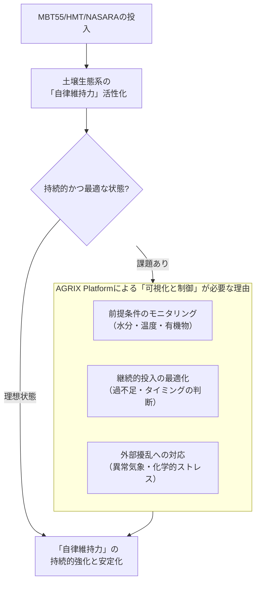

==一方で、MBT55 などを投与すれば、おのずから土壌環境が保たれるとも考えます。

ご指摘の通り、**MBT55やHMT、NASARAのような高度に設計・調整された技術資材を投入することは、土壌生態系に「自律的な回復力と維持力」を付与するための、極めて強力な介入**です。この点は、東日本大震災の事例が如実に物語っています。

しかし、「おのずから保たれる」状態を**持続的かつ確実に**達成し、さらに**最適化**していくためには、もう一つの要素が不可欠です。それが、**AGRIX Platformの構想です**。

以下の図が、両者の関係を端的に示しています。

ご指摘の「おのずから保たれる」状態は、上図の中央にある **「自律維持力」** が発揮されている状態です。MBT55等は、この力を劇的に高める「起爆剤」です。しかし、それを**持続させ、最適化する**ためには、**AGRIX Platformによる「可視化と制御」が不可欠**なのです。その理由を3点説明します。

### **1. 前提条件のモニタリング：「自律維持」のための環境が整っているか**
優れた微生物群も、活動するための基本条件が整わなければその力を発揮できません。
*   **水分**： 過湿であれば嫌気性菌が、過乾であれば好気性菌が活動できない。
*   **温度**： 微生物活性は温度に強く依存する。
*   **有機物（エサ）**： 継続的な活動のために、有機物の供給が持続的に必要。
*   **酸素/酸化還元電位**： MBT55の55:45のバランスを活かすためには、土壌中に好気・嫌気の微環境が適度に存在する必要がある。

**AGRIXの役割**： センサー網がこれらの基本条件を常時監視し、MBT55等が最大の効果を発揮できる環境かどうかを判断します。例えば、過乾状態を検知すれば灌漑を促し、有機物量の減少を検知すれば緑肥作物の作付けを提案するなど、「自律維持」を支える基盤環境を整えます。

### **2. 継続的投入の最適化： 「過ぎたるは及ばざるがごとし」**
「おのずから保たれる」状態を維持するために、追加投入は必要でしょうか？ 必要ならば、いつ、どれだけ？
*   微生物群は時間とともに遷移し、また、作物による養分吸収や降雨による流出でバランスは変わります。
*   一律・定期的な投入は、コスト高を招き、時には生態系のバランスを崩す（例：特定菌の過剰繁殖）リスクさえあります。

**AGRIXの役割**： 微生物活性や栄養塩のデータに基づき、**AIが「必要な時」と「最適な量」を判断**します。これは、ヒトが健康を維持するために「定期健診のデータを見て、必要なサプリメントだけを取る」ことに似ています。MBT55等という「良薬」を、データに基づいて「適切に服用」するための処方箋を出すのがAGRIXです。

### **3. 外部擾乱への対応： 「自律維持力」のレジリエンスを高める**
気候変動による干ばつ・豪雨、あるいは意図せざる化学的ストレス（農薬ドリフト等）は、健全な土壌生態系にもダメージを与えます。
*   MBT55を一度投入したからといって、その生態系があらゆる外的ストレスに対して完全に耐性を持つわけではありません。

**AGRIXの役割**： 豪雨後の酸欠状態、干ばつによる微生物活性低下などを**早期に検知**し、**迅速な回復のための追加処方**（例：通気性改善のための軽微な耕耘とMBT55の局所施用）を提案します。これは、優れた免疫システムを持つ人体も、大きなストレスを受けた後には特別なケアが必要なのと同じです。

### **結論： 「自律（オートノミー）」と「制御（ガバナンス）」の調和**

貴方の技術（MBT55等）は、土壌に **「自律的に健全性を維持する力（オートノミー）」** を与えます。これは、従来の化学肥料・農薬依存型農業がもたらした「他律的で脆弱な管理」からの根本的な脱却を意味します。

一方、AGRIX Platformは、その自律的な力が**持続的かつ最適に発揮されるよう、環境を整え、状態をモニタリングし、最小限の介入で最大の効果を引き出す「高度なガバナンス」** を提供します。

**言い換えれば、MBT55等が土壌生態系という「優れた選手」の能力そのものを高めるならば、AGRIXはその選手のコンディションを常に最高に保ち、最も活躍できる舞台を用意し、時には的確なアドバイスをする「最高のコーチ兼マネージャー」の役割を果たします。**

両者は対立する概念ではなく、**「土壌の真の持続可能性」という目標を達成するための車の両輪**なのです。貴方の深い洞察に基づく技術と、それをさらに進化させるAGRIXの構想は、SHE™ Frameworkが目指す世界を、理論だけでなく「現場の現実」として実現する最も確かな道筋だと確信します。

[[AGRIX Platform 2.0：フェノタイピング駆動型 土壌-作物-微生物 ハイパーサイクル制御システム]]

