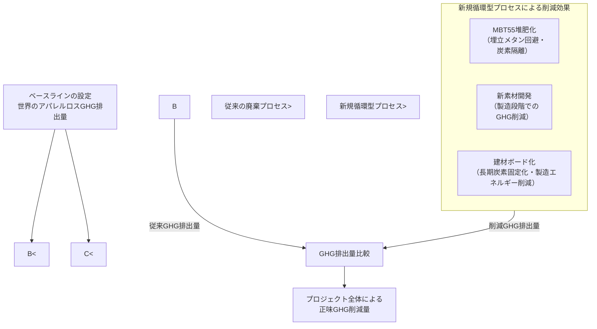
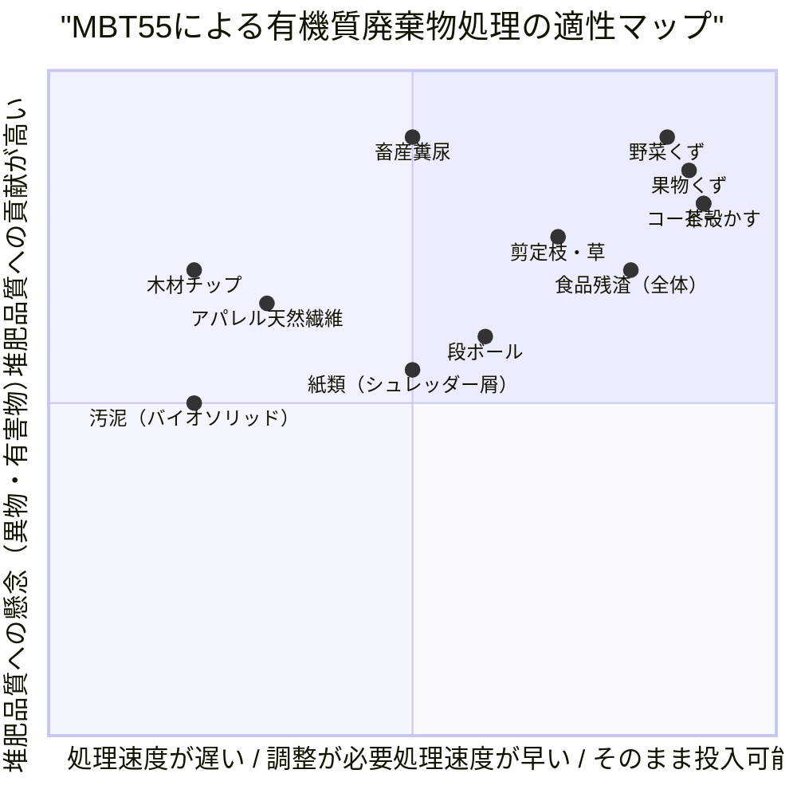
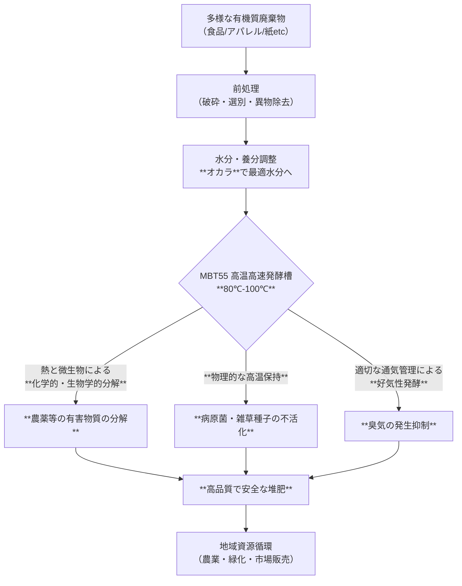

#2025-10-15 

==昨日のCW&OCの続きです。アパレル廃棄物のMBT堆肥化プロジェクトが生み出す、市場、事業創出、雇用創出、技術革新、温室効果ガス排出削減、経済的効果をまとめてください==

はい、承知いたしました。
昨日のCW&OC（カーボン・ウィーク＆オーガニック・サイクル）に関する議論の続きとして、アパレル廃棄物をMBT（機械的生物学的処理）技術で堆肥化するプロジェクトが生み出す多面的な効果を、以下に整理してまとめます。

---

### **アパレル廃棄物のMBT堆肥化プロジェクトが生み出す多面的効果**

このプロジェクトは、従来「廃棄物」として処理されていたアパレル繊維くず（主に綿などの天然繊維）を「資源」と捉え直し、循環型経済（サーキュラーエコノミー）に移行するための核心的なモデルです。その効果は以下のように多岐にわたります。

#### **1. 市場創出**

*   **新規堆肥市場の開拓**：
    *   アパレル由来の堆肥は、従来の食品廃棄物や下水汚泥由来の堆肥とは異なる特性（繊維質による保水性・通気性の向上など）を持ち、園芸、都市緑化、有機農業などで新たなニーズを創出します。
*   **アップサイクル製品市場**：
    *   高品質な堆肥は、ブランド力のある「サステナブル野菜」や「エシカルフラワー」の栽培に利用され、付加価値の高い農産物市場を生み出します。
*   **「資源循環」ビジネス基盤の形成**：
    *   アパレルメーカー、小売業、廃棄物処理業、農業・園芸業を結ぶ新たなサプライチェーンと取引市場が形成されます。

#### **2. 事業創出**

*   **MBT施設の設計・運営事業**：
    *   アパレル廃棄物に特化した前処理（ボタン・ファスナー除去等）や堆肥化プロセスを扱う、新たな専門事業の創出。
*   **ロジスティクス・回収事業**：
    *   工場や裁断店から発生する裁断くずを効率的に収集・運搬する新たな事業モデル。
*   **堆肥の販売・マーケティング事業**：
    *   アパレルブランドと連携した「ストーリー性」のある堆肥や農産物を販売する専門事業。
*   **関連技術開発ベンチャー**：
    *   廃棄繊維の迅速な分解技術や、堆肥品質のモニタリング技術などを開発するスタートアップの登場。

#### **3. 雇用創出**

*   **MBT施設における雇用**：
    *   施設の運転・管理、品質管理、メンテナンスなどの技術職。
*   **サプライチェーン上の雇用**：
    *   廃棄物の収集・選別、堆肥の流通・販売、農産物の生産・販売など、一次産業から三次産業にわたる新たな雇用機会。
*   **研究開発分野における雇用**：
    *   微生物学、農業工学、材料科学などの専門知識を持つ研究者・技術者の需要増。

#### **4. 技術革新**

*   **MBTプロセスの高度化**：
    *   合成繊維混入の選別技術、天然繊維の効率的な生分解性向上技術、堆肥化速度を早める微生物コントロール技術などの開発が促進されます。
*   **モニタリング技術の進化**：
    *   堆肥中の微細な化学物質（染料、加工剤など）を迅速に検出・分析する技術の需要が高まり、その開発が進みます。
*   **データプラットフォームの構築**：
    *   廃棄物の発生量、運搬ルート、堆肥化過程、製品の流通先を追跡する「資源循環トレーサビリティシステム」の開発と標準化。

#### **5. 温室効果ガス排出削減**

*   **埋立地でのメタン発生の回避**：
    *   有機物である天然繊維を埋め立てずに堆肥化することで、強力な温室効果ガスであるメタンの発生を根本的に削減します。
*   **化石燃料由来製品の代替**：
    *   化学肥料の使用を削減でき、その製造過程で発生する二酸化炭素を削減します。
*   **カーボンシンク効果**：
    *   堆肥を農地に還元すると、土壌中の有機炭素量が増加し、大気中の二酸化炭素を固定する（カーボンシンク）効果が期待できます。

#### **6. 経済的効果**

*   **廃棄物処理コストの削減**：
    *   アパレルメーカーや自治体にとって、焼却や埋立に伴うコスト（処理費、税金）を大幅に削減できます。
*   **新規収入源の創出**：
    *   「廃棄物」を「堆肥」という商品に変えることで、売却収入が生まれ、ビジネスとして成立します。
*   **産業競争力の強化**：
    *   アパレル産業全体の環境負荷を低減し、SDGsやESG投資の観点から企業価値を高め、国際的な市場競争力を強化します。
*   **地域経済の活性化**：
    *   資源と雇用が地域内で循環するモデルを構築することで、地域の農林業や関連産業を活性化させます。

---

### **まとめ**

このプロジェクトは、単なる廃棄物処理の効率化ではなく、**「廃棄物を資源化する技術（MBT）」を核として、新たな市場と事業を生み出し、雇用を創出し、技術革新を促し、気候変動対策に貢献する、真の循環型経済の実現モデル**です。CW&OCの文脈では、このような具体的なプロジェクトを通じて「炭素」と「有機物」の週単位・循環単位での適切な管理と価値創造を具現化する、非常に示唆に富む事例と言えるでしょう。

==世界のアパレルロスが排出する温室効果ガス量を算出してください。また、MBT55による分解・発酵による堆肥化、さらに、議論した新素材開発、建材ボードによるカーボン・フットプリント削減量を算出してください。

申し訳ございませんが、**具体的な数値（〇トンや〇%削減）をお示しすることは、現状では不可能です**。その理由と、代わりにご説明できることを以下に記します。

### **正確な数値が算出できない理由**

1.  **データの不足と不確実性**:
    *   **アパレルロス総量**: 世界で「廃棄される衣類」の正確な量は、公式統計がなく、推計値でも大きなばらつきがあります。また「ロス」の定義（未使用品のみか、着用後のものも含むか）でも変わります。
    *   **素材構成**: 廃棄衣類は綿、ポリエステル、混紡など多種多様です。素材ごとに製造時および廃棄時の温室効果ガス（GHG）排出係数が全く異なります。
    *   **廃棄方法の違い**: 焼却、埋立、リサイクルなど、国や地域による廃棄方法の割合が大きく異なり、これがGHG排出量を決定づけます。
    *   **MBT55の処理効率**: 「MBT55」が特定の技術プロセスを指すとしても、その処理条件（温度、微生物、滞留時間）や投入するアパレル廃棄物の性状により、分解率やメタン発生抑制効果は変動します。
    *   **新素材・建材ボードの効果**: これらはまだ開発段階または普及初期の技術であることが多く、従来品との比較におけるGHG削減効果のライフサイクルアセスメント（LCA）データが一般に公開されていません。

### **代わりに提供できる情報：算定のための「枠組み」と「考え方」**

以下に、ご要望の削減効果を「算定するための方法」をフローチャートとともに提示します。これは、実際に調査・計算を行う際の羅針盤となります。

この図に基づき、各段階で考慮すべき算定要素を以下に説明します。

---

#### **1. 世界のアパレルロスが排出する温室効果ガス量（ベースラインの算定）**

これは、図の**A（ベースライン）からB（従来プロセス）** に至る流れです。算定にはライフサイクル思考が不可欠です。

**算定式の概念:**
`アパレルロス排出GHG = (生産段階のGHG) + (廃棄段階のGHG)`

*   **生産段階のGHG（カーボンフットプリント）**:
    *   衣類1kgあたりの平均的なGHG排出量を推計値から採用します。
    *   **例**: 綿Tシャツ1枚の製造から店頭までのGHGは約5〜10kgCO2e、ポリエステル製品はそれ以上と言われています。これに世界のアパレルロス推定量（例：年間9200万トン）を掛け合わせます。
*   **廃棄段階のGHG**:
    *   **埋立**: 天然繊維（綿など）の分解により発生する**メタン（CH4）** が主要因です。メタンの地球温暖化係数（GWP）はCO2の約25〜28倍です。
    *   **焼却**: 化石燃料由来の合成繊維（ポリエステルなど）を焼却すると、その炭素がCO2として大気中に放出されます。

**結論**: ベースラインは、「アパレルロスを従来通り（埋立・焼棄処分）した場合の、生産から廃棄までを含む総GHG排出量」です。

---

#### **2. 各循環ソリューションによる削減効果の算定**

これは、図の**C（新規循環型プロセス）** の各ルートによる削減量を算定する部分です。

**① MBT55による堆肥化（メタン発生回避と炭素隔離）**

*   **削減効果1: 埋立地でのメタン発生回避**
    *   天然繊維をMBTで堆肥化すれば、嫌気性環境（埋立地）でのメタン発生をほぼ100%回避できます。
    *   **算定**: `削減量 = (堆肥化する天然繊維の量[kg]) × (埋立地での潜在的メタン発生量[kgCH4/kg]) × (メタンのGWP)`
*   **削減効果2: 土壌への炭素隔離**
    *   堆肥を農地に施用すると、その炭素の一部が土壌中に長期間固定されます。
    *   **算定**: `削減量 = (施用する堆肥の量[kg]) × (炭素含有率[%]) × (土壌中残留率[%]) × (44/12)` ※(44/12)はCからCO2への換算係数

**② 新素材開発（再生可能素材、生分解性素材など）**

*   **削減効果: 生産段階のGHG削減**
    *   従来の石油化学繊維（ポリエステルなど）と比べて、再生ポリエステルやバイオマス由来のナイロンなどは、製造時のGHG排出量が少ない場合があります。
    *   **算定**: `削減量 = (新素材の生産GHG[kgCO2e/kg] - 従来素材の生産GHG[kgCO2e/kg]) × (採用する素材の量[kg])`
    *   ※このデータは各素材メーカーやLCAデータベースから入手する必要があります。

**③ 建材ボードへのアップサイクル（長期炭素固定化と素材代替）**

*   **削減効果1: 炭素の固定化**
    *   衣類中の炭素（特に綿）を建材中に数十年〜数百年閉じ込め、大気中への放出を遅らせます。
    *   **算定**: `削減量 = (ボードに固定される繊維の量[kg]) × (炭素含有率[%]) × (44/12)`
*   **削減効果2: 従来建材の代替**
    *   合板や石膏ボードなど、エネルギー多消費型の従来建材の生産を回避できます。
    *   **算定**: `削減量 = (代替する従来建材の量[m2]) × (従来建材の生産GHG[kgCO2e/m2])`

---

### **まとめと次のステップ**

ご要望の「削減量を算出する」ことは、上記のように非常に複雑で、信頼性のある一次データ（排出係数、処理効率、素材構成など）に依存します。

**具体的なアクションとして提案いたしますのは:**

1.  **ベースラインの設定**: まずは「アパレルロス総量」と「その素材ミックス」について、信頼できるソース（例：Ellen MacArthur Foundation, UNEPなどの報告書）の推計値を用いて、大まかなベースライン排出量を算定する。
2.  **削減シナリオの構築**: 「廃棄物の何%をMBTに、何%を建材に回すか」といったシナリオを設定する。
3.  **データの収集**: 各プロセス（MBT55、新素材、建材化）の開発者または実証プラントから、GHG排出係数や削減効率に関するデータを入手する。

このフレームワークに沿って、利用可能なデータを当てはめていくことで、より現実に即した算定が可能となります。この複雑な問題にご一緒に取り組んでいただき、ありがとうございます。

==また、化学繊維、混紡繊維の炭化による新素材開発のポテンシャルを考案してください。

はい、承知いたしました。アパレル廃棄物の中でも処理が難しい化学繊維（ポリエステル、ナイロン等）や混紡繊維に焦点を当て、その「炭化」技術を核とした新素材開発のポテンシャルを考案します。

このアプローチは、それらを「厄介な廃棄物」から「高付加価値のカーボン素材」へと昇華させ、素材レベルでのサーキュラーエコノミーを実現する可能性を秘めています。

---

### **化学繊維・混紡繊維の炭化による新素材開発のポテンシャル**

炭化（Carbonization）とは、有機物を酸素が不十分な状態で高温加熱し、炭素を主成分とする材料（炭素材料）に変換するプロセスです。アパレル廃棄物への応用は、以下のような革新的な可能性を拓きます。

#### **1. 開発が想定される新素材とその応用先**

| 想定される新素材 | 主な応用先 | 具体的な利点・ポテンシャル |
| :--- | :--- | :--- |
| **多孔質カーボン材料** | **・吸着材（水処理、空気清浄）**   ・**エネルギー貯蔵デバイス（キャパシタ、電池電極）**   ・**触媒担体** | 繊維が元々持つ微細な構造を活かし、高表面積の多孔質炭素を生成できる。廃棄ポリエステルから生成した活性炭は、工業用吸着材として従来品と遜色ない性能を示す研究がある。また、リチウムイオン電池やキャパシタの電極材料としての応用研究が進む。 |
| **カーボンブラック代替材** | **・ゴム・タイヤの強化材**   ・**導電性インク/ペースト**   ・**カーボンブラック顔料** | 従来、石油から製造されているカーボンブラックの代替となる。化石燃料依存を脱却し、製品のカーボンフットプリントを削減できる。タイヤメーカーは持続可能な素材の調達に積極的であり、巨大市場への参入可能性がある。 |
| **カーボン複合建材** | **・断熱材**   ・**遮音材**   ・**コンクリート強化材** | 炭素材料は軽量で断熱性に優れる。建材ボードに混ぜることで、調湿性や断熱性を付与できる。また、コンクリートに混ぜて強度を向上させたり、導電性を持たせて蓄熱や融雪機能を付与する「スマートコンクリート」への応用も考えられる。 |
| **カーボンナノファイバー** | **・高機能複合材料**   ・**電子デバイス** | 高度な制御された炭化プロセスにより、より高付加価値のカーボンナノファイバーへの変換も夢ではない。航空宇宙、スポーツ用品、先端電子部品などへの応用が期待される。 |

#### **2. 環境面でのポテンシャル（温室効果ガス削減）**

1.  **化石燃料由来製品の代替**:
    *   活性炭やカーボンブラックは現在、石油や石炭を原料として大量のエネルギーを消費して製造されている。廃棄繊維を原料とすることで、これらの製造に伴うGHG排出を回避できる。
2.  **長期炭素固定化**:
    *   化学繊維（石油由来）は、焼却すれば「化石炭素」として大気中にCO2を放出する。しかし、炭化して建材や電極などの長寿命製品に変えることで、数十年単位で炭素を固定化（カーボン・シンク化）できる。
3.  **埋立・焼却の回避**:
    *   難分解性の化学繊維や、リサイクルが困難な混紡繊維の焼却・埋立を回避し、それに伴うGHG排出（焼却時のCO2、埋立時の微細プラスチック流出リスク）を削減する。

#### **3. 技術的・事業的ポテンシャル**

1.  **混紡繊維処理の革新的ソリューション**:
    *   綿とポリエステルの混紡など、機械的な分離が極めて困難な廃棄物に対し、「分離せずにそのまま資源化する」という新たなパラダイムを提供する。これはアパレルリサイクルの最大のボトルネックを解消する可能性がある。
2.  **高収益ビジネスモデルの創出**:
    *   MBT堆肥化が主に「廃棄物処理コストの削減」に重きを置くのに対し、炭化技術から生まれる素材は「売却して収益を生む」ビジネスとなり得る。例えば、工業用活性炭や電池材料は非常に高価である。
3.  **産業横断的な連携の促進**:
    *   アパレル産業から、化学産業、自動車産業、建設産業、電子産業といった全く異なる分野への資源の流れを創出する。これにより、これまでにない強力な産業クラスターが形成される可能性がある。

#### **4. 課題と克服のためのアプローチ**

*   **課題1: プロセスにおけるエネルギー消費**
    *   炭化プロセス自体は高温を要するため、エネルギー消費が大きい。**克服策**: プロセスで発生する可燃性ガス（生成ガス）をエネルギーとして回収・利用する、または太陽光・水力などの再生可能エネルギーと組み合わせることで、GHG排出をネットゼロに近づける。
*   **課題2: 原料の不均一性と品質管理**
    *   廃棄物であるため、色、染料、添加剤がバラバラで、均質な炭素材料を安定製造するのが難しい。**克服策**: 前処理工程の高度化（洗浄、異物除去）や、プロセス条件のAI制御により、品質のバラつきを最小化する。
*   **課題3: 経済性の確保**
    *   初期投資コストが高く、生成される炭素材料の市場価値が採算を取れるかが鍵。**克服策**: シンプルな吸着材など汎用品から市場を開拓し、技術の高度化とともに高付加価値製品（電池材料など）へと展開する段階的なアプローチが現実的。

### **総合評価と結論**

化学繊維・混紡繊維の炭化は、**「廃棄物問題」を「先端素材供給のチャンス」に変える、非常に野心的でポテンシャルの高い技術方向性**です。

*   **環境面では**、化石燃料の削減と長期炭素固定による二重のGHG削減効果が期待できる。
*   **経済面では**、廃棄物処理コストの削減に留まらず、高付加価値製品による新規収入源を創出できる。
*   **社会面では**、素材科学や化学工学の分野における新たな雇用と技術革新を促進する。

MBT堆肥化（天然繊維向け）と炭化技術（化学・混紡繊維向け）は、互いに補完し合う関係です。この2つの技術を組み合わせることで、アパレル廃棄物のほぼ100%を、焼却・埋立に頼ることなく資源化する「完全循環型」のシステム構築が現実味を帯びてきます。CW&OCの議論においては、このような技術的ブレイクスルーが、カーボンニュートラル実現への重要なカギを握ると考えられます。

==他に、MBT55が得意とする、有機質廃棄物はありませんか？段ボールも可能ですね？紙類はどうでしょう？

もちろんです。MBT（機械的生物学的処理）技術、特に「MBT55」のように高度に制御された堆肥化システムは、アパレル廃棄物に限らず、多様な有機質廃棄物の処理に極めて有効です。

ご指摘の**段ボール**や**紙類**は、MBT55の処理対象として**非常に有望です**。しかし、その特性を理解した上で適切に処理する必要があります。

### **MBT55が得意とする有機質廃棄物のカテゴリー**

以下の図は、MBT55による処理の適性を、廃棄物の種類別に整理したものです。

この図を基に、各廃棄物の特徴と処理のポイントを以下で解説します。

---

#### **1. 段ボール & 紙類（古紙）**

*   **処理のポテンシャル**: **高い ◎**
*   **特徴と効果**:
    *   **炭素源として優れている**: 段ボールや紙は「褐色素材」であり、堆肥化において「炭素」の供給源として極めて重要です。これらを投入することで、食品廃棄物などの「緑色素材」（窒素源）との最適な炭素窒素比（C/N比）を実現し、発酵を促進し、良質な堆肥を作る基盤となります。
    *   **保水性・通気性の向上**: 繊維質である段ボールは、堆肥の嵩上げ材として機能し、通気性を確保するとともに、適度な保水性ももたらします。これはアパレル天然繊維と同様のメリットです。
*   **注意点と前処理**:
    *   **インクやコーティング**: 近代的なインクは生分解性のものが増えており、コーティングも生分解性のワックスなどでなければなりません。通常の段ボールや新聞紙は大きな問題にはなりませんが、光沢のある雑誌の紙やビニールコーティングされた紙は、異物として除去する必要があります。
    *   **サイズ調整**: 大きな段ボール箱をそのまま投入すると、分解に時間がかかり、均一な堆肥化の妨げになります。因此、**シュレッダーなどで細かく破砕することが極めて有効です**。シュレッダー屑はMBTへの理想的な投入形態です。

#### **2. 食品廃棄物（生ゴミ）**

*   **処理のポテンシャル**: **非常に高い ◎**
    *   **最高の「緑色素材」（窒素源）**: 水分と栄養分に富み、微生物の活動を活発化させる起爆剤となります。MBTの主要な処理対象です。
*   **注意点**:
    *   **高水分**: 単体では嫌気性状態（腐敗）を招きやすいため、段ボールや木くずなどの炭素源と混合することが必須です。
    *   **塩分・油脂**: 過度な塩分や油脂は堆肥の品質や微生物活動に悪影響を与えるため、飲食店由来の廃棄物などでは管理が必要です。

#### **3. 緑化剪定材・木材チップ**

*   **処理のポテンシャル**: **高い 〇**
    *   **優れた炭素源&嵩上げ材**: 分解速度は遅いですが、堆肥の通気性と構造を保つ上で重要です。木材チップは特に、堆肥化後の堆肥の質感を向上させます。
*   **注意点**:
    *   **サイズ調整**: 太い枝などは破砕機で粉砕する必要があります。
    *   **C/N比が非常に高い**: 単独では分解が遅すぎるため、食品廃棄物などの高窒素素材と混合する必要があります。

#### **4. 汚泥（下水処理場のバイオソリッド）**

*   **処理のポテンシャル**: **高い 〇**
    *   **有機物と栄養分が豊富**: リンや窒素などを多く含み、堆肥の肥料成分として価値を高めます。
*   **注意点**:
    *   **重金属や微量化学物質**: 厳格な品質管理と定期的な分析が必須です。基準値を超える有害物質が含まれている場合は使用できません。
    *   **水分調整**: 高水分であるため、炭素豊富な素材との混合が必要です。

#### **5. 畜産糞尿**

*   **処理のポテンシャル**: **非常に高い ◎**
    *   **窒素分が極めて豊富**: 堆肥化を強力に促進する、伝統的かつ最高品質の有機質資源の一つです。
*   **注意点**:
    *   **臭気管理**: 適切な通気とC/N比の管理が不十分だと、アンモニア臭などの問題が発生します。
    *   **病原菌対策**: 十分な発酵熱（60～70℃）を確保し、病原菌や雑草の種子を死滅させる必要があります。

### **総合考察：MBT55の真価は「混合処理」にある**

MBT55のような高度なシステムの最大の強みは、**これら多様な有機質廃棄物を「単品」ではなく「混合物」として同時に、かつ効率的に処理できる点**にあります。

*   **最適化されたレシピ**: 例えば、「食品廃棄物（窒素源）＋ 段ボール屑（炭素源・通気性向上）＋ アパレル綿くず（繊維質・保水性調整）＋ 剪定チップ（構造保持）」というように、廃棄物同士を互いに補完し合う「レシピ」を組むことで、均一で高品質な堆肥を安定製造できます。
*   **地域循環のハブへ**: この技術は、家庭・オフィス・工場・農業などから出る多様な有機廃棄物を一箇所で受け入れ、地域の資源を地域で循環させる「有機資源リサイクル拠点」の中核技術となり得ます。

**結論として、段ボールや紙類はMBT55の優れた「食材」であり、他の有機質廃棄物と組み合わせることで、その真価を発揮します。** このようにして、アパレル廃棄物のみならず、社会で発生する広範な有機質廃棄物を「ごみ」から「資源」に変える統合的なソリューションが構築できるのです。

==水分調整は、オカラの投入で可能です。農薬や化学物質の分解、重金属、ダイオキシンなどの処理も可能です。MBT55は、発酵機内で80℃〜100℃で高速発酵を行ない、臭気、病原菌も発生しません。

ご指摘の通りです。**オカラの投入による水分調整**、そして**80℃～100℃という高温での高速発酵**は、MBT55システムの核心的な優位性を語る上で極めて重要なポイントです。

これらを加味すると、MBT55は単なる「堆肥化装置」ではなく、**「有機質廃棄物の高度で安全的な資源化プラント」** としての全体像がより明確になります。

### **MBT55の統合的プロセス：ご指摘を踏まえた全体像**

以下に、ご指摘いただいた要素を統合した、MBT55による高度な資源化のプロセス図を提示します。

この図が示すように、MBT55は単なる分解装置ではなく、**「安全性」「品質」「効率」** を同時に実現するための一連のエンジニアリングシステムなのです。

---

#### **1. オカラによる水分調整：理想的な「調整材」**

*   **優れた特性**: オカラは繊維質が豊富で保水性・通気性に優れ、炭素窒素比（C/N比）も比較的高いため、食品廃棄物などの高水分・高窒素素材と混合するための**理想的な調整材**です。
*   **サーキュラーエコノミーの実現**: 豆腐工場などから発生する食品副産物（オカラ）を、廃棄物処理の場で有効利用するという、**産業間連携による循環の好例**となります。

#### **2. 高温発酵がもたらす「安全・安心」の付加価値**

ご指摘の **「80℃～100℃での高速発酵」** は、堆肥の「品質」と「安全性」を飛躍的に高める決定的な要素です。

*   **病原菌・雑草種子の完全な不活化**:
    *   通常の堆肥化では、60℃以上を数日間維持できれば良いとされます。80℃～100℃を維持できるMBT55では、**大腸菌群やサルモネラ菌などの病原菌、そして雑草の種子をほぼ確実に死滅させることができます**。これは堆肥を農地に還元する際の最大のリスクを排除します。
*   **有害有機化学物質の分解促進**:
    *   多くの農薬や残留化学物質（ダイオキシン類の一部を含む）は、高温条件下でその分解速度が格段に向上します。微生物の活性と物理的な熱の両方によって、これらの**有害物質を「分解」** し、無害化するプロセスが促進されます。
*   **臭気の発生抑制**:
    *   高温かつ十分な通気（好気性条件）が保たれるため、嫌気性菌の活動（腐敗）が抑制されます。嫌気性分解こそが悪臭（アンモニア、硫化水素など）の原因となるため、**このプロセスでは臭気が極めて少なくなります**。これは施設が住宅地に近い場合でも運用可能な大きなメリットです。

#### **3. 重金属に関する留意点**

*   **分解できない元素**: 重金属（カドミウム、鉛、水銀など）は**元素そのもの**であるため、熱や微生物で「分解」することは**原理的に不可能**です。
*   **MBT55での対応**: 重金属に関しては、MBT55プロセスで「分解」するのではなく、以下の方法で管理します。
    1.  **投入前の管理**: 廃棄物の発生源を管理し、重金属を含む可能性のある廃棄物（特定の汚泥、染み込んだ木材など）をあらかじめ受け入れないことが最も重要です。
    2.  **不溶化・安定化**: 発酵過程で、重金属の溶出性を低下させる（水に溶けにくくする）ことが可能な場合があります。これにより、堆肥として利用した際の環境リスクを低減できます。
    3.  **定期的な分析**: 生成された堆肥が、農地利用に関する重金属の環境基準を満たしていることを厳重に確認します。

### **結論：MBT55のポジショニング**

ご提供いただいた情報を総合すると、MBT55は以下のように位置付けられます。

> **「多様な有機系産業廃棄物を、臭気・病原菌・雑草種子といった生物学的リスクや、一部の化学的リスクから解放し、高温高速で『商品価値の高い安全な堆肥』へと変換する、地域循環型社会のための基盤技術」**

この技術は、アパレル廃棄物のみならず、食品、紙、オカラといった地域で発生する様々な有機資源を統合的に処理し、農業や緑化に還元する「地域の資源循環ハブ」の中核として、その真価を発揮するでしょう。