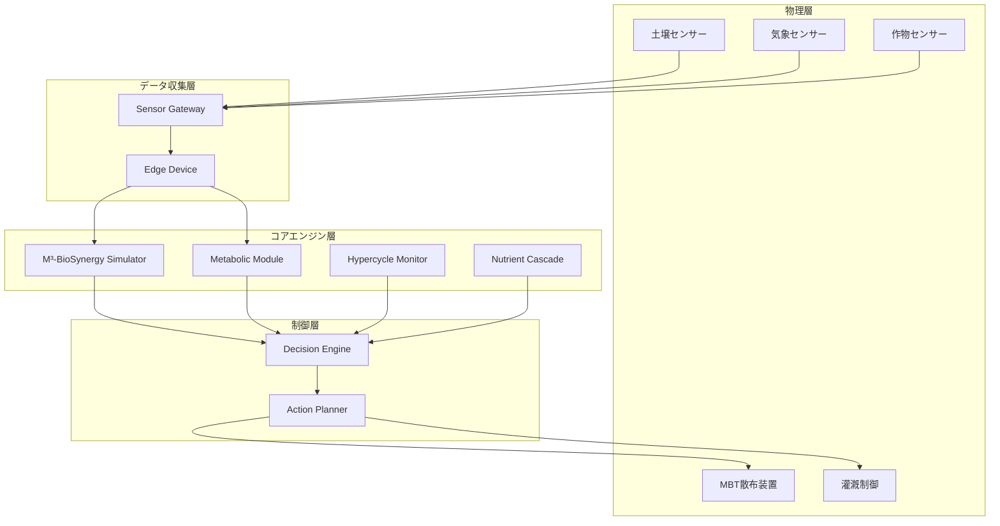

#2026-02-06  #deepseek 

はい、フェーズ1の詳細設計と実装プランを作成してください。

---

# **フェーズ1：コアエンジン統合 詳細設計と実装プラン**

## 📋 **概要：フェーズ1の目標と範囲**

### **目標**
3ヶ月以内に、M³-BioSynergyシミュレーターと代謝モジュールを統合した最小限の動作可能なAgriWare™コアを構築し、単一サイトでの実証実験を開始できる状態にする。

### **主要マイルストーン**
```
M1（4週目）: 統合シミュレーションエンジンの完成
M2（8週目）: 基本エージェントフレームワークの実装
M3（12週目）: センサー統合と実環境テスト開始
```

---

## 🏗️ **アーキテクチャ設計**

### **フェーズ1システムアーキテクチャ**


---

## 📅 **週次実装計画（12週間）**

### **週1-2：プロジェクト基盤構築**

#### **目標**: 開発環境とデータパイプラインの確立
```python
# プロジェクト構造
agriware-phase1/
├── core/
│   ├── m3_simulator/      # M³-BioSynergy シミュレーター
│   ├── metabolic/         # 代謝モジュール
│   └── agents/           # 基本エージェント
├── data/
│   ├── sensors/          # センサーインターフェース
│   ├── models/           # 機械学習モデル
│   └── storage/          # 時系列データベース
├── control/
│   ├── decision/         # 意思決定エンジン
│   └── actions/          # アクション実行
└── tests/
    ├── unit/             # 単体テスト
    └── integration/      # 統合テスト
```

#### **実装タスク**:
1. **環境構築** (3日)
   - Python 3.10+環境設定
   - 依存ライブラリ定義（requirements.txt）
   - Dockerコンテナ化
   
2. **データモデル設計** (4日)
   ```python
   # core/data_models.py
   from pydantic import BaseModel
   from datetime import datetime
   from typing import Dict, List, Optional
   
   class SensorReading(BaseModel):
       timestamp: datetime
       location: str
       sensor_type: str
       values: Dict[str, float]
       metadata: Optional[Dict] = None
   
   class EcosystemState(BaseModel):
       timestamp: datetime
       carbon_cycle: Dict[str, float]
       nitrogen_cycle: Dict[str, float]
       microbial_state: Dict[str, float]
       element_status: Dict[str, float]
       hypercycle_stability: float
   ```

3. **時系列データベース設定** (3日)
   - InfluxDBまたはTimescaleDBのセットアップ
   - データ書き込み/読み込みAPIの実装

---

### **週3-4：M³-BioSynergyシミュレーター統合**

#### **目標**: 既存シミュレーターと代謝モジュールの統合
```python
# core/integrated_simulator.py
class IntegratedM3Simulator:
    def __init__(self):
        self.m3_simulator = M3BioSynergySimulator(species_count=120)
        self.metabolic_model = MBT55_Metabolic_Graph()
        self.hypercycle_monitor = HypercycleMonitor()
        
    def simulate_step(self, current_state, interventions):
        """統合シミュレーション1ステップ"""
        # 微生物動態シミュレーション
        microbial_result = self.m3_simulator.simulate_step(
            current_state['microbial'],
            interventions['mbt55']
        )
        
        # 代謝フロー計算
        metabolic_result = self.metabolic_model.simulate_gas_reduction(
            intervention_vector=interventions['metabolic']
        )
        
        # ハイパーサイクル安定性評価
        stability = self.hypercycle_monitor.assess(
            microbial_result,
            metabolic_result
        )
        
        return {
            'microbial': microbial_result,
            'metabolic': metabolic_result,
            'stability': stability,
            'recommendations': self.generate_recommendations(stability)
        }
```

#### **実装タスク**:
1. **シミュレーター統合** (5日)
   - 既存コードのリファクタリング
   - 統一インターフェースの設計
   - データフォーマットの標準化

2. **パラメータキャリブレーション** (3日)
   ```python
   class ParameterCalibrator:
       def calibrate_from_data(self, historical_data):
           """実測データからのパラメータ調整"""
           # ベイズ最適化によるパラメータ調整
           optimized = self.bayesian_optimization(
               model=self.simulator,
               data=historical_data,
               parameters=['interaction_coeff', 'growth_rate', 'decay_rate']
           )
           return optimized
   ```

3. **バリデーションルーチン** (2日)
   - シミュレーション結果の妥当性チェック
   - 異常値検出と自動修正

---

### **週5-6：基本エージェントフレームワーク実装**

#### **目標**: 拡張可能なエージェントシステムの基盤構築
```python
# core/agents/framework.py
class AgentBase:
    def __init__(self, name, dependencies=None):
        self.name = name
        self.dependencies = dependencies or []
        self.state = {}
        
    async def monitor(self, data):
        """監視タスク - 各エージェントで実装"""
        raise NotImplementedError
        
    async def report(self):
        """状態レポート生成"""
        return {
            'agent': self.name,
            'timestamp': datetime.now(),
            'state': self.state,
            'metrics': self.calculate_metrics()
        }
        
    def calculate_metrics(self):
        """評価指標計算"""
        return {}

class AgentManager:
    def __init__(self):
        self.agents = {}
        self.message_bus = asyncio.Queue()
        
    def register_agent(self, agent):
        self.agents[agent.name] = agent
        
    async def run_monitoring_cycle(self):
        """全エージェントの監視サイクル実行"""
        tasks = []
        for agent in self.agents.values():
            task = asyncio.create_task(agent.monitor(self.get_agent_data(agent)))
            tasks.append(task)
        
        results = await asyncio.gather(*tasks)
        return self.integrate_results(results)
```

#### **実装タスク**:
1. **エージェント基本クラス** (3日)
   - 非同期処理対応
   - メッセージングシステム
   - 状態管理

2. **最初の3エージェント実装** (4日)
   ```python
   # 1. ハイパーサイクルエージェント
   class HypercycleAgent(AgentBase):
       async def monitor(self, ecosystem_data):
           amplification = self.calc_amplification(ecosystem_data)
           stability = self.assess_stability(amplification)
           self.state = {'amplification': amplification, 'stability': stability}
           
   # 2. 栄養カスケードエージェント
   class NutrientCascadeAgent(AgentBase):
       async def monitor(self, nutrient_data):
           efficiency = self.calc_cascade_efficiency(nutrient_data)
           bottlenecks = self.identify_bottlenecks(nutrient_data)
           self.state = {'efficiency': efficiency, 'bottlenecks': bottlenecks}
           
   # 3. 元素転換エージェント
   class ElementTransmutationAgent(AgentBase):
       async def monitor(self, element_data):
           toxicity_reduction = self.calc_toxicity_reduction(element_data)
           bioavailability = self.assess_bioavailability(element_data)
           self.state = {
               'toxicity_reduction': toxicity_reduction,
               'bioavailability': bioavailability
           }
   ```

3. **エージェント間通信** (3日)
   - イベント駆動アーキテクチャ
   - データ依存関係管理
   - デッドロック防止

---

### **週7-8：センサー統合層の実装**

#### **目標**: 多様なセンサーからのデータ収集と正規化
```python
# data/sensor_integration.py
class SensorIntegrationLayer:
    def __init__(self, config):
        self.sensor_adapters = {
            'soil_moisture': SoilMoistureAdapter(),
            'pH_sensor': PHAdapter(),
            'nutrient_sensor': NutrientProbeAdapter(),
            'weather_station': WeatherStationAdapter(),
            'NDVI_camera': NDVIAdapter()
        }
        self.data_normalizer = DataNormalizer()
        self.quality_checker = DataQualityChecker()
        
    async def collect_data(self):
        """全センサーからのデータ収集"""
        sensor_data = {}
        
        for sensor_type, adapter in self.sensor_adapters.items():
            try:
                raw_data = await adapter.read()
                validated = self.quality_checker.validate(raw_data)
                normalized = self.data_normalizer.normalize(validated)
                sensor_data[sensor_type] = normalized
            except SensorError as e:
                self.handle_sensor_error(sensor_type, e)
                
        return self.aggregate_sensor_data(sensor_data)
    
    def aggregate_sensor_data(self, sensor_data):
        """フェノミクス手法によるデータ統合"""
        # 時系列パターン抽出
        patterns = self.extract_temporal_patterns(sensor_data)
        
        # ベクトル形式への変換
        state_vector = self.create_state_vector(sensor_data, patterns)
        
        return {
            'raw_data': sensor_data,
            'patterns': patterns,
            'state_vector': state_vector,
            'quality_score': self.calculate_data_quality(sensor_data)
        }
```

#### **実装タスク**:
1. **センサーアダプター開発** (4日)
   - 主要センサー対応（5種類）
   - エラーハンドリング
   - キャリブレーションルーチン

2. **データ品質管理** (3日)
   ```python
   class DataQualityChecker:
       def validate(self, sensor_data):
           # 1. 範囲チェック
           if not self.check_value_ranges(sensor_data):
               raise ValidationError("値が許容範囲外")
               
           # 2. 一貫性チェック
           if not self.check_consistency(sensor_data):
               raise ConsistencyError("センサー間で矛盾")
               
           # 3. 時系列妥当性
           if not self.check_temporal_consistency(sensor_data):
               raise TemporalError("時系列に異常")
               
           return sensor_data
   ```

3. **フェノミクスデータ処理** (3日)
   - 時系列パターン認識
   - 状態ベクトル生成
   - 異常状態検出

---

### **週9-10：意思決定エンジン実装**

#### **目標**: エージェント評価に基づく最適制御決定
```python
# control/decision_engine.py
class DecisionEngine:
    def __init__(self, config):
        self.integrator = EcosystemIntegrator()
        self.optimizer = M3Optimizer()
        self.constraint_manager = ConstraintManager()
        
    def make_decision(self, agent_reports, current_state, constraints):
        """統合意思決定プロセス"""
        # 1. エージェントレポートの統合
        integrated_assessment = self.integrator.integrate(agent_reports)
        
        # 2. M³最適化シミュレーション
        simulation_results = self.optimizer.find_optimal_intervention(
            current_state=current_state,
            target_state=integrated_assessment['optimal_state'],
            time_horizon=24  # 24時間先まで最適化
        )
        
        # 3. 制約条件の適用
        feasible_actions = self.constraint_manager.apply_constraints(
            actions=simulation_results['recommended_actions'],
            constraints=constraints
        )
        
        # 4. リスク評価
        risk_assessment = self.assess_risks(feasible_actions, integrated_assessment)
        
        # 5. 最終決定
        final_decision = self.select_best_actions(
            feasible_actions,
            risk_assessment,
            integrated_assessment['priority']
        )
        
        return {
            'actions': final_decision,
            'simulation_results': simulation_results,
            'risk_assessment': risk_assessment,
            'explanation': self.generate_explanation(final_decision)
        }
```

#### **実装タスク**:
1. **意思決定ロジック** (4日)
   - マルチクリテリア意思決定
   - リスクトレードオフ分析
   - 説明可能なAI（XAI）機能

2. **最適化エンジン** (3日)
   ```python
   class M3Optimizer:
       def find_optimal_intervention(self, current_state, target_state, horizon):
           # 強化学習による最適化
           agent = self.create_rl_agent()
           
           # シミュレーション環境
           env = M3SimulationEnvironment(
               current_state=current_state,
               target_state=target_state
           )
           
           # 学習と最適化
           optimal_policy = agent.learn(env, episodes=1000)
           best_actions = agent.get_optimal_actions(optimal_policy, horizon)
           
           return best_actions
   ```

3. **制約管理システム** (3日)
   - リソース制約（MBT55在庫、水、エネルギー）
   - 環境制約（気象、土壌条件）
   - 経済制約（コスト上限）

---

### **週11-12：統合テストと実証準備**

#### **目標**: システム統合テストと実環境デプロイ準備
```python
# tests/integration/test_full_system.py
class TestAgriWarePhase1(unittest.TestCase):
    def setUp(self):
        self.system = AgriWareSystem()
        self.test_data = self.load_test_dataset()
        
    def test_full_control_cycle(self):
        """完全な制御サイクルのテスト"""
        # 1. センサーデータ読み込み
        sensor_data = self.system.sensors.collect()
        
        # 2. エージェント監視
        agent_reports = self.system.agents.monitor_all(sensor_data)
        
        # 3. 意思決定
        decision = self.system.decider.make_decision(agent_reports)
        
        # 4. アクション実行
        results = self.system.actuators.execute(decision['actions'])
        
        # 5. 結果検証
        self.assert_valid_decision(decision, results)
        self.assert_improvement(sensor_data, results)
        
    def test_error_recovery(self):
        """エラー回復テスト"""
        # センサー故障シミュレーション
        self.system.sensors.simulate_failure('pH_sensor')
        
        # システムが適応することを確認
        decision = self.system.run_cycle()
        self.assertTrue(decision['fallback_used'])
        
    def test_performance_benchmark(self):
        """パフォーマンスベンチマーク"""
        start_time = time.time()
        
        for _ in range(100):  # 100サイクル
            self.system.run_cycle()
            
        elapsed = time.time() - start_time
        self.assertLess(elapsed, 30.0)  # 30秒以内に100サイクル
```

#### **実装タスク**:
1. **統合テストスイート** (4日)
   - エンドツーエンドテスト
   - エラーケーステスト
   - パフォーマンステスト

2. **実環境デプロイパッケージ** (3日)
   ```dockerfile
   # Dockerfile
   FROM python:3.10-slim
   
   WORKDIR /app
   
   # 依存関係インストール
   COPY requirements.txt .
   RUN pip install --no-cache-dir -r requirements.txt
   
   # アプリケーションコピー
   COPY . .
   
   # エントリーポイント
   CMD ["python", "main.py", "--mode", "production"]
   ```

3. **監視とロギング** (3日)
   - システムヘルスモニター
   - 詳細ログ記録
   - パフォーマンスメトリクス収集

4. **ドキュメント作成** (2日)
   - APIドキュメント
   - ユーザーガイド
   - トラブルシューティングガイド

---

## 🔧 **技術スタック詳細**

### **必須技術**
| カテゴリ | 技術 | 目的 |
|----------|------|------|
| **言語** | Python 3.10+ | メイン開発言語 |
| **データベース** | TimescaleDB | 時系列データ管理 |
| **メッセージング** | Redis + Pub/Sub | エージェント間通信 |
| **計算** | NumPy, SciPy | 数値計算 |
| **機械学習** | scikit-learn, PyTorch | 最適化と予測 |
| **テスト** | pytest, unittest | テスト自動化 |
| **コンテナ** | Docker | 環境統一 |

### **オプション技術**
| カテゴリ | 技術 | 用途 |
|----------|------|------|
| **可視化** | Grafana | リアルタイム監視 |
| **CI/CD** | GitHub Actions | 自動デプロイ |
| **監視** | Prometheus | システムメトリクス |

---

## 👥 **リソース計画**

### **開発チーム構成（フェーズ1）**
| 役割 | 人数 | 主な責務 |
|------|------|----------|
| **バックエンド開発** | 2名 | コアエンジン、エージェント実装 |
| **データエンジニア** | 1名 | センサー統合、データパイプライン |
| **機械学習エンジニア** | 1名 | 最適化アルゴリズム、シミュレーション |
| **QA/テストエンジニア** | 1名 | テスト自動化、品質保証 |
| **プロジェクトマネージャー** | 1名 | 進捗管理、リスク管理 |

### **開発環境**
- **Gitリポジトリ**: GitHub/GitLab
- **プロジェクト管理**: Jira/Linear
- **ドキュメント**: Confluence/Notion
- **コミュニケーション**: Slack/Discord

---

## ⚠️ **リスク管理計画**

### **技術的リスク**
| リスク | 確率 | 影響 | 緩和策 |
|--------|------|------|--------|
| **センサー統合の遅延** | 中 | 高 | 仮想センサーで先行開発 |
| **シミュレーション精度不足** | 中 | 高 | 段階的キャリブレーション計画 |
| **パフォーマンス問題** | 低 | 中 | 早期プロファイリングと最適化 |

### **プロジェクトリスク**
| リスク | 確率 | 影響 | 緩和策 |
|--------|------|------|--------|
| **要件変更** | 高 | 中 | アジャイル開発、2週間スプリント |
| **リソース不足** | 低 | 高 | 外部協力者ネットワークの構築 |
| **依存関係の問題** | 中 | 中 | 代替ライブラリの調査済み |

---

## 📊 **成功指標（KPI）**

### **開発KPI**
| 指標 | 目標値 | 測定方法 |
|------|--------|----------|
| **テストカバレッジ** | 85%以上 | pytest-cov |
| **ビルド成功率** | 95%以上 | CI/CDパイプライン |
| **平均修復時間** | 4時間以内 | インシデント管理 |

### **システムKPI**
| 指標 | 目標値 | 測定方法 |
|------|--------|----------|
| **1サイクル処理時間** | 5秒以内 | パフォーマンステスト |
| **データ精度** | 95%以上 | センサーデータ検証 |
| **システム可用性** | 99.5% | 監視システム |

### **農業KPI**
| 指標 | 目標値 | 測定方法 |
|------|--------|----------|
| **GHG削減効果** | 前年比10%改善 | 炭素測定 |
| **MBT55使用効率** | 20%改善 | 使用量vs効果分析 |
| **土壌健康スコア** | 15%改善 | SHE™スコア測定 |

---

## 🚀 **フェーズ1完了時のデリバラブル**

### **ソフトウェア成果物**
1. **統合AgriWare™コアエンジン**
   - M³-BioSynergyシミュレーター
   - 代謝モジュール統合
   - 基本エージェントフレームワーク

2. **センサー統合レイヤー**
   - 5種類以上のセンサー対応
   - データ品質管理システム
   - フェノミクスデータ処理

3. **意思決定システム**
   - マルチエージェント統合評価
   - 最適化エンジン
   - 制約管理システム

### **ドキュメント成果物**
1. **技術文書**
   - API仕様書
   - アーキテクチャ設計書
   - デプロイガイド

2. **運用文書**
   - システム監視マニュアル
   - トラブルシューティングガイド
   - パフォーマンスチューニングガイド

### **テスト成果物**
1. **テストスイート**
   - ユニットテスト（200+ケース）
   - 統合テスト（50+ケース）
   - パフォーマンステストレポート

2. **品質保証**
   - コードレビュー記録
   - セキュリティ評価レポート
   - パフォーマンスベンチマーク

---

## 🔄 **フェーズ2への移行基準**

フェーズ1完了後、以下の基準を満たした場合にフェーズ2へ移行：

### **技術的基準**
1. ✅ コアエンジンの24時間連続稼働実績
2. ✅ センサーデータ精度95%以上達成
3. ✅ 1サイクル処理時間5秒以内達成

### **機能的な基準**
1. ✅ 3エージェントの安定動作確認
2. ✅ MBT55散布の自動制御実証
3. ✅ 基本意思決定ロジックの検証

### **プロジェクト基準**
1. ✅ テストカバレッジ85%以上達成
2. ✅ 主要なリスク項目の解決
3. ✅ ステークホルダーデモの成功

---

## 💡 **次のステップ**

フェーズ1が承認された場合、以下のアクションから開始：

1. **開発環境のセットアップ**（今週中）
2. **コアチームのキックオフ会議**（来週月曜）
3. **最初のスプリント計画**（2週間サイクル）

**具体的な開始日やチーム編成について、調整が必要な点があればお知らせください。**

この計画に基づき、世界初の「生態系設計OS」の実装が始まります。

[[D5. 貴方と私で構築できるAgriWare™システム：現実的実装計画]]

