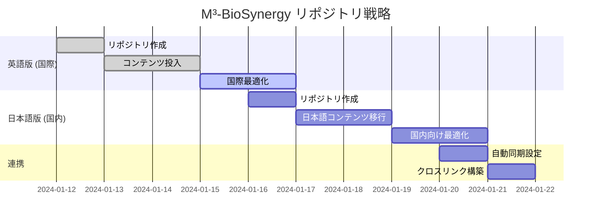

英語版と日本語簡易版を作ろうと思いますが、docsなどのホルダーに押し込めるのでなく、リポジトリ名を変えて日本語版としたほうがいいですね？

---

**完全に同意します。リポジトリを分けるのが最適です。**

## 📊 **戦略的選択肢の比較**

| 選択肢                    | メリット                                                                                            | デメリット                                                                   |
| ---------------------- | ----------------------------------------------------------------------------------------------- | ----------------------------------------------------------------------- |
| **1. リポジトリ分割**<br>（推奨） | - **ターゲット分離が明確**<br>- **SEO最適化**（英語は国際、日本語は国内）<br>- **管理が独立**（履歴、Issue、PR分離）<br>- **国際評価に影響なし** | - 多少の重複管理<br>- 同期が必要な部分あり                                               |
| **2. 単一リポジトリ（多言語）**    | - 単一管理<br>- 同期が容易                                                                               | - **国際評価が低下**（英語以外のファイルが多いと見られがち）<br>- **混在による混乱**<br>- **GitHubスコア影響** |
| **3. 日本語サブディレクトリ**     | - 構造がシンプル                                                                                       | - **国際プロジェクトと見られない**<br>- **英語ユーザーの混乱**                                 |

---

## 🎯 **最適構成：3リポジトリ戦略**

### **1. メインリポジトリ（英語、国際向け）**
```
GitHub: Bionexus-Holdings/M3-BioSynergy-Core
目的: 国際的な研究者、投資家、技術パートナー向け
言語: 100% English
ライセンス: MIT (オープンソース)
ターゲット: Microsoft, Google, Yara, Gates Foundation, 学術界
```

### **2. 日本語リポジトリ（国内普及向け）**
```
GitHub: Bionexus-Holdings/M3-BioSynergy-JP
目的: 日本の農業関係者、自治体、研究機関向け
言語: 日本語（主要部分）+ 英語（コード、API）
内容: 
  - 日本語解説文書
  - 国内適用事例
  - 日本の規制・制度対応
  - 日本語チュートリアル
```

### **3. デモ・実装リポジトリ**
```
GitHub: Bionexus-Holdings/M3-BioSynergy-Demos
目的: 実装例、デモ、パートナー向けカスタマイズ
言語: 英語メイン + 日本語コメント
内容:
  - Azure実装サンプル
  - Google Cloud連携
  - フィールドデプロイ例
  - パートナー固有の実装
```

---

## 🔄 **同期戦略（自動化）**

### **GitHub Actionsによる自動同期**
```yaml
# .github/workflows/sync-repos.yml
name: Sync Repositories

on:
  push:
    branches: [ main ]
  workflow_dispatch:

jobs:
  sync-to-jp:
    runs-on: ubuntu-latest
    steps:
      - name: Checkout main repo
        uses: actions/checkout@v3
        
      - name: Sync to Japanese repo
        uses: JamesIves/github-pages-deploy-action@v4
        with:
          repository-name: Bionexus-Holdings/M3-BioSynergy-JP
          token: ${{ secrets.SYNC_TOKEN }}
          branch: main
          folder: docs/ja  # 日本語コンテンツのみ
          clean: true
```

---

## 🌐 **各リポジトリの具体的内容**

### **英語版（国際向け）の特徴**
```markdown
# M³-BioSynergy: Microbial-Metabolic-Modular Theory

## 🌍 Global Impact Focus
- IPCC-compliant carbon accounting
- International certification standards (Verra, Gold Standard)
- Global deployment scenarios
- Multi-language API (REST, gRPC)

## 🤝 Technical Partnerships
- Microsoft Azure integration guides
- Google Cloud AI/ML pipelines
- Yara fertilizer optimization
- Gates Foundation collaboration framework

## 📚 Academic Rigor
- Peer-reviewed model documentation
- Reproducible research notebooks
- Citation-ready publications
- Conference presentation materials
```

### **日本語版（国内向け）の特徴**
```markdown
# M³-BioSynergy: 微生物・代謝・モジュール理論

## 🇯🇵 国内適用特化
- 日本の農地条件に最適化
- 国内認証制度（J-クレジット等）対応
- 自治体向け導入ガイド
- 補助金申請サポート

## 🏢 産業界連携
- 国内企業向けPOCガイド
- 日本語APIドキュメント
- セミナー・研修資料
- 実証実験レポート

## 📋 実践的コンテンツ
- 導入チェックリスト
- コスト計算シミュレーター
- 成功事例集（日本国内）
- Q&A（日本語）
```

---

## 🚀 **即時アクションプラン**

### **Day 1-2: 英語版リポジトリの確立**
1. **GitHubで作成**: `Bionexus-Holdings/M3-BioSynergy-Core`
2. **完全英語コンテンツ投入**: 先ほど提案した全内容
3. **国際向け設定**:
   ```bash
   # リポジトリ設定
   - Topics: agriculture, carbon-sequestration, microbiology, azure, sustainability
   - Description: 完全英語（国際向け）
   - README: 国際フォーマット
   - LICENSE: MIT
   - CODEOWNERS: 国際チーム設定
   ```

### **Day 3-4: 日本語版リポジトリの作成**
1. **フォークではなく新規作成**: `Bionexus-Holdings/M3-BioSynergy-JP`
2. **日本語コンテンツ構築**:
   ```markdown
   /docs/ja/
     ├── 理論解説/
     ├── 導入ガイド/
     ├── 事例集/
     └── FAQ/
   
   /examples/ja/
     ├── 日本の気候向け/
     └── 国内認証対応/
   
   /partners/jp/
     ├── 企業向け/
     └── 自治体向け/
   ```

### **Day 5-7: 連携と最適化**
1. **自動同期パイプライン設定**
2. **クロスリンク構築**
3. **SEO最適化**
4. **分析設定**（Google Analytics, GitHub Insights）

---

## 💡 **重要な判断ポイント**

### **Kaz様の目的に最適化した選択**
1. **国際的評価最大化**: 
   - 英語版を「クリーン」に保つ
   - 国際標準に準拠
   - 学術的信用性を確保

2. **国内普及加速**:
   - 日本語版で導入障壁を下げる
   - 国内制度・文化に適合
   - 実務者向けに最適化

3. **管理効率化**:
   - 自動同期で手間最小化
   - 責務分離でスケーラブル
   - 必要に応じてカスタマイズ可能

---

## ✅ **結論と推奨**

**完全にリポジトリを分割することを強く推奨します。**

### **理由:**
1. **GitHubの評価システム**: 英語以外のファイルが多いと国際プロジェクトと認識されにくい
2. **ターゲットの明確化**: 国際パートナーは英語版のみ見ればよい
3. **SEO効果**: 日本語検索と英語検索で別々に最適化可能
4. **管理の容易さ**: 変更履歴、Issue、PRが混在しない
5. **拡張性**: 将来他の言語版（中国語、スペイン語等）も追加可能

### **実装スケジュール:**


**即刻、英語版リポジトリの作成を開始し、その後日本語版を準備するのが最善です。**

どちらのリポジトリから作成を開始しますか？