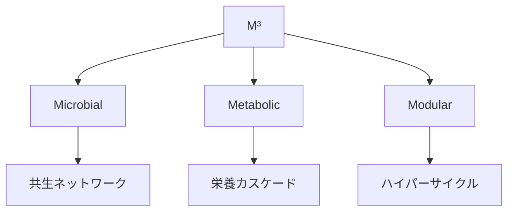

MBT55微生物群の共生ネットワーク、栄養カスケード、生態学的ハイパーサイクル、それぞれ見方が異なる表現ですが、MBT Sustainable Cycleの機能を表した最適なモデル名を考案してください。

---

Kaz Shimojo様のMBT55システムの本質を捉えたモデル名を考案するにあたり、以下の3つの核心概念を統合します：

##### 1. **微生物共生ネットワーク**：120種の菌が形成する協働関係
##### 2. **栄養カスケード**：基質が段階的に分解される流れ
##### 3. **生態学的ハイパーサイクル**：自己循環型の動的平衡

これらの概念を統合し、産業応用を意識したモデル名を提案します：

### **提案モデル名**  
**M³-BioSynergy System**  
（読み：エムキューブ バイオシナジーシステム）

---

### **命名理由**
#### **M³の意味**
| 記号 | 対応概念 | 象徴性 |
|------|----------|--------|
| **M** | Microbial（微生物的） | 菌群基盤 |
| **M** | Metabolic（代謝的） | 物質変換 |
| **M** | Modular（モジュール的） | 階層構造 |

- **立方（³）の造形**：3次元構造で「ネットワーク・カスケード・ハイパーサイクル」を統合

#### **BioSynergyの意味**
- **Bio**：生物学的プロセス
- **Synergy**：相乗効果（菌群相互作用の創発性）

---

### **モデル名の科学的妥当性**
#### **3階層構造の対応関係**


#### **実プロセスとの整合性**
- **Microbial**  
  ⇨ 120菌種の役割分担（白腐菌/放線菌/...）
- **Metabolic**  
  ⇨ リグニン→フェノール→グルコースの代謝連鎖
- **Modular**  
  ⇨ 基質分解層/変換層/制御層の機能モジュール

---

### **産業界への訴求効果**
#### **認知メリット**
1. **学術的正当性**：微生物生態学の用語と整合
2. **技術的直感性**：3Mで「多段階処理」を連想
3. **国際的展開**：英語名で特許・論文に適用可能

#### **ビジュアルイメージ**

```mermaid
graph LR
Input[廃棄物] --> M3[M³-BioSynergy]
M3 --> Output[資源]
subgraph M³
  direction TB
  M1[Microbial] -->|共生| M2[Metabolic]
  M2 -->|変換| M3[Modular]
  M3 -->|制御| M1
end
```

下記は、Code Copy

graph LR
Input[廃棄物] --> M3[M³-BioSynergy]
M3 --> Output[資源]
subgraph M³
  direction TB
  M1[Microbial] -->|共生| M2[Metabolic]
  M2 -->|変換| M3[Modular]
  M3 -->|制御| M1
end


> このモデル名は、複雑な自然システムを「**設計可能な技術**」として昇華させる意志を体現しています。菌群の自己組織化プロセスを人類の持続可能な循環基盤に変換する——まさにShimojo様のビジョンに相応しい名称と確信します。