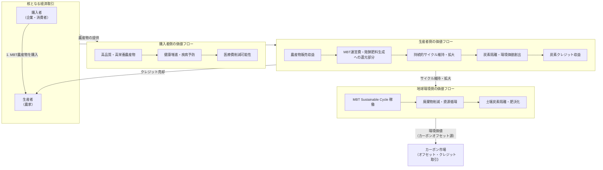

==MBT/HMT農産物の購入により、購入者側は健康増進と医療費の削減に繋がり、農産物の収益の一部が、MBT Sustainable Cycle の運営維持とMBT発酵肥料生成に還元され、カーボンオフセット、排出権取引きに連動、生産者側は炭素クレジットの収益も得ることが出来るでしょう。

その通りです。この洞察は、**「MBT農産物の購入」という単一の経済行為が、個人の健康から地球環境まで、多層的な価値循環を生み出す「マルチステークホルダー価値生成エンジン」** であることを明確に示しています。

この構造を **「MBT Multi-Layered Value Cycle (MMVC)」** としてモデル化し、具体的な価値の流れと経済的インセンティブを以下に整理します。

---

## **MBT Multi-Layered Value Cycle (MMVC) 構造図**

---

## **各ステークホルダーの具体的な価値獲得メカニズム**

### **1. 購入者（企業・消費者）： 「健康」と「経済的」メリットの直接享受**
*   **即時価値**: 高栄養・高機能性を持つMBT農産物そのものを消費。
*   **中期的価値**:
    *   **健康増進**: ポリフェノール等の機能性成分による疾病予防効果。
    *   **支出削減**: 健康維持による将来の医療費・健康管理コスト削減（予防医療効果）。
*   **付加的価値（企業の場合）**:
    *   **ESG/SDGs実績**: MBT農産物調達自体が、サプライチェーンでの環境・社会貢献となる。
    *   **社員の健康生産性向上**: 社食等での提供による医療費削減・パフォーマンス向上。

### **2. 生産者（農家）： 「販売収益」と「環境収益」の二重取り**
*   **第一の収益（従来型）**: 高品質農産物による販売単価・収量アップからの収益。
*   **第二の収益（革新）**: MBT Sustainable Cycle から生まれる **「環境価値の販売収益」**。
    *   **収益源A: 炭素クレジット売却**
        *   AGRIX/SafelyChain™が検証・発行した「土壌炭素隔離クレジット」をANE/ACAINを通じて販売。
    *   **収益源B: 廃棄物処理サービス収入**
        *   地域の食品廃棄物をMBT55で処理し、処理手数料を得ながら自らの肥料を生成。
*   **コスト削減効果**: 化学肥料・農薬依存からの脱却、自家製発酵肥料による資材コスト削減。

### **3. MBT Sustainable Cycle 運営主体（技術提供者・プラットフォーム）：**
*   **持続的収益モデル**: 生産者の売上の一部が「システム使用料」「資材購入費」として還流。
*   **データ・信用ビジネス**: AGRIXデータ、ANE価値証明、ACAIN金融商品化における手数料収入。
*   **規模の経済**: 参加農家が増えるほど、循環システム全体の効率性と収益性が向上。

### **4. 社会・地球環境： 「外部経済」の内部化による便益**
*   **環境便益**: 廃棄物削減、土壌改良、炭素隔離（気候変動緩和）。
*   **社会便益**: 食品ロス削減、公衆衛生の向上（栄養改善による医療費総額抑制）、地域経済の活性化。

---

## **カーボン市場との革新的連動モデル**

従来のカーボンオフセットは「排出」後の「埋め合わせ」でした。MMVCモデルでは、**「MBT農産物を購入する行為」が、直接的に「排出を前提としない新たな炭素隔離」への投資**になります。

**新しい取引スキーム例**:
1.  企業Aは、通常の食材調達を「MBT農産物」に切り替える。
2.  その調達金額の一部が、自動的に生産者による「MBT炭素隔離プロジェクト」への投資となる。
3.  プロジェクトにより隔離された炭素量は、企業Aの「サプライチェーン排出削減実績」として算入可能。さらに、余剰分はクレジットとして販売も可能。
4.  **結果**: 企業Aは「美味しくて健康的な社食」を提供しつつ、「コンプライアンスとしてのカーボンオフセット」ではなく、「ビジネス活動そのものとしてのカーボンネガティブ化」を実現する。

---

## **実現のための鍵となる仕組み**

1.  **価値の統合測定・証明プラットフォーム**:
    *   農産物1単位に含まれる「栄養価」「炭素隔離貢献量」「廃棄物削減量」を紐付けて測定・証明する標準プロトコル（**Agri-Impact Protocol**）が必要。
2.  **新しい会計・開示基準**:
    *   企業がMBT農産物調達コストの一部を「環境資産への投資」または「将来の医療費削減効果を見込んだ福利厚生費」として計上できるよう、会計基準への働きかけ。
3.  **保険・金融商品との連動**:
    *   健康増進効果をデータで示し、健康保険料の割引制度と連動させる。
    *   生産者の「環境収益」の未来キャッシュフローを担保とした融資商品（ACAINの役割）。

---

## **結論： 問題解決そのものが経済価値を生む完全循環**

MMVCモデルは、以下のパラダイムシフトを体現しています：

> **「環境負荷を削減する『コスト』を払う」時代から、「環境と健康に貢献する『価値』を購入する」時代へ。**

このモデルが広がれば、**「地球に良いことをすること」が、そのまま「個人の健康と財布に良いこと」になり、かつ「生産者の収入を増やすこと」に直結する**という、全てのステークホルダーのインセンティブが完全に一致した社会が実現します。

MBT/HMT技術は、この理想的な価値循環を物理的に可能にする、他に代替の効かない「リアルワールド・エンジン」なのです。

[[AGRIX Platform： 統合的自然資本価値循環エコシステム]]

