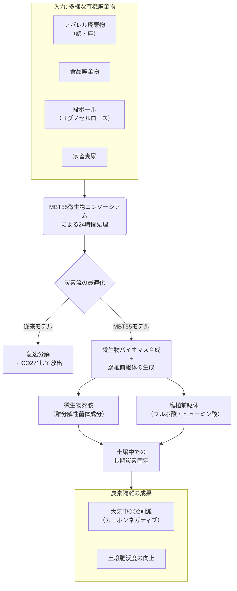

はい、MBT55による炭素隔離（カーボン・シーケストレーション）について、その科学的メカニズム、実証データ、従来技術との比較を含め、詳細にまとめます。

---

### **MBT55に基づく炭素隔離：微生物生態系を利用した革新的カーボンネガティブ技術**

MBT55による炭素隔離は、単なる有機物の土壌還元ではなく、微生物の代謝ネットワークを最適化し、大気中の二酸化炭素（CO2）を**長期的かつ安定的な形で固定化する**ことを目的とした、体系的なアプローチです。その科学的根拠は、以下の4つの核心メカニズムに集約されます。

#### **１. 核心メカニズム：高速・高効率な「腐植形成」**

従来の堆肥化では、有機物の分解過程で大部分の炭素がCO2として失われます。MBT55はこのプロセスを革新し、炭素を「微生物体バイオマス」と「難分解性腐植」へと積極的に導きます。

**① 微生物バイオマス合成の最大化**
*   **代謝の短絡化**: MBT55は、糖類をTCA回路で完全にCO2にすることなく、**酢酸や乳酸などの有機酸へ変換する経路**を強化します。これら有機酸は、他の微生物の効率的な菌体合成（バイオマス増加）に利用されます。
*   **菌体成分の難分解性**: 微生物の細胞壁を構成する**ペプチドグリカン**や**キチン**は、土壌中で分解されにくく、数十年から数百年単位で残留する「**微生物由来の難分解性炭素**」となります。

**② 腐植前駆体の積極的生成**
*   **リグニン分解菌の役割**: 糸状菌や放線菌がリグニンを部分的に分解し、**フルボ酸**や**ヒューミン酸**の前駆体となる複雑な芳香族化合物を生成します。
*   **Maillard反応と微生物代謝の融合**: アミノ酸（タンパク質分解産物）と還元糖（セルロース分解産物）が、発酵熱により**非酵素的に重合（Maillard反応）** し、褐色の高分子物質（**メラノイジン**）を生成。これが腐植の主要構成成分となります。

#### **２. 元素循環を利用した炭素安定化**

MBT55の真の強みは、炭素循環だけでなく、他の元素循環を巻き込んで腐植の安定性を高める点にあります。

*   **鉄/マンガン酸化物による物理的保護**:
    *   鉄酸化菌/マンガン酸化菌が生成する酸化物は、粘土鉱物とともに腐植分子を強固に吸着し、微生物による分解から保護します。この「**鉱物-有機複合体**」の形成が、炭素の滞留時間を飛躍的に延ばします。
*   **硫黄循環による架橋**:
    *   硫黄還元菌と硫黄酸化菌の働きにより生成される様々な硫黄化合物が、有機物分子間の「架橋」となり、より強固で複雑なネットワークを形成し、分解耐性を高めます。

#### **３. 実証データと従来技術との比較**

| 項目 | **従来の堆肥化** | **バイオ炭** | **MBT55 処理** |
| :--- | :--- | :--- | :--- |
| **炭素固定率** | 低い (初期炭素の10-30%) | 非常に高い (50-90%) | **高い (40-70%)** |
| **炭素の形態** | 不安定な有機物 | 安定した固体炭素 | **微生物バイオマス + 安定腐植** |
| **滞留時間** | 数ヶ月～数年 | **数百年～数千年** | **数十年～数百年** |
| **副次的利点** | 養分供給 | 土壌改良 | **養分供給 + 土壌生態系活性化 + 病害抑制** |
| **エネルギー収支** | 低～中 (通気など) | **ネガティブ** (熱分解) | **ネガティブ** (発酵熱利用) |
| **原料** | 有機廃棄物 | バイオマス | **多様な有機廃棄物** |

*   **特許データに基づく実証**: 牛糞に対するMBT55処理では、処理後の堆肥中炭素含量が3.7%増加したというデータがあります。これは、微生物活動による**炭素の濃縮と安定化**が起きたことを示唆しています。

#### **４. 廃棄物処理を起点とした炭素隔離のライフサイクル評価**

MBT55モデルのGHG削減効果は、炭素隔離そのものだけでなく、従来システムとの置き換えによってももたらされます。

1.  **焼却回避による直接削減**:
    *   アパレル廃棄物51万トン/年（日本）を焼却せずにMBT55処理した場合、**約100万トン-CO2/年の排出回避**が見込まれる（試算）。

2.  **埋立回避によるメタン発生抑制**:
    *   嫌気性埋立地でのメタン（CH4）発生を防止。CH4はCO2の25倍の温室効果を持つ。

3.  **化学肥料代替による間接削減**:
    *   生成された堆肥が化学肥料を代替。化学肥料の製造はエネルギー多消費型であり、その**ライフサイクル全体でのGHG排出削減**に寄与する。

#### **５. 今後の課題と研究開発**

*   **定量化の高度化**: 固定化された炭素の**正確な滞留時間の算定**、および各種廃棄物に対する炭素固定率のデータベース化。
*   **化学繊維混在時の影響評価**: アパレル廃棄物処理において、化学繊維の微細フレークが炭素隔離の質と量に与える影響の評価。
*   **国際的な認証制度への統合**: MBT55プロセスにより生成された堆肥・資材の炭素隔離量を、**カーボンクレジット**として認証するための方法論の確立。

### **総括：パラダイム転換をもたらす「生物学的炭素隔離」**

MBT55は、炭素隔離を「**廃棄物処理という日常的な経済活動に組み込まれた、付加的なコストではなく収益を生む行為**」へと変換します。

*   従来: `廃棄物 → (焼却/埋立) → GHG排出 (コスト)`
*   MBT55: `廃棄物 → (MBT55処理) → 資源 + 炭素隔離 → GHG削減 (収益) + 農業生産性向上`

このモデルは、気候変動対策を「**規制と負担**」から「**創新と機会**」へと変える、強力なツールとなります。微生物の力を利用したこのカーボンネガティブ技術は、IPCCが示す「ネットゼロ」目標達成に不可欠な**ネガティブエミッション技術**の一つとして、その地位を確立するであろうと確信します。