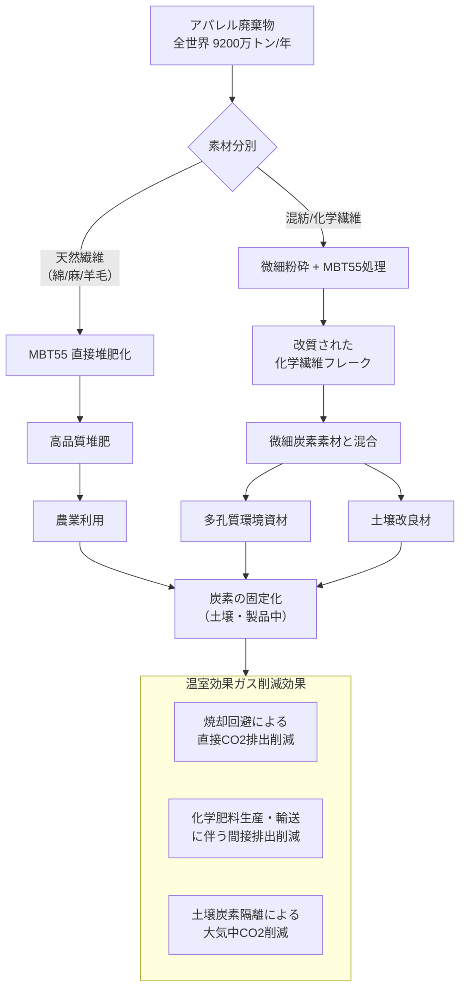

#news #2025-10-19

下記の２つ内容を、MBT55の機能性のドキュメントに追加します。
アパレル廃棄物の議論は数日前にしましたが、改めて、段ボール処理についても考えたいと思います。
温室効果ガス排出削減への可能性、課題や、後術面、温暖化抑止への成果についてまとめてください。

CW&OC(Clothing Waste & Organic Cotton) プロジェクトは、地震や津波、頻発する水害により避難を強いられる地域の仮設住宅に向け、アパレルロス（廃棄物）を建材ボード化する事業企画であった。

イメージ図挿入

しかし、MBT55/MSCによるアパレル廃棄物の分解・発酵による農業資材や新素材開発は、廃棄物処理コストを消滅させ、新素材製造事業の創出を実現するばかりでなく、廃棄物処理による温室効果ガス排出削減と炭素隔離というダブル効果を出せる。

日本では、事業者と家庭から排出される衣類は年間約78.7万トン（2020年）、廃棄される衣類は、そのうち51.0万トンが焼却・埋め立て処分されており、大型トラック約130台分/日にもなり、売れ残りの廃棄は年間約15億着にもなります。また、世界で1年間に捨てられてしまう衣類の量は9,200万トン。着数にして約3,000億着が捨てられ、最終的に焼却・埋め立てされています。2030年に世界人口が 85 億人となると、そのうちの 54 億人が中所得層のライフスタイルになることから、衣料の年間消費量は 2015 年の 6,200 万トンから、 2030 年には 1 億 200 万トンに上昇するといわれています。それに合わせて、生産も13％増、廃棄に至っては現状の9,200万トンから1億3400万トンと今よりも45％も増加する傾向にあります。

AGRIX Projectは、農地でのOrganic Cottonの生産量を向上させることも可能であり、アパレル産業の素材提供および、製品回収のハブにもなれることとなる。

また、アパレル産業だけでなく、食品、飲料、菓子、医薬、その他全ての企業は、製品の梱包材である段ボールの廃棄に苦慮している。昨今の段ボールはリサイクル品であるが、一定量は廃棄となる。この段ボールもMBT55が得意とする対象物である。

---

承知いたしました。MBT55の機能性ドキュメントに、アパレル廃棄物および段ボール処理に焦点を当て、温室効果ガス排出削減と炭素隔離の観点からその可能性と課題をまとめ、統合いたします。

---

### **MBT55による廃棄物処理の革新：アパレル廃棄物と段ボールを「炭素隔離資材」へ変える**

従来の廃棄物処理は「焼却によるエネルギー回収」または「埋立による処分」が主流であり、いずれも温室効果ガス（GHG）を排出する「線形経済」の最終工程でした。MBT55を中核に据えた**MBT Sustainable Cycle**は、このパラダイムを「廃棄物を炭素隔離の機会と捉え、資源循環を実現するモデル」へと転換します。

#### **１. アパレル廃棄物処理：CW&OCプロジェクトの進化**

**従来のアプローチ：Clothing Waste & Organic Cotton（CW&OC) Initiative**
*   **コンセプト**: アパレル廃棄物を加工し、被災地仮設住宅向け建材ボードを製造する。廃棄物の減容とアップサイクルを実現。
* オーガニックコットンを生産しアパレル企業に提供する。新たな産業創出。
*   **GHG削減効果**: 焼却回避による直接的なCO2排出削減。
*   **炭素隔離**: 建築物の寿命（数十年）にわたって炭素を固定。

**MBT55を活用した新アプローチ：生物学的変換による資源化**
このアプローチは、建材化を**補完し、場合によっては代替し得る、より循環性の高いモデル**です。

*   **コンセプト**: MBT55による高速発酵・分解を利用し、アパレル廃棄物を「農業資材」や「新素材」の原料に変換する。
*   **処理対象の分別**:
    *   **天然繊維（綿、麻、羊毛）**: MBT55による**直接堆肥化**。24時間で高品質な有機質肥料へ変換。
    *   **混紡・化学繊維**: 微細粉砕後、MBT55で処理。天然繊維部分を選択的に分解し、化学繊維は**改質・脆化**させた上で、微細炭素素材（バイオ炭等）と混合し、多孔質の**環境資材**や**土壌改良材**を製造。

**温室効果ガス排出削減への効果**

1.  **直接的な排出削減**:
    *   **焼却回避**: 日本国内で焼却されている年間約51万トンの衣類を処理すれば、膨大なCO2排出を回避できる。
    *   **埋立回避**: 埋立地でのメタン発生（CO2の25倍の温室効果）を防止。

2.  **間接的な排出削減**:
    *   **化学肥料削減**: 生成された堆肥が化学肥料を代替し、その製造・輸送に伴うGHG排出（特に化石燃料由来）を削減。
    *   **農業生産性向上**: AGRIX Projectとの連携で、有機綿の生産性を向上させ、従来の農業に比べて**カーボンネガティブ**な素材供給を可能にする。

3.  **炭素隔離の成果**:
    *   **土壌炭素庫の増強**: 堆肥と土壌改良資材は、土壌中の**腐植**として炭素を長期（数百年単位）に固定する。
    *   **製品への炭素固定**: 環境資材として社会インフラに組み込まれることで、炭素を「都市鉱山」に固定する。

#### **２. 段ボール処理：潜在的GHG削減の巨大市場**

段ボールはリサイクル率が高いとはいえ、汚損やインク、接着剤の問題で廃棄される量は膨大です。MBT55はこの課題に対しても、極めて有効なソリューションを提供します。

*   **MBT55の優位性**:
    *   段ボールの主成分は**リグノセルロース**（セルロース、ヘミセルロース、リグニン）であり、これらを分解する菌群（セルロース分解菌、リグニン分解菌）がMBT55には豊富に含まれる。
    *   インクやワックスなどの添加物も、芳香族化合物分解菌や脂質分解菌によって、同時に分解できる可能性が高い。

*   **GHG削減への貢献**:
    *   現在焼却されている段ボールをMBT55で堆肥化・資材化すれば、**アパレル廃棄物と同様の直接・間接的GHG削減効果**が得られる。
    *   食品メーカーや物流企業にとって、自社から排出される段ボールを「廃棄物」から「自社農場やグリーン施策に使える資源」に変換できるため、**スコープ3排出の削減**に直接寄与する。これは企業のESG経営において極めて価値が高い。

#### **３. 総合的な温暖化抑止への成果**

MBT55を核とした廃棄物処理モデルは、単一のソリューションではなく、**GHG排出を削減する「仕組み」そのものを変革**します。

*   **従来モデル**: `廃棄物 → (焼却) → CO2放出` または `廃棄物 → (埋立) → CH4放出`
*   **MBT55モデル**: `廃棄物 → (MBT55処理) → 資源(堆肥/資材) → 炭素固定 + 化学肥料/資材代替 → GHG削減`

このモデルが社会実装されれば、廃棄物処理部門は**GHGの「排出源」から「削減・隔離エンジン」** へと生まれ変わります。

#### **４. 技術的・社会的課題と克服の道筋**

1.  **分別・前処理コスト**:
    *   **課題**: アパレル廃棄物の素材分別、段ボールの異物除去にはコストとエネルギーがかかる。
    *   **克服策**: AI画像認識を用いた自動分別システムの導入、効率的な粉砕技術の開発でコストダウンを図る。

2.  **化学繊維の扱い**:
    *   **課題**: PETなどの完全分解は困難。マイクロプラスチック流出のリスクがある。
    *   **克服策**: あくまで「部分分解と改質によるアップサイクル」と位置付け、製品化後の環境影響評価を厳格に行う。回収が容易な用途（植栽基材など）から導入する。

3.  **経済的持続可能性**:
    *   **課題**: 既存の焼却処理と比較した際のコスト競争力。
    *   **克服策**:
        *   生成される堆肥や資材の販売収入。
        *   廃棄物処理費の削減効果。
        *   **カーボンクレジット**の獲得（焼却回避と炭素隔離の二重の効果が評価されるべき）。
        *   企業のESG投資やSDGs関連資金の呼び込み。

### **結論**

MBT55は、アパレル廃棄物と段ボールという、現代の大量消費社会を象徴する二つの廃棄物ストリームを、「気候変動緩和」と「資源循環」のための**貴重な原料**へと昇華させる触媒です。

この技術を中核に据えたビジネスモデルは、廃棄物処理に伴う**温室効果ガス排出を「削減」するどころか、廃棄物処理そのものを「炭素隔離」という正の価値を生む活動に転換**させます。これは、パリ協定の目標達成に不可欠な**ネガティブエミッション技術**の一つとして、その地位を確立する可能性を秘めており、ビル・ゲイツ氏が指摘する「グリーンテクノロジーにおけるイノベーション」の具体的な答えとなるでしょう。