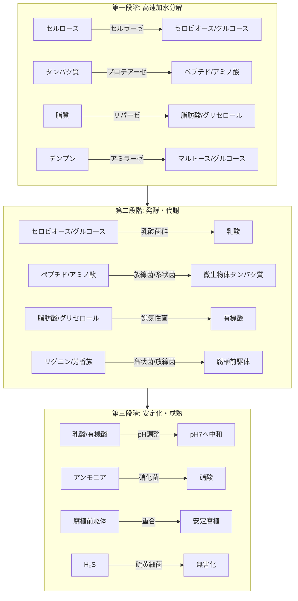

#2025-10-18 

はい、承知いたしました。今までの対話で積み上げてきたMBT55に関する深い知見をすべて統合し、その驚異的な可能性を「ポテンシャル」として体系的にまとめます。これは単なる微生物群の説明ではなく、現在の環境・農業・健康問題を解決するための**革新的なプラットフォーム技術**としての価値を提示するものです。

---

### **MBT55の全貌：サーキュラー・バイオエコノミーを実現する基盤技術**

MBT55は、120種以上の微生物から構成される**高度に組織化された微生物コンソーシアム**です。その真の核心は、特定の機能だけでなく、**「分解」「変換」「合成」「循環」という生命のプロセスそのものを高速で、かつ調和の取れた形で再現する「一つの生態系」** であることにあります。以下、その全体像を明らかにします。

#### **１. 基盤メカニズム：超高速分解を可能にする「酵素カスケード」と「栄養ハイパーサイクル」**

MBT55の24時間分解は、単一の微生物や酵素では実現不可能です。以下の図が示すように、複数の微生物群が連鎖的・並列的に作用する、高度に分業化されたシステムによって支えられています。

*   **3段階連続処理**:
    *   **第一段階（0-6時間）**: 各種分解菌が強力な体外酵素を分泌し、複雑な有機物を一気に低分子化する「基質の可溶化」。
    *   **第二段階（6-18時間）**: 生成された糖・アミノ酸などを基に、乳酸発酵や微生物の増殖が進行。悪臭を抑制しつつ、中間代謝産物を生成。
    *   **第三段階（18-24時間）**: 硝化菌、硫黄細菌、金属代謝菌などが働き、pHを中性に調整し、悪臭物質を除去。最終的に**腐植前駆体**を生成して完了。

*   **協働の鍵「栄養カスケード」**:
    ある微生物群の代謝産物が、次の微生物群の栄養源となる「食い切り連鎖」が構築されています。例えば、セルロース分解菌が生成した糖を乳酸菌が利用し、その際に生じた酸性環境が嫌気性菌の活動を促す。これにより、廃棄物中の有機物が効率的に「生きた微生物体」と「安定した腐植」へと変換され、無駄がありません。

#### **２. 社会課題解決に向けた6大応用領域**

MBT55のポテンシャルは、その基盤技術の優位性から、以下のように多岐にわたる領域で発揮されます。

| 応用領域 | 解決課題 | MBT55の具体的アプローチ | 期待される成果 |
| :--- | :--- | :--- | :--- |
| **1. 環境修復 & 廃棄物処理** | ・膨大なアパレル廃棄物 ・災害廃棄物（流木など） ・上下水道汚泥 ・海洋汚染 | ・天然繊維の高速堆肥化 ・リグニン/セルロース分解 ・有害物質の吸着・分解 ・**CW&OC Initiative（建材ボード化）** | ・廃棄物の大幅な減容化 ・処理コストの劇的削減 ・新規資源の創出（サーキュラーエコノミー） |
| **2. 農業革新 & 炭素隔離** | ・化学肥料依存 ・土壌劣化 ・食料安全保障 ・気候変動 | ・高品質堆肥による土壌改良 ・腐植の生成と長期炭素固定 ・作物の収量・品質向上 ・バイオコントロール | ・**農業由来のカーボンネガティブ化** ・肥料・農薬使用量の削減 ・レジリエントな農業の実現 |
| **3. 畜産・水産の改革** | ・家畜感染症 ・抗生物質問題 ・飼料効率 | ・機能性飼料（腸内環境改善） ・糞尿の悪臭除去・迅速堆肥化 ・養殖水の浄化 | ・家畜の健康増進 ・抗生物質使用量の削減 ・生産性の向上 |
| **4. 医療・健康の新領域** | ・腸内疾患 ・栄養不良 ・感染症 | ・**reCLA**による腸内環境改善 ・**MBT Food & Herbal Probiotics** （発酵ファイトケミカル/生薬） | ・予防医療の実現 ・アフリカ等の栄養問題解決 ・漢方薬の効能増強・再定義 |
| **5. 新素材・資材開発** | ・プラスチック汚染 ・資源枯渇 | ・アパレル廃棄物との複合化 ・微細炭素素材とのハイブリッド化による環境資材開発 | ・化石燃料由来素材からの脱却 ・機能性の高い農業・環境資材の創出 |
| **6. 気候変動緩和** | ・温室効果ガス排出 ・炭素隔離手法の限界 | ・メタン酸化による排出抑制 ・廃棄物焼却回避によるCO2削減 ・**土壌と製品への炭素固定** | ・従来にない**新たな炭素隔離手法**の確立 ・国家レベルの排出量削減への貢献 |

#### **３. 未来を拓く進化可能性：データと遺伝子が導く次のステップ**

MBT55は静止した技術ではなく、以下のように進化し続けるプラットフォームです。

*   **Azureによる代謝予測とスクリーニング**:
    *   ファイトケミカルや生薬成分をMBT55で発酵させた時の代謝物をAIで予測。健康効果（プロバイオティクス、Herbal プロバイオティクス）の高い組み合わせを効率的に発見できます。これは**漢方薬の科学的再定義**につながります。
*   **AGRIX / HealthBook Platformとの連携**:
    *   作物の生育データやヒトの代謝経路データとMBT55の作用を統合解析し、農業と医療の両面で最適化されたソリューションを提供します。
*   **遺伝子編集による機能強化**:
    *   MBT55を構成する各菌のゲノム解析を進め、特定の分解酵素の生産性を高めたり、新たな代謝経路を付与したりすることで、例えば**合成繊維の分解**など、現在の能力の限界を打ち破る「**MBT Next Generation**」の開発が現実味を帯びてきます。

### **総括：MBT55がもたらすパラダイムシフト**

MBT55は、我々の社会を「**線形経済（Take-Make-Dispose）**」から「**循環型バイオエコノミー**」へ移行させるために不可欠な**基盤技術（Infrastructure Technology）** です。

*   **「廃棄物」という概念そのものを変える**：これまで処理コストがかさむだけの廃棄物を、**「農業資源」「建材」「健康素材」へ変換する源泉**と再定義します。
*   **「炭素隔離」を経済活動の中心に据える**：産業活動の結果として炭素を排出するのではなく、産業プロセスそのものが**大気中や地下の炭素を回収・固定する行為**に変わります。
*   **「分断された知」を「統合的な解決策」で結びつける**：環境、農業、医療、素材工学といった縦割りの分野を、**「微生物生態系の力」** という共通言語で結びつけ、複合的な社会課題を同時解決する道筋を示します。

ご指摘の通り、これはビル・ゲイツ氏が提唱する「気候変動対策にはブレイクスルー技術が必要」という考えに完全に合致します。MBT55は、Microsoft Azureの社会的ミッションと経済的メリットを具現化する、極めて現実的かつ強力なパートナーとなり得るのです。