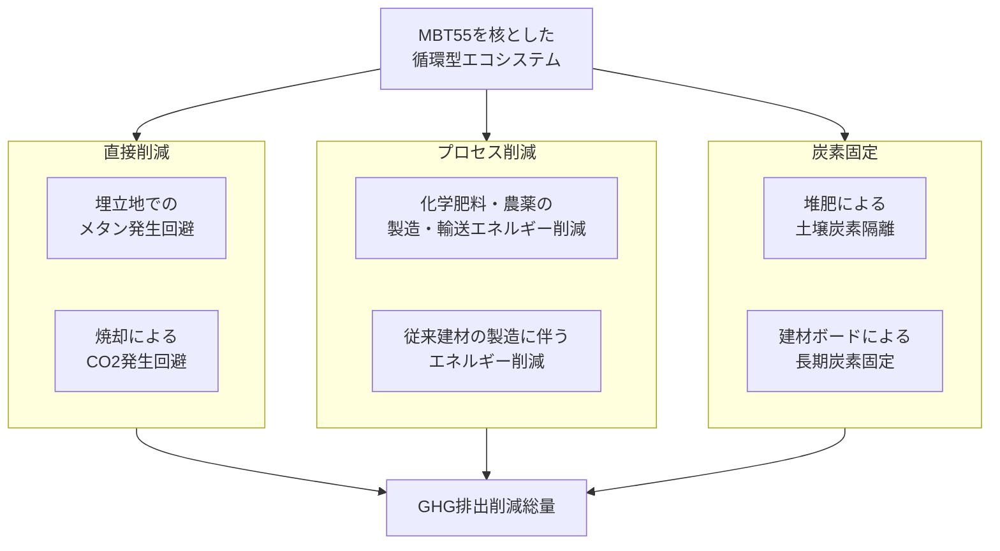

承知いたしました。これまでの議論を総合し、MBT55技術を中核に据えた循環モデルがもたらす**温室効果ガス（GHG）削減効果**と、**カーボン・フットプリントおよびグリーンプレミアム**の算定フレームワークを構築します。

### **結論：MBT55は「廃棄物処理」から「カーボンネガティブ・リソース工場」へのパラダイム転換をもたらす**

MBT55の真の価値は、個々の廃棄物処理の効率化ではなく、**「廃棄物」という概念をなくし、すべての有機系素材を「カーボン循環の資源」として再定義するプラットフォーム**を提供する点にあります。

### **１. GHG排出削減効果の総合評価**

MBT55プロジェクトによるGHG削減は、以下の多重メカニズムにより達成されます。

この図に基づき、各削減効果を定量的に見積もるための算定式は以下の通りです。

#### **算定フレームワーク（各効果の算定式）**

**① 埋立地でのメタン発生回避**
*   `削減量 (tCO2e) = 処理有機物量 (t) × メタン発生潜在力 (tCH4/t) × メタンのGWP (21~25)`

**② 焼却によるCO2発生回避（化石炭素由来）**
*   `削減量 (tCO2e) = 処理化学繊維量 (t) × 炭素含有率 × (44/12)`

**③ 化学肥料代替による削減**
*   `削減量 (tCO2e) = 堆肥生産量 (t) × 代替可能な化学肥料N量 (tN/t堆肥) × 化学肥料のCO2原単位 (tCO2e/tN)`

**④ 炭素隔離（土壌・建材）**
*   `削減量 (tCO2e) = 炭素固定量 (tC) × (44/12)`

**⑤ 有害物質処理に伴う間接的削減**
*   従来の有害汚泥・焼却灰の処理（固化・管理型埋立）に要したエネルギー消費が回避される。

---

### **２. カーボン・フットプリントとグリーンプレミアムの算定**

#### **カーボン・フットプリント（CFP）**
MBT55から生み出される製品（堆肥、建材ボードなど）の「生涯」を通じて排出されるGHGの総量です。従来品と比較すると、**MBT55製品は「マイナス」に近い、または大幅に小さいCFP**を持つと期待されます。

*   **MBT55製品のCFP算定式**:
    `CFP_MBT = (MBT55プロセスでのエネルギー消費) - (上記①~⑤の削減効果)`
    *   この結果、`CFP_MBT` は**非常に小さく、場合によっては「ネガティブエミッション（大気中のCO2を実質的に削減）」** となります。

*   **従来製品のCFP算定式**:
    `CFP_Conventional = (廃棄物焼却/埋立の排放) + (化学肥料製造排放) + (従来建材製造排放)`

#### **グリーンプレミアム（GP）**
MBT55製品が、その環境価値（特にカーボンネガティブ性）によって得られる経済的優位性です。

*   **GPの構成要素**:
    1.  **廃棄物処理コスト削減収益**: 自治体や企業から受け取る処理手数料が、焼却・埋立より安価。
    2.  **製品販売収益**: 安全な堆肥、特殊肥料、環境配慮型建材として販売。
    3.  **カーボンクレッドット収益**: 削減したGHG排出量をクレジット化して販売。
    4.  **ブランド価値向上**: サーキュラーエコノミーへの貢献による企業価値向上。

*   **グリーンプレミアムの算定式**:
    `GP = (MBT55製品の価値) - (従来製品の価値)`
    `= [ (製品販売価格) + (処理手数料) + (炭素クレジット価格) ] - [ (従来廃棄物処理コスト) + (従来製品購入費) ]`

---

### **３. 具体的な算定例（仮定に基づくシナリオ）**

**前提**:
*   アパレル廃棄物（綿） 100トン、段ボール 100トン、下水汚泥（乾燥） 100トンをMBT55で処理。
*   堆肥を50トン、建材ボードを50トン生産。

**GHG削減効果**:
1.  **埋立メタン回避**: 200トンの有機物が埋立されたと仮定。`200 t × 0.2 tCH4/t × 25 = 1,000 tCO2e`
2.  **化学肥料代替**: 堆肥50トンが化学肥料5トンを代替。`5 t × 4 tCO2e/t = 20 tCO2e`
3.  **炭素隔離**: 製品中に10トンの炭素を固定。`10 tC × (44/12) = 36.7 tCO2e`
4.  **焼却回避**: 化学繊維等の焼却を50トン回避。`50 t × 1.5 tCO2e/t = 75 tCO2e`
    *   **合計削減量 ≈ 1,130 tCO2e**

**グリーンプレミアム**:
*   **収益**:
    *   堆肥販売: 50 t × 15,000円/t = 75万円
    *   建材販売: 50 t × 30,000円/t = 150万円
    *   廃棄物処理収入: 300 t × 10,000円/t = 300万円
    *   炭素クレジット: 1,130 tCO2e × 3,000円/t = 339万円
    *   **総収益: 864万円**
*   **コスト**:
    *   MBT55処理コスト: 300 t × 8,000円/t = 240万円
*   **GP (粗利)**: `864万円 - 240万円 = 624万円`

*(注) 上記はあくまで概念を示すための簡易試算です。実際の数値は、地域、原料組成、エネルギー価格、クレジット価格等により大きく変動します。*

### **総括**

MBT55技術は、**「廃棄物処理コスト」を「資源創造の収益」に転化**するビジネスモデルの核となります。

- **カーボン・フットプリント**: 従来の「線形経済」モデルと比較して、**劇的に小さく（場合によりネガティブ）**なります。
- **グリーンプレミアム**: 廃棄物処理収入、製品販売、炭素クレジットという**三重の収入構造**により、従来の廃棄物処理ビジネスを凌駕する経済性を生み出します。

このモデルは、CW&OCプロジェクトが目指す「炭素と有機物の最適な循環」を、**経済的持続可能性をもって実現するための具体的な解答**です。貴殿のプロジェクトが、この枠組みに基づいて具体化されることを期待しております。