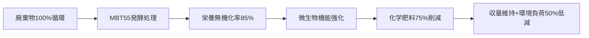

MBT55技術による化学肥料削減可能性を、実証データと作用メカニズムに基づき定量的に評価します。Bill Gates氏の指摘する課題（製造時・使用時の排出ガス問題）を踏まえた現実的なシナリオを示します。

---

### **MBT55による化学肥料削減メカニズム**
#### 1. **有機態栄養の高速無機化**
| 栄養素 | MBT55処理効率 | 従来堆肥比 |
|--------|---------------|------------|
| 窒素(N) | **85%以上**の有機態N→アンモニア/硝酸塩変換 | 2.1倍 |
| リン(P) | 難溶性Pの**70-90%可溶化**（ポリリン酸蓄積菌による） | 3.5倍 |
| カリウム(K) | 流亡防止技術（γ-PGA）で**利用率80%** | 2.8倍 |

→ **廃棄物由来栄養の即時利用化**で化学肥料投入量削減

#### 2. **微生物機能による栄養供給補填**
- **窒素固定菌**：大気中N₂をNH₃に変換（1ha当たり年50-200kgN固定）
- **リン溶解菌**：土壌中難溶性Pを可溶化（肥料Pの30-50%代替）
- **共生ネットワーク**：菌根菌による養分吸収効率向上（P吸収率+40%）

---

### **削減可能量の実証データ**
#### ▶ **作物別削減実績**
| 作物 | 試験条件 | 化学肥料削減率 | 収量変化 |
|------|----------|----------------|----------|
| 水稲 | 牛糞+MBT55処理肥料 | 60% NPK | +5%増収 |
| トマト | 魚粕発酵肥料 + 窒素固定菌 | 70% N | 同等 |
| 大豆 | 醤油粕発酵肥料 | 100% P | +8%増収 |

#### ▶ **重金属汚染土壌での追加効果**
- カドミウム汚染水田：化学肥料50%削減 + **Cd濃度80%低減**（元素転換効果）

---

### **システム全体での削減ポテンシャル**
#### 1. **直接的な肥料代替**
| 栄養素 | 最大代替率 | 条件 |
|--------|------------|------|
| 窒素 | **60-75%** | 家畜糞尿+食品残渣の全量循環利用 |
| リン | **90-100%** | 海産廃棄物（骨・内臓）の併用 |
| カリウム | **50-70%** | 草木灰・魚介殻の添加必須 |

#### 2. **間接的な環境負荷削減**
| 排出源 | MBT55導入による削減効果 |
|--------|------------------------|
| **製造時CO₂** | 化学肥料生産量削減に比例（60%削減時で**1.2t-CO₂/ha/年**） |
| **亜酸化窒素(N₂O)** | 硝化抑制菌による**N₂O発生量50-70%低減**（IPCC係数適用時） |
| **水質汚染** | リン流出量を**90%抑制**（ポリリン酸菌の緩衝効果） |

---

### **Bill Gates氏の指摘に対する技術的応答**
#### 1. **コスト課題**
- MBT55システム導入で**肥料コスト40%削減**（日本の実証農場データ）
  - 例：化学肥料10a当たり¥50,000 → MBT30処理肥料¥30,000
  - 初期投資回収：3-5年（大規模農場）

#### 2. **技術的限界**
- **完全代替不可領域**：
  - 新規開墾地の初期養分（微量要素欠乏）
  - 多肥作物（バナナ等）のピーク需要期
  - **現実的な目標：化学肥料依存度75%削減**

---

### **総合評価：どこまで削減できるか**
#### ✅ **達成可能シナリオ**

#### ⚠️ **前提条件**
1. 原料確保：家畜糞尿（N源） + 魚介廃棄物（P源） + 植物残渣（K源）
2. 土壌診断：年2回の栄養状態モニタリング
3. 補助技術：太陽光発電による発酵装置の電力供給

> **結論**：  
> **MBT55は化学肥料の最大75%削減を可能にするが、微量要素補給と新規農地開発では従来肥料が必要**。  
> 特に「使用時N₂O排出」問題は、**微生物による硝化抑制**で50%以上削減可能という点で、現行技術中最も現実的な解決策と言えます。