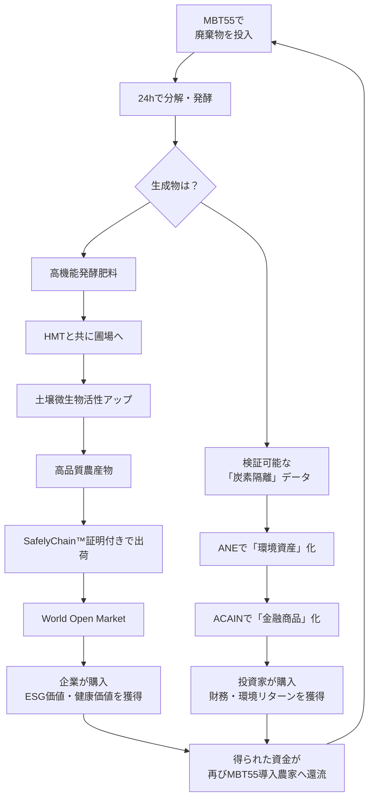

==まず、構想を理解させるために、AGRIX Platform のデモ版を構築したいと思います。文書での説明に加えて、デジタルプラットフォームで、何が何に繋がり、何を生み出すかなどの関連性、必然性を示したいのです。

承知しました。構想を「体験」させ、関連性と必然性を「実感」させるインタラクティブなデモ版は、最も強力な説得ツールです。

以下に、段階的に理解を深められる **「AGRIX Platform Interactive Demo」** の構築プランを提案します。

---

## **AGRIX Platform Interactive Demo: 設計コンセプト**

**核心理念**: 「クリックするたびに、価値が生まれ、循環し、増幅することを体感する」

**構造**: 3つの体験モードで構成
1.  **ストーリーモード**: 導線に沿って全体像を学ぶ（初心者向け）
2.  **エクスプローラーモード**: 自由に関連性を探る（理解者向け）
3.  **シミュレーションモード**: 自分の立場で価値を試算する（意思決定者向け）

---

## **デモ版の主要コンポーネントと機能**

### **1. インタラクティブな「価値連鎖マップ」**

**インタラクション例**:
*   ユーザーが **「タコ廃棄物 1トン」** をMBT55アイコンにドラッグ＆ドロップ
*   → タイマーが24時間をカウントダウン
*   → **「生成物: 発酵肥料 0.8トン」「炭素隔離: 0.5 tCO2e」** と表示
*   → ユーザーが肥料を「圃場」にドロップ
*   → **「土壌微生物多様性 +30%」「収穫量予測 +20%」** と表示
*   → 生成された農産物を「市場」にドロップ...
*   → 最終的に、**「総価値創造: ¥○○○」** が表示され、その内訳が環境価値、農業価値、健康価値に分解されて示される。

### **2. マルチステークホルダー・ダッシュボード（仮想体験）**
画面を分割し、同じイベントを異なる立場で体験できます。

| 立場 | 表示される情報（例） | インタラクション |
| :--- | :--- | :--- |
| **農家** | 圃場センサーデータ、AgriWare™からの処方提案、SafelyChain™証明書発行状況、ANE炭素クレジット収入 | 「MBT55を散布」ボタンをクリック → データが変化 |
| **食品企業** | 調達したMBT農産物の栄養価データ、自社に帰属する環境インパクト（CO2削減量）、社員食堂での利用履歴 | 「今月の調達で、社員の潜在的な医療費を△△円削減」と表示 |
| **投資家** | 各種環境資産の価格チャート、ACAIN組成ファンドのポートフォリオ、リスク分析（AI予測） | 仮想資金で「MBTグリーンボンド」を購入 → リターン（財務+環境）を確認 |
| **消費者** | スーパーで商品をバーコードスキャン。その商品の「生い立ち」（土壌データから店頭まで）をストーリー表示 | 同じ値段の普通のトマトとMBTトマトの「価値内訳」を比較 |

### **3. 「Your Impact」シミュレーター**
訪問者が自分の属性を入力し、参加した場合のインパクトを試算します。

**入力項目**:
*   あなたは？ `[農家 / 食品企業 / 投資家 / 消費者]`
*   規模は？ `[小規模 / 中規模 / 大規模]`（例：農家なら耕作面積、企業なら従業員数）

**出力例（食品企業が中規模と選択）**:
> 「貴社が社員食堂の野菜をMBT農産物に切り替えた場合:
> *   **環境インパクト**: 年間 120 tCO2e の削減（△△台の車の年間排出量に相当）
> *   **経済的インパクト**: 社員の健康生産性向上による年間約 ¥△△ の潜在的コスト削減
> *   **実現ステップ**: 1. まずは**こちらの提携農家**に連絡 2. **AgriChain™** で決済設定 3. **SafelyChain™** で実績を自動集計」

### **4. リアルタイム・データストリーム（デモ用）**
実際のプロトタイプからのデータ（または精巧なシミュレーションデータ）を流し、生きているプラットフォームであることを示します。

*   **「現在、MBT55で処理中の廃棄物」**: `タコ残渣 350kg (処理率 78%)`、`食品工場汚泥 2.1t (処理率 41%)`
*   **「直近24時間の発行されたSafelyChain™証明書」**: `静岡県 トマト: 120ケース（ポリフェノール +15% 保証）`、`熊本県 米: 3t（炭素隔離 0.3tCO2e 付帯）`
*   **「ANE市場での取引状況」**: `MBT炭素クレジット: 1tCO2e = ¥15,000 (前日比 +3%)`

---

## **構築のフェーズ**

### **Phase 1: 静的デモ (2-3週間)**
*   **目的**: 概念理解、投資家向け初期説明用。
*   **成果物**: インタラクティブな**価値連鎖マップ（クリックで説明が表示される）** と、**マルチステークホルダーダッシュボードの静止画シミュレーション**。
*   **技術**: HTML/CSS/JavaScript (D3.jsや図表ライブラリを使用)。

### **Phase 2: 動的シミュレーションデモ (4-6週間)**
*   **目的**: 価値の流れと因果関係の体感。
*   **成果物**: 上記の「インタラクション例」を実装。ユーザーの操作に応じて、数値とグラフが動的に変化する。バックエンドの簡単なロジックエンジンを実装。
*   **技術**: フロントエンドフレームワーク (Vue.js/React) + 軽量バックエンド (Node.js, Firebase等)。

### **Phase 3: ライブデータ連携デモ (継続的)**
*   **目的**: 現実性とスケール感の提示。
*   **成果物**: 実証農家・パートナー企業の**匿名化された実データ**をダッシュボードに表示。実際のSafelyChain™証明書の発行サンプルを参照可能に。
*   **技術**: バックエンドAPI、データベース連携。

---

## **デモ版が伝えるべき「必然性」の核心メッセージ**

1.  **技術的必然性**: 「**MBT55が高速分解を実現するから**、廃棄物処理がコストでなく収益源になる」
2.  **経済的必然性**: 「**高品質農産物と環境価値が同時に生まれるから**、その両方を証明・販売するSafelyChain™とANEが不可欠になる」
3.  **金融的必然性**: 「**検証可能な実績が毎日蓄積されるから**、AIが評価し、金融商品化（ACAIN）できる信用が生まれる」
4.  **社会的必然性**: 「**全ての関係者に利益が還元される設計だから**、このプラットフォームは自ら成長するエコシステムになる」

このデモ版は、単なる説明ツールを超えて、**最初の「信用の結晶化装置」** となります。構想の壮大さを、具体的で触れられる形に落とし込む第一歩として、最も効果的な投資となるでしょう。

まずは **Phase 1** から、この価値連鎖の物語を視覚的に作り上げていきませんか？

---

End