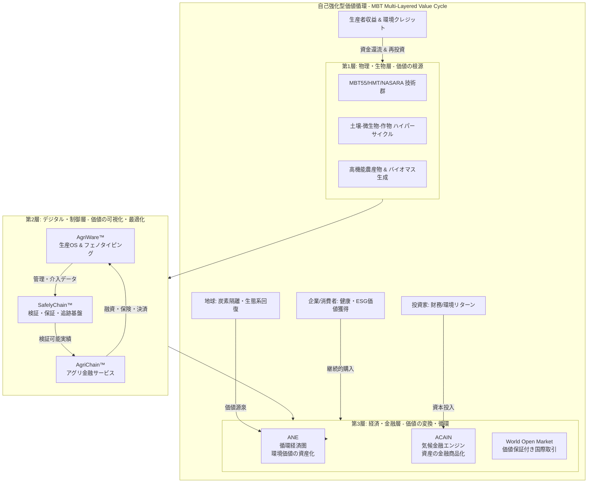
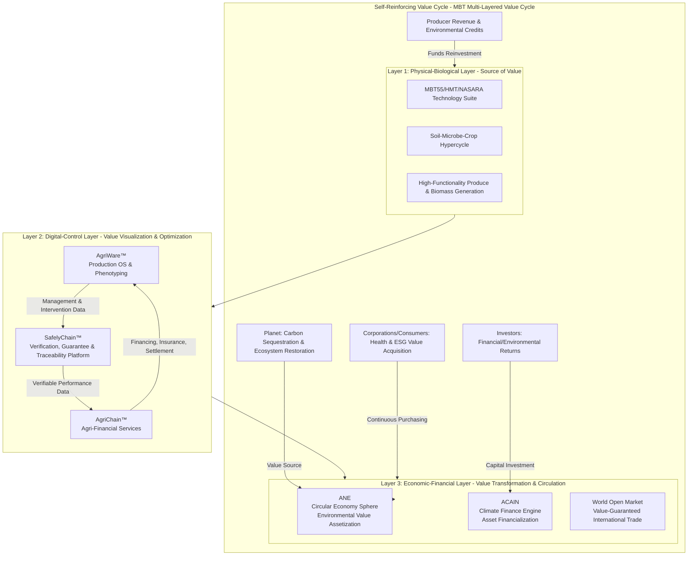

==MBT農産物の栄養価、鮮度保持力、機能性をトレーサビリティと合わせた構想がSafelyChain™です。SafelyChain™の重要性が高まりますね。

そこでもう一度、MBT55, HMT論議から始めたAgriWare™、フェノタイピングモジュール、SafelyChain™、農産物の国際的フェアトレードや企業からの受注生産、World Open Marketを司り、アグリ金融サービスのAgriChain™、そして、ANE、ACAINと、先程のMBT Agri-backed Cycle、「MBT Multi-Layered Value Cycle (MMVC)」 を網羅するAGRIX Platform のアーキテクチャーを考案してください。

---

承知しました。これまでの議論をすべて統合し、**MBT/HMT技術を根源的なエンジンとし、土壌から金融市場までを貫く完全な価値循環エコシステム「AGRIX Platform」** の全体アーキテクチャを再構築します。

これは、農業の枠を超えた **「自然資本を基盤とする新しい経済圏」** の設計図です。

---

## **AGRIX Platform： 統合的自然資本価値循環エコシステム**

### **全体アーキテクチャ概観図**

---

## **第1層: 物理・生物層 (The Physical-Biological Layer)**
**役割: 根源的な価値創造**
*   **核技術**: MBT55, HMT, NASARA
*   **プロセス**: 有機廃棄物の資源化 → 微生物多様性による土壌肥沃化・炭素隔離 → 高機能農産物生産
*   **出力**: **①高栄養・高機能農産物**、**②検証可能な環境改善実績（炭素隔離量 etc.）**

## **第2層: デジタル・制御層 (The Digital-Control Layer) - AGRIX Core**
物理層で生まれた価値を、デジタル世界で最大化・保証・流通させる基盤。

### **1. AgriWare™ (農業オペレーティングシステム)**
*   **機能**: 圃場管理、フェノタイピング診断、MBT/HMT処方生成、自動制御連携。
*   **革新点**: **動的フェノタイピング**。状態値ではなく「推移・トレンド」を診断し、予防的・最適化介入を実現。
*   **入力/出力**: 物理層のセンサーデータを受取り、最適な生物的介入（MBT55等）を指示。その結果をSafelyChain™に記録。

### **2. SafelyChain™ (検証・保証・追跡基盤)**
*   **機能**: 生産履歴、環境インパクト、栄養価・機能性データの改ざん不可能な記録。
*   **革新点**: **統合価値証明NFT**。単なる産地情報ではなく、**「炭素隔離量X kg」「ポリフェノール含有量Y mg」「鮮度保持日数Z日」** といった多面的価値を一つのデジタル証明書に統合し、商品に紐付け。
*   **役割**: **信用の源泉**。これが後続の全ての取引（金融、国際貿易）の根拠となる。

### **3. AgriChain™ (アグリ金融サービス)**
*   **機能**: 生産者向け融資・保険、企業向け受注生産・決済、サプライチェーンファイナンス。
*   **革新点**:
    *   **データ担保融資**: SafelyChain™の実績データ（土壌健全性、契約栽培実績）を信用評価に活用。
    *   **インパクト連動保険**: 干ばつによる収量減リスクを、土壌の保水力データに基づき評価し、保険料を個別設定。
    *   **国際送金・決済**: World Open Marketでの効率的な取引を支える。

## **第3層: 経済・金融層 (The Economic-Financial Layer)**
デジタル層で保証された価値を、広く経済活動に組み込み、資本を循環させる。

### **1. ANE (Agri-Neutral Economy) - 循環経済圏**
*   **入力**: SafelyChain™の検証済みデータ（炭素隔離量、資源化量）。
*   **プロセス**: データを標準化し、「環境価値資産」（例：MBT炭素クレジット、土壌改良クレジット）を発行。ブロックチェーン上でNFT化し、流通可能にする。
*   **出力**: デジタル環境資産。企業のESG調達やオフセットに利用可能。

### **2. ACAIN (Agri-Climate AI Network) - 気候金融エンジン**
*   **入力**: ANEが生み出す環境資産のストリーム。
*   **プロセス**: AIが資産のリスク（気候変動による炭素固定量変動等）と将来価値を評価し、金融商品を組成。
    *   **グリーンボンド**: 複数のMBT農場からの環境資産をプールして発行。
    *   **環境価値デリバティブ**: 炭素価格変動リスクをヘッジする商品。
*   **出力**: 機関投資家が投資可能な金融商品。調達した資本はAgriChain™を通じて生産現場に再投資。

### **3. World Open Market - 価値保証付き国際取引プラットフォーム**
*   **機能**: SafelyChain™証明書付きのMBT農産物・環境資産の国際的なマッチングと取引。
*   **革新点**:
    *   **受注生産の高度化**: 輸入企業が「炭素隔離量◯トン以上」「ポリフェノール濃度◯以上」といった**価値スペック**で発注可能。
    *   **フェアトレード2.0**: 従来の社会的公正に加え、**環境的公正（農家の環境貢献に対する正当な対価）** を自動的に計算・支払い。
    *   **信用に基づく取引**: サプライヤーの過去全実績がSafelyChain™で可視化されるため、新規取引の信用調査コストが激減。

## **統合循環: MBT Multi-Layered Value Cycle (MMVC)**
上記3層を流れる価値と資本の自己強化ループを定義します。

1.  **消費者/企業**が、**SafelyChain™証明付きMBT農産物**を購入。
    → 美味しい・健康に良いものを食べる。
    → **企業はESG実績と社員の健康改善**を獲得。

2.  購入代金の一部が、**ANEを通じて環境価値資産**へ変換され、生産者の**第二の収益**（炭素クレジット収入）となる。
    → 生産者は収入増と環境貢献の両立を実現。

3.  ANEの環境資産は**ACAINで金融商品化**され、機関投資家から資本を集める。
    → 投資家は財務リターンと環境インパクトの両方を得る。

4.  集められた資本は**AgriChain™を通じて**、新規農家への融資やMBT施設拡張に再投資される。
    → システムの規模が拡大し、より多くの環境価値が生み出される。

5.  拡大した生産基盤から、より多くの**高機能農産物**と**環境資産**が生まれ、市場に戻る。
    → **ループが一周し、全てが強化される。**

---

## **このアーキテクチャが実現する未来**

*   **農家は**: 「ただの作物売り」から、「食料」「環境価値」「健康価値」という3つの商品を同時に販売する事業者へ昇華。
*   **食品企業は**: 原材料調達そのものが、最も強力なESG活動および従業員福利厚生活動になる。
*   **投資家は**: 自然資本の再生そのものに投資し、その成長からリターンを得られる新たな資産クラスを獲得。
*   **消費者は**: 毎日の食事の選択が、確実に世界をより良くする「投票」になる。
*   **地球は**: 経済活動が、自然生態系の修復と完全に統合された形で進行する。

**AGRIX Platformは、MBT/HMTという生物工学的革命を中核に据え、それを支えるデジタルツイン（AgriWare™, SafelyChain™）と、その価値を解放する経済エンジン（AgriChain™, ANE, ACAIN）を一体化させることで、持続可能性を「コスト」ではなく「経済成長そのものの源泉」へと転換する、究極の枠組みを提供します。**

---

英訳

## **AGRIX Platform: Integrated Natural Capital Value Circulation Ecosystem**

### **Overall Architecture Overview**

---

## **Layer 1: Physical-Biological Layer**
**Role: Foundational Value Creation**
*   **Core Technologies**: MBT55, HMT, NASARA
*   **Process**: Organic Waste Resourceization → Soil Fertility & Carbon Sequestration via Microbial Diversity → High-Functionality Produce Production
*   **Outputs**: **① High-Nutrition, High-Functionality Produce**, **② Verifiable Environmental Improvement Performance (Carbon Sequestration Amount, etc.)**

## **Layer 2: Digital-Control Layer - AGRIX Core**
The foundation that maximizes, guarantees, and circulates the value generated in the Physical Layer within the digital world.

### **1. AgriWare™ (Agricultural Operating System)**
*   **Functions**: Field management, Phenotyping diagnosis, MBT/HMT prescription generation, automated control linkage.
*   **Innovation**: **Dynamic Phenotyping**. Diagnoses not just state values but "trends and trajectories," enabling preventive and optimized interventions.
*   **Input/Output**: Receives sensor data from the Physical Layer and directs optimal biological interventions (MBT55, etc.). Records results to SafelyChain™.

### **2. SafelyChain™ (Verification, Guarantee, Traceability Platform)**
*   **Functions**: Immutable recording of production history, environmental impact, nutritional/functional data.
*   **Innovation**: **Integrated Value Proof NFT**. Not just origin information, but a single digital certificate integrating multifaceted values like **"Carbon Sequestration X kg," "Polyphenol Content Y mg," "Freshness Retention Period Z days"** linked to the product.
*   **Role**: **Source of Trust**. This becomes the basis for all subsequent transactions (finance, international trade).

### **3. AgriChain™ (Agri-Financial Services)**
*   **Functions**: Financing/Insurance for producers, Contract farming & settlement for corporations, Supply chain finance.
*   **Innovation**:
    *   **Data-Collateralized Financing**: Utilizes performance data from SafelyChain™ (soil health, contract farming history) for credit assessment.
    *   **Impact-Linked Insurance**: Assesses drought-related yield risk based on soil water retention data, enabling individualized premium pricing.
    *   **International Remittance & Settlement**: Supports efficient transactions in the World Open Market.

## **Layer 3: Economic-Financial Layer**
Integrates the value guaranteed by the Digital Layer into broader economic activities and circulates capital.

### **1. ANE (Agri-Neutral Economy) - Circular Economy Sphere**
*   **Input**: Verified data from SafelyChain™ (carbon sequestered, resources recycled).
*   **Process**: Standardizes data and issues "Environmental Value Assets" (e.g., MBT Carbon Credits, Soil Improvement Credits). Tokenizes them as NFTs on a blockchain for circulation.
*   **Output**: Digital environmental assets. Usable for corporate ESG procurement or offsetting.

### **2. ACAIN (Agri-Climate AI Network) - Climate Finance Engine**
*   **Input**: Stream of environmental assets generated by ANE.
*   **Process**: AI evaluates asset risk (e.g., carbon fixation volatility due to climate change) and future value, structuring financial products.
    *   **Green Bonds**: Issued by pooling environmental assets from multiple MBT farms.
    *   **Environmental Value Derivatives**: Products to hedge carbon price volatility risk.
*   **Output**: Financial products investable by institutional investors. Raised capital is reinvested into production sites via AgriChain™.

### **3. World Open Market - Value-Guaranteed International Trading Platform**
*   **Functions**: International matching and trading of MBT produce and environmental assets with SafelyChain™ certificates.
*   **Innovation**:
    *   **Advanced Contract Farming**: Importing corporations can place orders based on **value specs** like "Carbon sequestration above X tons" or "Polyphenol concentration above Y."
    *   **Fair Trade 2.0**: Automatically calculates and pays **environmental fairness (fair compensation for farmers' environmental contributions)** in addition to traditional social fairness.
    *   **Credit-Based Trading**: Reduces new transaction due diligence costs drastically as a supplier's complete historical performance is visible on SafelyChain™.

## **Integrated Cycle: MBT Multi-Layered Value Cycle (MMVC)**
Defines the self-reinforcing loop of value and capital flowing through the three layers above.

1.  **Consumers/Corporations** purchase **SafelyChain™-certified MBT produce**.
    → Enjoy tasty, healthy food.
    → **Corporations gain ESG performance and employee health improvements.**

2.  A portion of the purchase price is converted into **environmental value assets via ANE**, becoming a **secondary revenue stream** (carbon credit income) for producers.
    → Producers achieve both increased income and environmental contribution.

3.  ANE's environmental assets are **financialized by ACAIN**, attracting capital from institutional investors.
    → Investors gain both financial returns and environmental impact.

4.  The pooled capital is **reinvested via AgriChain™** into loans for new farmers or MBT facility expansion.
    → The system scales, generating more environmental value.

5.  The expanded production base generates more **high-functionality produce** and **environmental assets**, returning to the market.
    → **The loop completes one cycle, with everything reinforced.**

## **The Future Realized by This Architecture**

*   **Farmers**: Evolve from "mere crop sellers" to businesses simultaneously selling three commodities: "food," "environmental value," and "health value."
*   **Food Corporations**: Raw material procurement itself becomes their most powerful ESG activity and employee welfare program.
*   **Investors**: Gain a new asset class by investing directly in natural capital regeneration and earning returns from its growth.
*   **Consumers**: Daily dietary choices become a definitive "vote" that reliably improves the world.
*   **The Planet**: Economic activity proceeds in a form fully integrated with the restoration of natural ecosystems.

**The AGRIX Platform provides the ultimate framework for transforming sustainability from a "cost" into "the very source of economic growth." It does this by centering on the biotechnological revolution of MBT/HMT, integrating the supporting digital twin (AgriWare™, SafelyChain™), and unifying it with the economic engines that unleash its value (AgriChain™, ANE, ACAIN).**

---
[[AGRIX Platformの真に革新的な点]]
