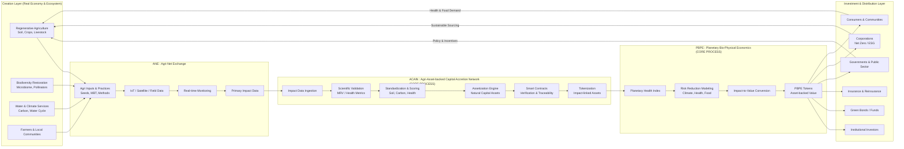

![[Pasted image 20260107211817.png]]

上記のAGRIXのビジネスモデルを、Mermaid記法のフローチャートで表現してください。特に[コアプロセス]の部分を詳細に描画してください。

#AGRIX 

---

以下に、**AGRIXビジネスモデル（ANE / ACAIN / PBPE）**を
**Mermaid記法のフローチャート**として整理します。
ご要望どおり、**［コアプロセス］（ANE→ACAIN→PBPE）**を詳細に描画しています。

---

## 全体構造の考え方（要約）

* **ANE**：実体経済（農業・生態系・データ）を生成・接続
* **ACAIN**：生成価値を「検証・標準化・金融資産化」
* **PBPE**：生態系価値を経済価値へ自動変換（インパクト金融エンジン）

---

## Mermaid フローチャート（詳細版）



---

## ［コアプロセス］のポイント（概念整理）

### ACAIN（価値の金融化）

* **データ → 科学 → 資産**
* MRV・HealthBook・土壌炭素・腸内環境・栄養指標などを統合
* 「自然資本」を**検証可能な金融資産**へ変換

### PBPE（価値の自動換算）

* **Planetary Health → 経済価値**
* 医療費削減、保険リスク低下、気候リスク回避を定量化
* PBPE Tokenとして市場・政策・金融へ接続

---

## 次の展開案（必要なら）

* 投資家向け **1枚スライド版**
* Gates / IFAD / 保険業界向け **ユースケース分岐図**
* 数式（PBPE変換関数）との対応図

ご希望があれば、**このMermaidをPowerPoint用図解構造**や
**ホワイトペーパー図（Nature Finance向け）**にも落とし込みます。


---

統合AGRIX Platform を更に進化・深化させる独創的なストラクチャーを考案してください。0107

---

以下は、**統合AGRIX Platform（ANE / ACAIN / PBPE）**を
**「次の文明OS」レベルへ進化・深化させるための、独創的かつ実装可能なストラクチャー案（0107版）**です。
これまで和彦 下條さんが構想されてきた **MBT55・HealthBook・ハイパーサイクル・PBPE** を前提に、
「思想 × 数理 × 制度 × 実装」が一体化する構造として整理しています。

---

# AGRIX-Ω（オメガ）構造

### ― Planetary Health as a Living Financial System ―

---

## Ⅰ. 中核思想の進化

### 🔁「循環」から **自己進化（Autopoiesis）** へ

従来：

> 再生型農業 → インパクト計測 → 金融化 → 再投資

進化後：

> **生命システム自身が“価値生成主体”となり、
> 経済・政策・技術を再設計する**

AGRIXを
**プラットフォーム**ではなく
👉 **「生きている経済OS（Living Economic OS）」**として再定義します。

---

## Ⅱ. 新・五層統合ストラクチャー（AGRIX-Ω）

```
[Ω0] Biosphere Kernel（生命カーネル）
[Ω1] Cognitive Layer（意味・知能）
[Ω2] Verification Layer（真実化）
[Ω3] Economic Layer（価値化）
[Ω4] Governance Layer（制度化）
```

---

## Ω0｜Biosphere Kernel

### 🌱「生命そのもの」をOSの中核へ

**新概念：Bio-State Vector（BSV）**

* 土壌微生物多様性
* 植物フェノタイプ
* 人体腸内・代謝指標（HealthBook）
* 水・炭素・ミネラル循環

➡ これらを**統一ベクトル**として扱う
➡ **PBPE変換の最小単位**

> 🔑 お金ではなく「生命状態」が最初の変数

---

## Ω1｜Cognitive Layer（意味と知能）

### 🧠 AGRIX Cognitive Twin™

**特徴**

* 農地・流域・人体・都市ごとに
  **意味理解型デジタルツイン**を生成
* 単なる予測ではなく
  **「なぜ価値が生まれたか」を説明可能**

**統合要素**

* MBT55ハイパーサイクル
* 栄養カスケード理論
* NaCl原子転換モデル（構造保存）

👉 **金融・政策決定の“説明責任AI”**

---

## Ω2｜Verification Layer（真実化層）

### 🔐 Proof of Life（PoL）

ブロックチェーンを超えた
**新しいコンセンサスメカニズム**

| 従来             | AGRIX-Ω               |
| -------------- | --------------------- |
| Proof of Work  | Proof of Life         |
| Proof of Stake | Proof of Regeneration |

**検証対象**

* 生命機能が「改善したか」
* システム全体の**エントロピーが下がったか**
* 偽のESGを排除できているか

👉 **ACAINの進化形**

---

## Ω3｜Economic Layer（価値化層）

### 💱 PBPE-X（拡張型）

**新機能：多次元価値変換**

```
生命改善 ΔL
  ↓
医療費削減 ΔH
保険損失低下 ΔI
気候リスク回避 ΔC
社会安定性 ΔS
  ↓
統合価値 VΩ
```

#### 新金融商品

* PBPE Sovereign Tokens（国家）
* PBPE Health Bonds（医療）
* PBPE Food Security Derivatives（食料）
* PBPE Insurance Swaps（再保険）

👉 **GDPの代替指標そのもの**

---

## Ω4｜Governance Layer（制度化層）

### 🏛 Bio-Constitution Engine

**国家・国際機関向け機能**

* 「自然・人体・未来世代」を
  **ステークホルダーとして定義**
* 政策を **PBPEスコア連動**で自動調整

**導入先**

* IFAD / FAO / WHO
* 気候脆弱国の国家予算
* 医療保険制度
* 年金・社会保障

👉 **法律・財政の自動最適化**

---

## Ⅲ. AGRIX-Ωの決定的独創性

### ✨ 世界初の特徴

1. **生命が担保になる経済**
2. **医療・農業・金融の完全統合**
3. **ESGを不要にするESG**
4. **AIが価値を説明できる**
5. **国家OSとして移植可能**

---

## Ⅳ. ゲイツ財団・IFAD向けの一文定義（英語）

> **AGRIX-Ω is a living planetary operating system that converts verified improvements in biological and human health into sovereign-grade economic value, enabling governments, investors, and communities to co-invest in life itself.**

---

## Ⅴ. 次のアクション（0107以降）

* 🔷 Ω構造の **1枚概念図**
* 🔷 PBPE変換の**数式モデル**
* 🔷 国家導入シナリオ（アフリカ／ASEAN）
* 🔷 Microsoft Azure × AGRIX-Ω 実装アーキテクチャ

どこから深掘りしますか？
**「思想」「数式」「政策」「投資」**のどれからでも続けられます。
