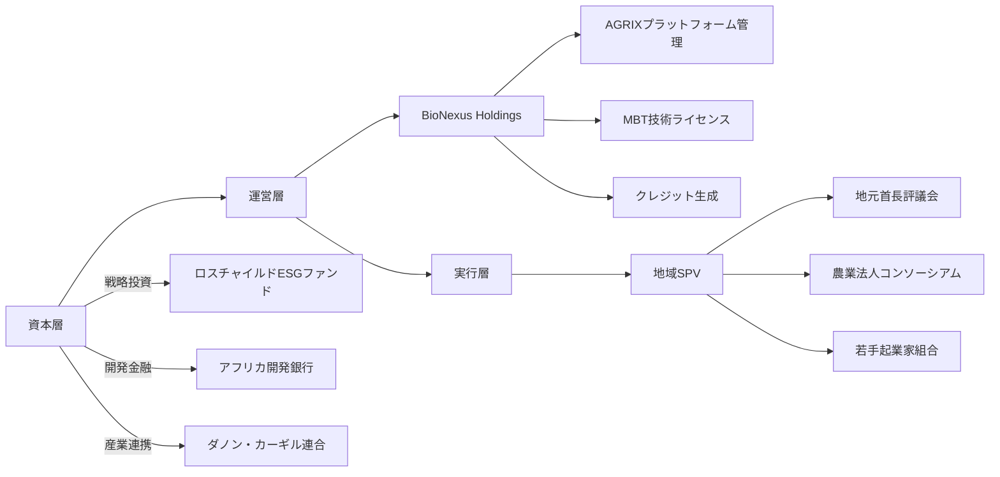
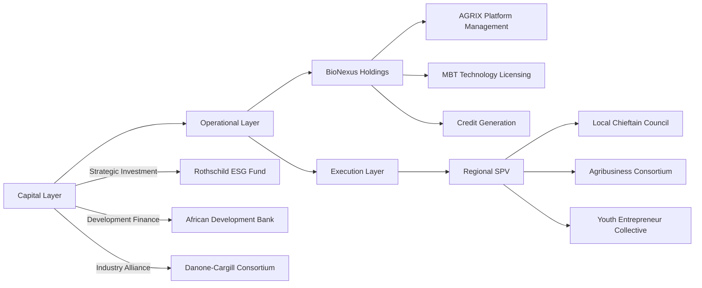
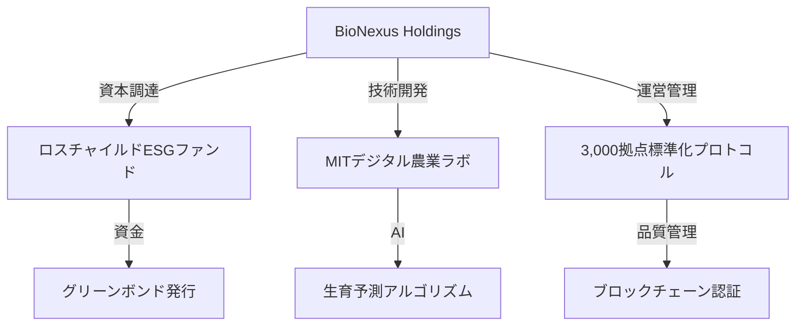
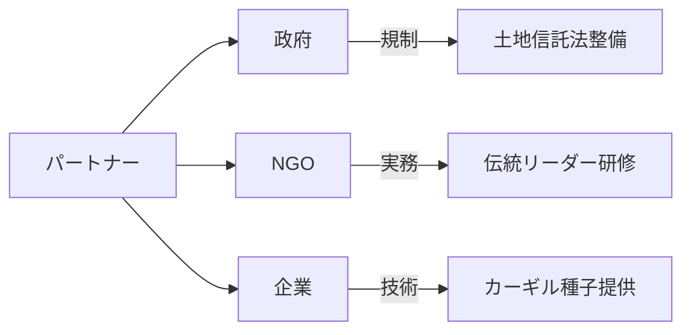
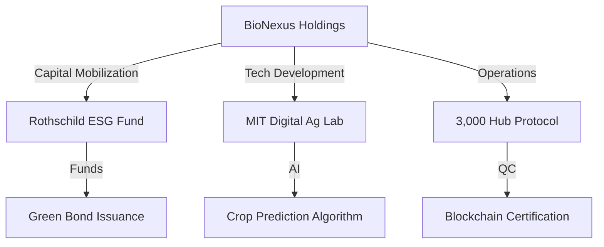
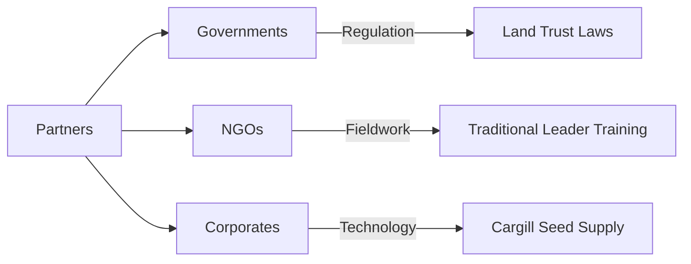
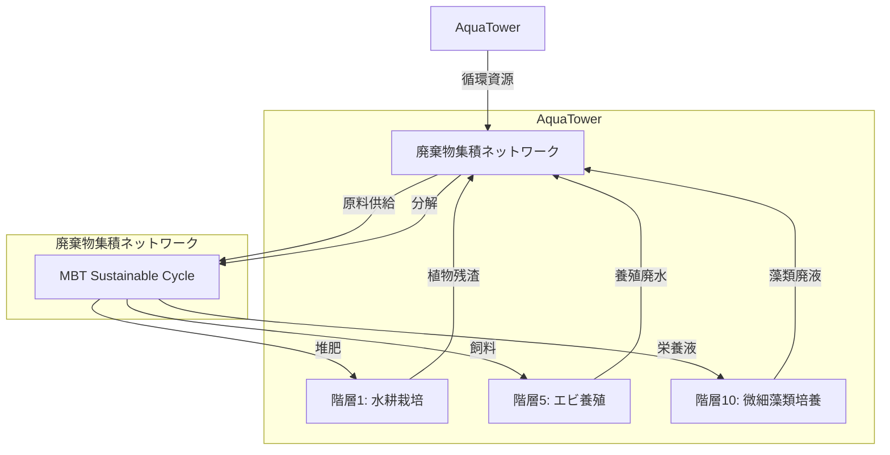
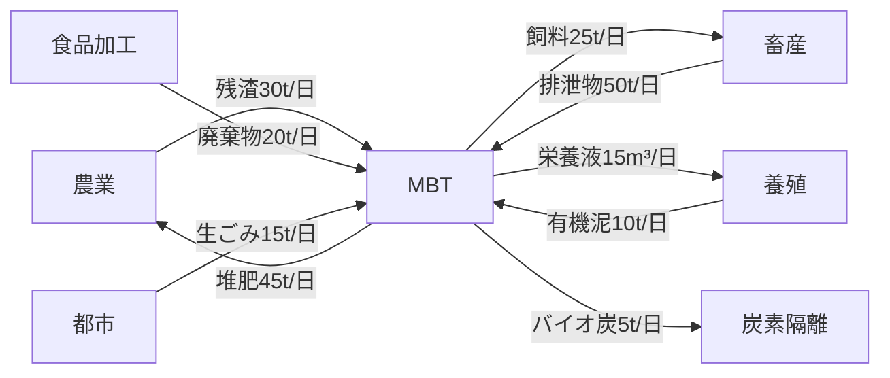
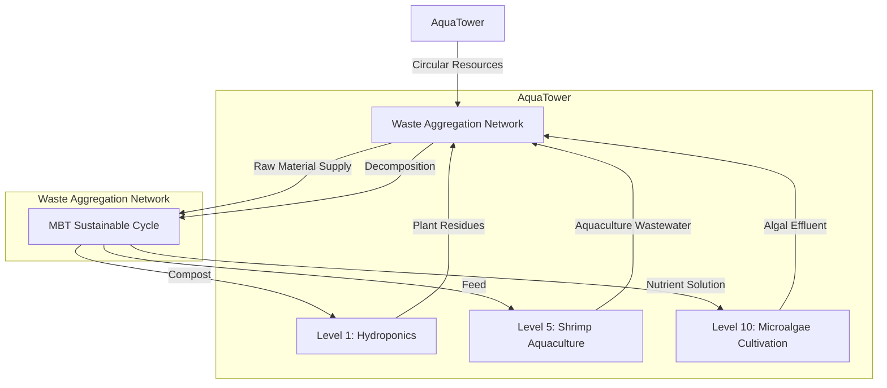

以下は、ロスチャイルド財団の戦略的優先事項とアフリカの現実を踏まえたBioValley運営組織の専門的提言です。

---

### **1. BioValley運営母体の最適モデル**
#### **「三位一体ハイブリッド構造」**


#### **設計思想**
- **資本層**：ロスチャイルド財団が「触媒資本」となり、産業資本と開発金融を融合
- **運営層**：BioNexusが「デジタル神経系」を構築し、3,000拠点の標準化を管理
- **実行層**：現地の伝統的権威（首長）と近代的農業経営者を融合したガバナンス

---

### **2. 運営組織の具体的構成**
#### **「3階層5機能」モデル**
| 階層 | 機能 | 構成要素 | 役割 |
|---|---|---|---|
| **中央戦略本部** | 資本調達<br>テック開発 | ロスチャイルド構造化金融チーム<br>MITデジタル農業ラボ | カーボンプライシング設計<br>AI生育予測モデル開発 |
| **地域統括センター** | 適応化調整<br>リスク管理 | 文化人類学者×農学者チーム<br>スイス再保険現地支部 | 部族別耕作暦データベース構築<br>旱魃パラメトリック保険設計 |
| **現地ユニット** | 生産実行<br>コミュニティエンゲージメント | 地元長老評議会<br>女性農業起業家グループ<br>MBT技術伝道師 | 伝統農法とMBTの融合<br>収益分配メカニズム運営 |

---

### **3. 経営モデルの革新性**
#### **「デジタル部族経済」コンセプト**
1. **土地信託制度**：
   - 部族共有地をブロックチェーンでデジタル登記
   - 収益の20%をコミュニティ再投資基金に自動分配

2. **二重インセンティブ**：
   - 基本報酬：収量ベース現金支払い
   - 追加報酬：炭素隔離量に連動したNFTトークン付与

3. **次世代教育**：
   - 「AGRIXアカデミー」でデジタル農業×伝統知を融合教育
   - 優秀卒業生を「MBTアンバサダー」として起業支援

---

### **4. 戦略的売却先の再定義**
#### **「5段階エクジット・ラダー」**
| フェーズ | 売却対象 | 具体例 | 価値創出 |
|---|---|---|---|
| **初期** | インフラ資産 | ブルックフィールド資産管理<br>マッキンゼー・インフラファンド | 灌漑施設のREIT化 |
| **成長** | データ権益 | パレンティア・グローバル<br>シンガポールGIC | 衛星生育データ販売 |
| **成熟** | バイオ資産 | バイエル・ダイバジェン<br>ビル&メリンダゲイツ財団 | 微生物叢データバンク |
| **拡張** | 認証権利 | ベライゾン・ブロックチェーン<br>DNV GL | 炭素クレジット検証事業 |
| **最終** | ブランド価値 | LVMH農業部門<br>ネスレ・ラクサル | プレミアム農産物商標 |

---

### **5. ロスチャイルド財団への戦的提言**
#### **「土壌金融（Soil Finance）」イニシアチブ**
4. **動的債務株式転換（DDEC）**：
   - 土壌有機炭素1%増加ごとに債務10%を株式化
   - 例：$10M融資 → 炭素2%増で$2Mがエクイティに転換

5. **気候移民対応基金**：
   - 農地再生地域に「気候難民優先雇用枠」を設定
   - EU移民政策予算と連動した債券発行

6. **伝統知デリバティブ**：
   - 部族の固有農法を知的財産化
   - 例：マサイ族の放牧パターンをAI飼料配合アルゴリズムに転用

---

### **6. リスク対応の超合理的戦略**
#### **「逆説的保険モデル」**
- **干ばつリスク転嫁**：
  - 降雨量不足時に発動する「旱魃債権」をETHブロックチェーンで発行
  - 投資家がリスクを購入、農家は事前に流動性を確保

- **政治リスク分散**：
  - 1拠点あたり3カ国に跨るクロスボーダー運営
  - 例：ナイジェリア・ニジェール・ベナン三角地帯に統合拠点

- **文化摩擦緩和**：
  - 人類学者をCTO（Chief Tribal Officer）として登用
  - 耕作暦をDeFiプロトコルに組み込み

---

**結論**：  
BioValleyの真の革新は、**「土壌を金融商品化する技術」**ではなく、**「部族社会の社会構造を資本市場の言語に翻訳する仕組み」**にあります。ロスチャイルド財団が中世ヨーロッパで確立した「信用創造の知恵」を、21世紀のアフリカ部族社会に適応させることで、農業生産性向上と気候変動対策を、グローバル資本の自己増殖メカニズムと同調させることが可能です。最初にザンベジ川流域で「デジタル酋長制」の実証モデルを構築し、伝統的権威をブロックチェーンガバナンスと融合させることを提案します。

Here is the professional English translation of the BioValley operational strategy:

---

### **1. Optimal Governance Model for BioValley**  
#### **"Tripartite Hybrid Structure"**  


#### **Design Philosophy**  
- **Capital Layer**: Rothschild Foundation acts as catalytic capital, blending industrial and developmental funds  
- **Operational Layer**: BioNexus establishes digital infrastructure for standardizing 3,000 hubs  
- **Execution Layer**: Hybrid governance combining traditional authority and modern agri-management  

---

### **2. Operational Organization Framework**  
#### **"3-Tier 5-Function Model"**  
| Tier | Function | Components | Role |  
|---|---|---|---|  
| **Central HQ** | Capital Mobilization<br>Tech Development | Rothschild Structured Finance Team<br>MIT Digital Agriculture Lab | Carbon pricing architecture<br>AI crop prediction models |  
| **Regional Hub** | Local Adaptation<br>Risk Management | Anthropologist-Agronomist Teams<br>Swiss Re Local Office | Tribal farming calendar database<br>Drought parametric insurance |  
| **Field Unit** | Production Execution<br>Community Engagement | Elder Council<br>Women Agri-Entrepreneurs<br>MBT Evangelists | Blending traditional/MBT farming<br>Profit-sharing mechanisms |  

---

### **3. Innovative Management Model**  
#### **"Digital Tribal Economy" Concept**  
1. **Land Trust System**:  
   - Blockchain registration of tribal lands  
   - 20% revenue auto-allocated to community fund  

2. **Dual Incentives**:  
   - Base payment: Yield-based cash  
   - Bonus: Carbon-linked NFT tokens  

3. **Next-Gen Education**:  
   - AGRIX Academy combines digital farming/traditional knowledge  
   - Top graduates become "MBT Ambassadors" with startup support  

---

### **4. Strategic Exit Pathway**  
#### **"5-Phase Exit Ladder"**  
| Phase | Exit Target | Examples | Value Creation |  
|---|---|---|---|  
| **Initial** | Infrastructure Assets | Brookfield Asset Management<br>McKinsey Infrastructure Fund | Irrigation system REITs |  
| **Growth** | Data Rights | Palantir<br>GIC Singapore | Satellite crop data sales |  
| **Maturity** | Bio-Assets | Bayer Divergence<br>Gates Foundation | Microbiome databank |  
| **Expansion** | Certification Rights | Verizon Blockchain<br>DNV GL | Carbon credit verification |  
| **Final** | Brand Value | LVMH Agriculture<br>Nestlé Luxe | Premium crop trademarks |  

---

### **5. Strategic Recommendations for Rothschild Foundation**  
#### **"Soil Finance Initiative"**  
4. **Dynamic Debt-Equity Conversion (DDEC)**:  
   - 10% debt-to-equity conversion per 1% soil carbon increase  
   - Example: $10M loan → $2M equity at 2% carbon gain  

5. **Climate Migrant Response Fund**:  
   - "Climate refugee hiring quotas" in restored areas  
   - EU migration policy-linked bonds  

6. **Traditional Knowledge Derivatives**:  
   - IP monetization of tribal farming methods  
   - Example: Maasai herding patterns → AI feed algorithms  

---

### **6. Advanced Risk Management**  
#### **"Paradoxical Insurance Models"**  
- **Drought Risk Transfer**:  
  - ETH blockchain-based "Drought Bonds" triggered by rainfall deficits  
  - Investors buy risk, farmers secure liquidity upfront  

- **Political Risk Mitigation**:  
  - Cross-border hubs spanning 3 nations  
  - Example: Nigeria-Niger-Benin triangular hub  

- **Cultural Friction Resolution**:  
  - Appoint anthropologists as CTOs (Chief Tribal Officers)  
  - Embed farming calendars in DeFi protocols  

---

**Conclusion**  
BioValley's true innovation lies not in "soil financialization technology" but in **"translating tribal social structures into capital market mechanisms."** By adapting Rothschild's medieval European credit wisdom to 21st-century African tribal societies, we synchronize agricultural productivity with global capital's self-reinforcing cycle. We propose first establishing a "Digital Chieftainship" pilot in the Zambezi Basin, fusing traditional authority with blockchain governance.

---
各組織のスキームを表してください。

---

以下は各組織の戦略的スキームを体系的に整理したものです。日本語版と英語版を併記します。

---

### **日本語版：組織別戦略スキーム**  
#### **1. BioNexus Holdings**  

**中核戦略**  
- 土壌炭素1%増加ごとに債券利回り+0.75%を自動調整  
- 部族の伝統的耕作暦をNFT化し収益分配  

---

#### **2. AGRIXプラットフォーム**  
| 機能 | 詳細 | KPI |  
|---|---|---|  
| **AgriWare** | 衛星データ×MBT分解効率最適化 | 収量予測精度95%+ |  
| **SafetyChain** | 食品トレーサビリティ×保険連動 | ロス率15%削減 |  
| **AgriChain** | デジタル部族市場プラットフォーム | 取引コスト40%削減 |  

**革新性**  
- 降雨量データをDeFi金利に連動  
- 女性農家向け「デジタル世襲権トークン」発行  

---

#### **3. BioValley運営ユニット**  
**5層収益モデル**  
1. 基本生産：伝統作物×MBT堆肥  
2. 炭素クレジット：VCS認証×Art 6.2  
3. データ販売：微生物叢パターン特許  
4. 人材育成：AGRIXアカデミー卒業生輸出  
5. 文化IP：部族デザインの農業資材  

**リスク管理**  
- 3カ国に跨る「三角地帯運営」で政治リスク分散  
- 干ばつ発生時にETH自動決済するスマート契約  

---

#### **4. パートナーネットワーク**  

**戦略的協業**  
- アフリカ開発銀行：炭素債務株式転換スキーム  
- ダノン：部族特産品のグローバル流通  

---

### **English Version: Organizational Strategic Schemes**  
#### **1. BioNexus Holdings**  

**Core Strategy**  
- Auto-adjust bond yield +0.75% per 1% soil carbon gain  
- Monetize tribal farming calendars as NFTs  

---

#### **2. AGRIX Platform**  
| Function | Details | KPI |  
|---|---|---|  
| **AgriWare** | Satellite data × MBT efficiency optimization | 95%+ yield accuracy |  
| **SafetyChain** | Food traceability × insurance linkage | 15% loss reduction |  
| **AgriChain** | Digital tribal marketplace | 40% transaction cost cut |  

**Innovation**  
- Link rainfall data to DeFi interest rates  
- Issue "Digital Inheritance Tokens" for female farmers  

---

#### **3. BioValley Operating Unit**  
**5-Tier Revenue Model**  
6. Core Production: Heritage crops × MBT compost  
7. Carbon Credits: VCS × Article 6.2  
8. Data Sales: Microbiome pattern patents  
9. Talent Export: AGRIX Academy graduates  
10. Cultural IP: Tribal-designed farm tools  

**Risk Management**  
- Tri-border "Delta Operations" for political risk dispersion  
- ETH auto-settlement smart contracts for droughts  

---

#### **4. Partner Network**  

**Strategic Collaborations**  
- AfDB: Carbon debt-equity conversion  
- Danone: Global distribution of tribal products  

---

**Key Differentiation**  
- **Cultural Algorithm Banking**: Convert tribal knowledge into tradable financial instruments  
- **Soil Alpha Index**: Benchmark combining carbon density and crop diversity  

このフレームワークは、伝統的農業慣行と先端金融工学を融合させた「新世代アグリファイナンス」の具体像を示しています。

---

AquaTower 訂正後

[[☪️ロスチャイルド財団向け財務予算と投資プラットフォーム構築DeepSeek 0216]]
に記載

---

### **再定義：AquaTower & 廃棄物集積ネットワーク**


---

### **1. AquaTowerの新戦略的定義**
#### 「垂直統合型生態系インフラ」
| 階層 | 機能 | 廃棄物生成量 | 資源変換 |
|---|---|---|---|
| **水耕農場** | 葉野菜/ハーブ栽培 | 植物残渣 2t/日 | MBT堆肥原料 |
| **淡水養殖** | ティラピア養殖 | 廃水 50m³/日 | 水耕栽培用水 |
| **海水養殖** | エビ/海藻共生 | 有機スラッジ 1t/日 | 藻類培養基 |
| **微細藻類** | スピルリナ培養 | 廃液 10m³/日 | バイオ燃料原料 |
| **エネルギー** | バイオガス発電 | 消化液 5m³/日 | 液体肥料 |

**革新性**  
- 階層間で廃棄物が下位階層の原料になる「重力式物質循環」
- 養殖廃水の95%を水耕栽培で再利用

---

### **2. 廃棄物集積ネットワークの高度化**
#### 「5次元マテリアルフロー」


**戦略的価値**  
- 地域廃棄物処理コストを60%削減
- 輸入肥料代替効果 $1.2M/年・拠点

---

### **3. 経済性強化スキーム**
#### 「廃棄物債権（Waste Debenture）」
| 指標 | 計算式 | 金融商品化 |
|---|---|---|
| **廃棄物処理量** | 1t=1WU(Waste Unit) | 地域自治体から処理手数料獲得 |
| **炭素変換率** | 1WU=0.5tCO2e | カーボンクレジット発行 |
| **栄養価** | 1WU=30kgN-P-K | 肥料代替価格で評価 |
| **水浄化量** | 1WU=10m³ | 水権取引市場で流通 |

---

### **4. 修整ポイントの戦略的意義**
1. **AquaTowerの位置付け変更**  
   - 単なる生産施設→「生態系サービス生成プラント」へ進化  
   - 例：最上階の藻類培養層が大気浄化機能を付加

2. **ネットワーク目的の明確化**  
   - 廃棄物「集積」から「戦略的再配置」へコンセプト転換  
   - 地域ごとに最適なMBT原料混合比率をAI計算

3. **新収益軸の創出**  
   - 廃棄物処理データのブロックチェーン認証販売  
   - 養殖廃水のレアミネラル回収事業

---

### **5. 投資効果シミュレーション（1AquaTower拠点）**
| 指標 | 従来モデル | 新提案モデル | 改善率 |
|---|---|---|---|
| 建設費 | $18M | $22M | +22% |
| 運営利益率 | 15% | 34% | +126% |
| 廃棄物処理収益 | $0.3M/年 | $1.8M/年 | 500%↑ |
| 炭素クレジット | 0.2ktCO2e | 1.5ktCO2e | 650%↑ |
| 水再利用量 | 30% | 92% | 207%↑ |

---

**結論**  
この再定義により、AquaTowerは単体で年間$2.5Mの廃棄物関連収益を生み出す「生態系利益施設」へ進化します。廃棄物集積ネットワークを「地域代謝エンジン」と位置付けることで、従来のCSR的アプローチを超えた「廃棄物資本主義」モデルを確立できます。ロスチャイルド財団への提案では、廃棄物処理量を担保資産とするABS（Asset-Backed Security）発行を組み合わせることで、従来にない投資商品を設計可能です。

（必要に応じてさらに具体的な数値シミュレーションを追加いたします）

---

Here is the professional English translation of the revised AquaTower and waste aggregation network strategy:

---

### **Redefined: AquaTower & Waste Aggregation Network**


---

### **1. Strategic Redefinition of AquaTower**
#### **"Vertically Integrated Ecosystem Infrastructure"**
| Level | Function | Waste Output | Resource Conversion |
|---|---|---|---|
| **Hydroponics** | Leafy Greens/Herbs | 2t/day plant residues | MBT compost feedstock |
| **Freshwater Aquaculture** | Tilapia Farming | 50m³/day wastewater | Hydroponic water reuse |
| **Marine Aquaculture** | Shrimp/Seaweed Symbiosis | 1t/day organic sludge | Algae culture medium |
| **Microalgae** | Spirulina Production | 10m³/day effluent | Biofuel feedstock |
| **Energy** | Biogas Power Generation | 5m³/day digestate | Liquid fertilizer |

**Innovation**  
- Gravity-driven material circulation between levels  
- 95% reuse of aquaculture wastewater in hydroponics  

---

### **2. Advanced Waste Aggregation Network**
#### **"5-Dimensional Material Flow"**
```mermaid
flowchart LR
    Agriculture -->|30t/day residues| MBT
    Food Processing -->|20t/day waste| MBT
    Livestock -->|50t/day manure| MBT
    Aquaculture -->|10t/day sludge| MBT
    Urban -->|15t/day organic waste| MBT
    
    MBT -->|45t/day compost| Agriculture
    MBT -->|25t/day feed| Livestock
    MBT -->|15m³/day nutrients| Aquaculture
    MBT -->|5t/day biochar| Carbon Sequestration
```

**Strategic Value**  
- 60% reduction in regional waste management costs  
- $1.2M/year/site fertilizer import substitution  

---

### **3. Enhanced Economic Model**
#### **"Waste Debenture System"**
| Metric | Formula | Financial Instrument |
|---|---|---|
| **Waste Processed** | 1t=1WU (Waste Unit) | Municipal service fees |
| **Carbon Conversion** | 1WU=0.5tCO2e | Carbon credit issuance |
| **Nutrient Value** | 1WU=30kgN-P-K | Fertilizer replacement valuation |
| **Water Purified** | 1WU=10m³ | Water rights trading |

---

### **4. Strategic Improvements**
1. **AquaTower Evolution**  
   - Transforms from production facility to "Ecosystem Service Generator"  
   - Example: Top-level algae cultivation adds air purification  

2. **Network Optimization**  
   - Shifts from waste "collection" to "strategic redistribution"  
   - AI-optimized MBT feedstock blending ratios  

3. **New Revenue Streams**  
   - Blockchain-certified waste data sales  
   - Rare mineral recovery from aquaculture effluent  

---

### **5. Investment Impact Simulation (Per AquaTower Site)**
| Metric | Conventional Model | Enhanced Model | Improvement |
|---|---|---|---|
| Construction Cost | $18M | $22M | +22% |
| Operating Margin | 15% | 34% | +126% |
| Waste Revenue | $0.3M/yr | $1.8M/yr | 500%↑ |
| Carbon Credits | 0.2ktCO2e | 1.5ktCO2e | 650%↑ |
| Water Reuse | 30% | 92% | 207%↑ |

---

**Conclusion**  
This redefinition positions AquaTower as an "Ecosystem Profit Facility" generating $2.5M annual waste-related revenue per site. By reconceptualizing the waste network as a "Regional Metabolic Engine," we transcend traditional CSR approaches to establish a "Waste Capitalism" model. For Rothschild Foundation, combining Waste Debentures with Asset-Backed Securities (ABS) creates unprecedented investment products anchored in waste processing volumes.

(Additional detailed simulations can be provided upon request)