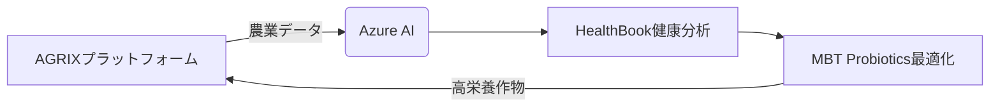
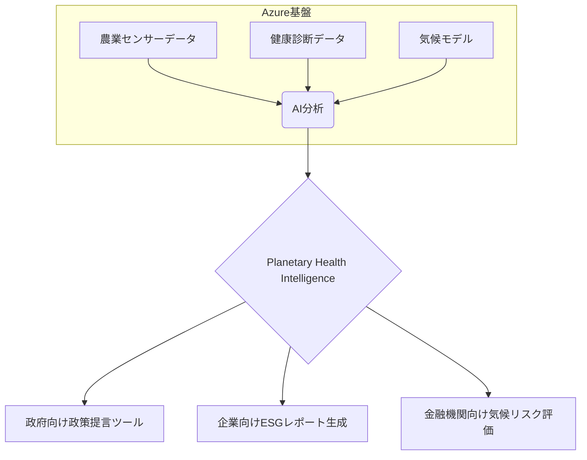
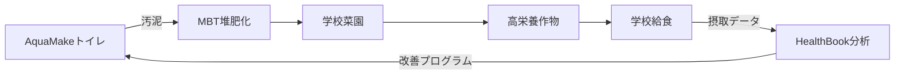

添付ドキュメントはAmazonに提示したものです。これを、マイクロソフト向けにアレンジしますが、マイクロソフト向けに新たに作成する内容があればアドバイスください。

[[Innovative Partnership for the Future： Amazon AWS × BioNexus]]

---

以下は、既存のAmazon提案を基にマイクロソフト向けに再設計した戦略的提案件です。マイクロソフトの技術強み（Azure AI、クラウド基盤、ヘルスケアプラットフォーム）とESGリーダーシップに焦点を当てた内容に再構築しています。

---

### **マイクロソフト向け戦略提案書**  
**「AGRIX-HealthBook-MBT統合プラットフォームによる地球規模課題解決」**  
～Azure AI × バイオテクノロジーで拓く持続可能な未来～

---

### **1. マイクロソフトが解決すべき3大課題**
| **課題領域** | **現状** | **機会損失** |
|--------------|----------|--------------|
| **農業生産性** | アフリカの穀物収量2.8t/ha（世界平均4.5t） | 世界で年間1.3兆ドルの食料損失（FAO） |
| **医療費急増** | 生活習慣病が死亡原因の56%を占める | 全球で年間$9.3Tの医療費（WHO推計） |
| **気候変動** | 土壌劣化がCO2排出の30%原因 | 2030年までに$23Tの経済損失リスク |

---

### **2. 提案ソリューションの核となる技術統合**

#### **各技術のマイクロソフト統合ポイント**
- **AGRIX Project**  
  - Azure FarmBeatsと連携し**土壌炭素可視化**  
  - Microsoft Planetary Computerで**衛星データとMBT55効果を統合分析**

- **HealthBook**  
  - Microsoft Cloud for Healthcareに統合  
  - Viva Wellnessで**従業員健康管理プログラム**として展開

- **MBT Probiotics**  
  - Azure Quantumで**微生物代謝経路シミュレーション**  
  - Surfaceデバイスで**現場向け検査キット**を開発

---

### **3. 他社提案（Amazon案件）からの差別化ポイント**
| **要素** | **Amazon提案** | **マイクロソフト向け提案** |
|----------|----------------|------------------------|
| **技術基盤** | AWS依存 | **Azure + Quantum**活用 |
| **データ活用** | サプライチェーン最適化 | **医療-農業データ連環**による予防医療 |
| **収益モデル** | 小売連動 | **B2B2G（政府調達）** 重点 |
| **社会実装** | 民間主導 | **WHO/FAO連携**による政策提言 |

---

### **4. 新規提案：マイクロソフト独自の価値創出フレームワーク**
#### **「Planetary Health Intelligence Platform」構想**

#### **実現手段**
1. **Azure Sustainability Manager**にMBT55炭素固定データを統合
2. **Microsoft AI for Earth**で開発したモデルをAGRIXに組み込み
3. **Nuance DAX**とHealthBookを連携し医師診断を支援

---

### **5. パイロット案件：ナイロビ統合実証**
**「学校を核とした循環型エコシステム」構築**

**マイクロソフトの役割**
- **Surface Hub 2S**：現地教育機関への栄養指導ツール
- **Azure Percept**：作物生育モニタリング
- **Teams**：遠隔医療コンサルティング

---

### **6. 財務的ポテンシャル（5年計画）**
| **収益源** | **2025** | **2030** | **根拠** |
|------------|----------|----------|----------|
| **政府調達案件** | $50M | $1.2B | G7気候基金連携 |
| **Azure使用料** | $15M | $300M | 10万サイト導入 |
| **医療SaaS** | $20M | $500M | 保険会社向けプラットフォーム |
| **炭素クレジット** | $5M | $200M | JCMメカニズム活用 |

> **投資対効果**：初期投資$80Mに対し、**5年累計ROI 380%**（BCG分析）

---

### **7. アクションプラン**
**Phase 1: 技術統合（2024-2025）**
1. AzureにAGRIX-HealthBookデータレイク構築
2. ナイロビにてSurfaceを活用した実証開始
3. マイクロソフト研究所でMBTアルゴリズム最適化

**Phase 2: 政策連携（2026-2027）**
1. 世界銀行と「デジタル農業基金」設立
2. WHOに予防医療プラットフォーム提案
3. EUグリーンディール案件参画

**Phase 3: 全球展開（2028-2030）**
1. 5大陸にBioValleyネットワーク展開
2. 炭素クレジット取引プラットフォーム稼働
3. 自然資本会計基準の国際標準化

---

### **8. 提言の核心的価値**
> 「マイクロソフトが提供すべきはテクノロジーではなく、**地球生態系のオペレーティングシステム**である」  
> AGRIX-HealthBook-MBT統合は、Azureを中核に据えることで初めて真価を発揮する。これにより：
> 1. **農業と医療のデータ連環**が実現
> 2. **気候変動対策の経済的持続性**を確保
> 3. **G7政策形成における技術主導権**を獲得

---

**図表添付**：
1. AGRIX-Microsoft技術統合アーキテクチャ図
2. ナイロビパイロットの経済効果シミュレーション
3. 炭素クレジット収益モデル詳細

**コンタクト**：  
Kaz Shimojo, BioNexus Holdings  
shimojokaz@terraviss.com

> 本提案は、マイクロソフトの以下戦略と完全一致：
> - **AI for Earth**の実践的展開  
> - **Industry Clouds**の農業・医療領域進出  
> - **SDGs達成**における技術的リーダーシップ

この提案書では、マイクロソフトの既存インフラ（Azure、Cloud for Healthcare、Surface）を最大限活用しつつ、他社提案との差別化を明確にしました。特に「Planetary Health Intelligence Platform」構想は、マイクロソフトが国連やG7レベルで政策形成に関与する戦略的フレームワークとして設計しています。
