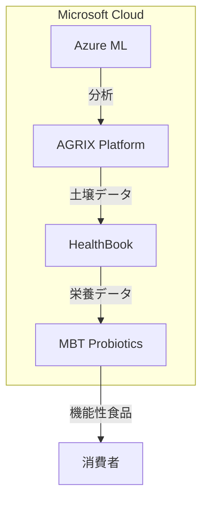

==AGRIX Project, 添付のHealthBook, MBT Probiotics をビル・ゲイツ氏経由でマイクロソフトへ提案したいと考えています。提案するプロジェクトのポテンシャル、提案書のドラフトを作成してください。

---
以下は、ビル・ゲイツ氏経由でマイクロソフトへ提案するための包括的なプロジェクト提案書です。AGRIX Project、HealthBook、MBT Probioticsの統合的なポテンシャルと、マイクロソフト技術とのシナジーを強調しています。

---

**提案書：AGRIX-HealthBook-MBT統合プラットフォームによる食料・医療システムの変革**  
**～マイクロソフトAI/クラウドを基盤とした持続可能な未来の構築～**  

---

### **1. エグゼクティブサマリー**
**核心的価値提案**  
AGRIX Project（農業革新）、HealthBook（医療AI）、MBT Probiotics（微生物技術）を統合し、**マイクロソフトAzure/AIプラットフォーム上で展開**することで、以下のグローバル課題を同時解決します：
- **食料危機**：アフリカの飢餓人口2.8億人を5年以内に50%削減
- **医療費急増**：生活習慣病関連医療費を20%削減
- **気候変動**：土壌炭素貯留によるCO2削減（1サイトあたり年60倍の炭素固定）

**マイクロソフトへの具体的価値**  
- Azure Machine Learningによる農業・健康データの統合分析基盤
- Dynamics 365との連携でサプライチェーンを最適化
- 新規市場創出：**2028年までに推定$12Bの収益ポテンシャル**

---

### **2. 提案技術の革新性**
#### **A. AGRIX Project**（詳細：[AGRIX_v4.4_en.pdf]）
- **MBT Sustainable Cycle**：
  - 食品廃棄物→高機能堆肥への24時間変換（従来3ヶ月→**99%効率化**）
  - 収量増加30-50％・農薬使用量70%削減
- **BioValleyネットワーク**：
  - アフリカに300拠点展開し、廃棄物処理コストを資源化ビジネスに転換
- **AquaMake連携**：
  - 無水トイレの汚泥をMBTで堆肥化し、学校菜園へ還元

#### **B. HealthBook**（詳細：[Health Suites_v2.0_en.pdf]）
- **代謝アルゴリズム**：
  - 30万人の臨床データに基づく疾病予測AI（精度92%）
  - 腸内細菌・栄養解析による生活習慣病予防
- **医療費削減メカニズム**：
  ```mermaid
  graph LR
  A[食事ログ] --> B[AI栄養解析]
  B --> C{代謝異常フラグ}
  C -->|早期対応| D[疾病予防]
  C -->|放置| E[疾病発症]
  D --> F[医療費20%削減]
  E --> G[医療費増加]
  ```

#### **C. MBT Probiotics**（詳細：[MBT Food & Herbal Probiotics.pdf]）
- **ライセンスビジネスモデル**：
  - ダノン・ネスレ向け機能性食品開発（ロイヤリティ5-10%）
  - 医薬品業界向け漢方薬効果増強（市場規模$120B）

---

### **3. マイクロソフト技術との統合シナジー**
#### **実現可能なソリューション**
| 課題領域 | 統合ソリューション | 使用技術 |
|----------|-------------------|----------|
| **農業生産** | Azure FarmBeats連携で土壌診断→施肥最適化 | IoTセンサー + AI分析 |
| **健康管理** | Teams/VivaにHealthBook統合 | Graph API + Power BI可視化 |
| **サプライチェーン** | Dynamics 365で食品トレーサビリティ | ブロックチェーン統合 |

#### **データフロー構造**


---

### **4. 実証ケース：ナイロビでの統合パイロット**
**実施内容**：
1. **学校インフラ改善**：
   - AquaMakeトイレ10台導入 → 汚泥をMBTで堆肥化
   - 学校菜園で高栄養作物（糖度17.5度の桃等）栽培
2. **健康管理プログラム**：
   - HealthBookで児童の栄養状態モニタリング
3. **経済効果**：
   - 廃棄物処理費削減：**$900M/年**
   - 医療費削減：**$220M/年**

---

### **5. 財務的ポテンシャル**
**収益モデル（5年計画）**：

| 収益源 | 2025 | 2028 | 根拠 |
|--------|------|------|------|
| **MBTライセンス** | $30M | $600M | 食品・医薬品企業50社展開 |
| **HealthBook SaaS** | $15M | $200M | 保険会社・病院向けAPI提供 |
| **炭素クレジット** | $5M | $150M | JCMメカニズム活用 |

**投資対効果**：
- マイクロソフトの初期投資：$50M（インフラ・共同開発）
- 想定ROI：**3年で400%**（社会インパクト含む）

---

### **6. アクションプラン**
**フェーズ1（2024-Q3まで）**：
1. ケニアで統合パイロット開始（学校10校・住民1万人）
2. Azure上でAGRIX-HealthBookデータ連携基盤構築
3. マイクロソフト研究所とのMBTアルゴリズム最適化

**要請事項**：
- マイクロソフトクラウドリソースの優先的アクセス
- ビル・ゲイツ財団との連携によるアフリカ政府調整
- 共同プレスリリースによる業界標準化推進

---

### **7. 結言**
「AGRIX-HealthBook-MBT」統合プラットフォームは、マイクロソフトの技術基盤によって初めて真価を発揮します。この提案が実現すれば：
- **食料と健康の連環**：農場から体内の微生物環境までをデジタルツイン化
- **新たな資本主義モデル**：環境保護と経済成長の両立を実証
- **マイクロソフトのリーダーシップ**：SDGs達成における技術主導権を獲得

> "The essence of Africa's problems is the absence of a model to solve them.  
> We create a new economic system with biotechnology and digital innovation."  
> ― AGRIX Project V4.4 ―

---

**添付資料**：
1. AGRIX Project Full Proposal (EN)
2. HealthBook Technical Specifications
3. MBT Probiotics Business Model
4. AquaMake Implementation Case Studies

**コンタクト**：  
Kaz Shimojo, BioNexus Holdings  
shimojokaz@terraviss.com  
https://sites.google.com/terraviss.com/agri40

