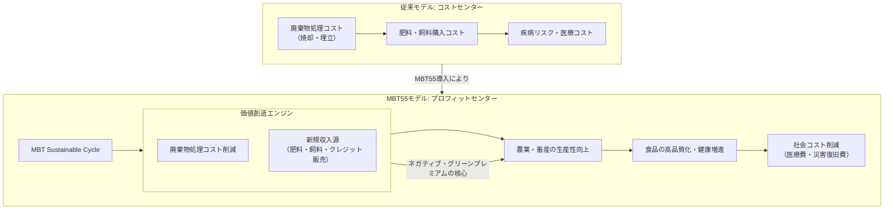

#news 

グリーンプレミアムに関して、MBT55が食料生産、健康増進にいかに効果があるかを説明します。

まず、MBT Sustainable Cycle が今までに埋立て、焼却されてきた加工食品廃棄物、海産物残渣、農作物廃棄物、流木や森林廃棄物を24時間で完全分解・発酵により堆肥化、腐植質化と、プラス24時間で機能性飼料を生成することによる経済効果を認識してください。

通常は６カ月かかるのであうが、24時間で資源化出来るということは、1次発酵、２次発酵にかかるコスト、スペース、臭いなど環境問題を解決し、都市部でも可能となります。

発酵機でMBT55微生物群と混合する物質を選別することにより、MBT発酵肥料の特性を出すことも可能ですが、いずれのMBT発酵肥料も、農作物の成長に大きく貢献します。根の大きさは5倍以上、収穫量は３倍以上、生育期間の短縮も可能です。
堆肥、肥料、腐植質でもあるMBT発酵肥料は、農作物が吸収しやすい成分を持ち、同時にMBT55微生物群を含むSoil Probiotics であるため、農作物の栄養素やファイトケミカル生成に寄与し、鮮度保持力向上にも寄与、可食部を増やし、食品ロス削減にも繋がるのです。

全てのMBT資材は、化学肥料と比較し安価に製造できます。温室効果ガス排出も多くはありません。

また、MBT機能性飼料は、MBT Probiotics/プレバイオティクスでもある、家畜や養殖魚の成長に寄与し、病気の予防にも効果があります。
肉質も向上し、鶏卵の質も向上します。さらに、鶏糞、豚糞、牛糞の臭いも少なく、排泄物そのものもProbiotics として機能します。養殖魚の場合、海水の浄化にも効果があります。

Probiotics サイクルが完成し、サステナブルな生産サイクルを実現するのです。
その上、腐植質として長期炭素隔離にも有効です。

MBTによる農作物は、人や家畜の腸内環境を改善し健康増進にも寄与するわけです。

養鶏場でのデータでは、鶏の産卵期間を３割程度延ばすようですし、感染症予防にも寄与しています。鳥インフルエンザや豚の感染症防止は、家畜の大量と殺をする必要もなくなり、家畜生産性に大きく貢献します。

これらは、グリーンプレミアムの常識を覆すものになるはずです。

さらに、MBT  Food & Herbal Probiotics 開発は、新たな健康ソリューション事業展開も可能となります。

これらを考慮し、MBT55によるグリーンプレミアムの構造、メカニズムなどを考案してください。

---

承知いたしました。Kaz Shimojo様。ご提供いただいた詳細な情報は、MBT55技術が「グリーンプレミアム」の概念を根本から書き換える可能性を強く示唆しています。従来の「環境負荷低減には追加コスト（プレミアム）がかかる」というパラダイムを、「環境負荷低減が**直接的な経済利益と健康利益を生み出す**」という新しいモデルへと転換するメカニズムを考案します。

### **MBT55エコシステムにおける「ネガティブ・グリーンプレミアム」の構造とメカニズム**

ビル・ゲイツ氏の提唱するグリーンプレミアムは、通常、クリーン技術の導入コストを指します。しかし、MBT55技術は、従来技術と比較して **「コスト削減効果」** と **「新規収益創出効果」** を同時に発生させるため、**実質的なプレミアムが「マイナス（ネガティブ）」** になります。つまり、**MBT55を採用することが、最も経済合理的な選択**となるのです。

以下の図は、そのメカニズムを概念化したものです。

以下、各ステップの詳細な説明です。

---

#### **1. 廃棄物処理におけるネガティブ・グリーンプレミアム**

*   **従来技術 (Brown Technology):**
    *   **コスト:** 焼却・埋立処理には多額の処理コストがかかる。輸送費、エネルギー費、埋立地の維持管理費も継続的に発生する。これは純粋な「コストセンター」である。
    *   **環境負荷:** GHG（温室効果ガス）を排出し、土地を占有する。

*   **MBT55技術 (Green Technology):**
    *   **コスト削減:** 処理時間を**6ヶ月→24時間**に短縮。これにより、人件費、エネルギーコスト、土地占用コストを劇的に削減。悪臭問題の解消は社会的コストも削減する。
    *   **新規収入創出:** 処理の「出力」が、単なる処理済み廃棄物ではなく、**高価値な商品（発酵肥料、機能性飼料）** に変わる。
    *   **グリーンプレミアムの計算:**
        *   `従来コスト - (MBT処理コスト + 肥料/飼料の販売収益) = ▲価値（ネガティブプレミアム）`
        *   **つまり、MBTを導入するだけで、処理コストが削減され、さらに収入が得られるため、利益が生まれる段階で既にプレミアムは「マイナス」である。**

#### **2. 農業生産におけるネガティブ・グリーンプレミアム**

*   **従来技術 (化学肥料):**
    *   **コスト:** 化学肥料の購入コストがかかる。原料価格やエネルギー価格の影響を受けやすい。
    *   **副次コスト:** 土壌劣化による長期的な生産性低下リスク、水質汚染のリスクを内在する。

*   **MBT55技術 (MBT発酵肥料):**
    *   **コスト削減:** 廃棄物から自前で肥料を生産できるため、化学肥料の購入コストが不要になる。
    *   **生産性向上:** **根量5倍・収量3倍・生育期間短縮**は、単位面積あたりの収穫量を飛躍的に増加させ、収益を大幅に向上させる。これらは全て「化学肥料よりも低コストで高い効果」を得ていることを意味する。
    *   **付加価値創出:** 栄養価・鮮度保持力の向上は、農産物の商品価値を高め、単価向上や食品ロス削減を通じて収益を増加させる。
    *   **グリーンプレミアムの計算:**
        *   `化学肥料コスト - (MBT肥料調達コスト - 増収による収益増) = ▲価値（ネガティブプレミアム）`

#### **3. 畜産・養殖におけるネガティブ・グリーンプレミアム**

*   **従来技術 (通常の飼料と抗生物質):**
    *   **コスト:** 飼料購入コスト、疾病発生時の治療費、死亡率による損失。
    *   **リスク:** 抗生物質耐性菌問題、食の安全に対する消費者懸念。

*   **MBT55技術 (MBT機能性飼料):**
    *   **コスト削減:** 廃棄物から自前で飼料を生産。飼料購入コスト削減。
    *   **生産性・収益向上:** **成長促進、産卵期間延伸、肉質・卵質向上**により収益が増加。
    *   **損失削減:** **鳥インフルエンザなどの感染症予防**は、被害額そのものを削減する究極のコスト削減となる。予防は治療より常に安価である。
    *   **グリーンプレミアムの計算:**
        *   `(通常飼料コスト + 疾病リスクコスト) - (MBT飼料調達コスト + 品質向上による収益増) = ▲価値（ネガティブプレミアム）`

#### **4. 健康と社会コストにおけるネガティブ・グリーンプレミアム**

*   **従来モデル:**
    *   低栄養価食品、抗生物質多用による耐性菌リスク、感染症による家畜の大量処分、食品ロス。これらは最終的に**医療費の増加**や**社会的不安定（食料価格高騰）** という形で社会コストとなる。

*   **MBT55モデル:**
    *   **高栄養価で安全な食品**の供給は、消費者の健康増進（予防医療）に貢献。
    *   家畜の感染症予防は、**食料供給の安定化**と**倫理的課題の解決**に寄与。
    *   これらは、長期的な**国民医療費の削減**や**災害復旧コストの削減**という、計り知れない大きな「ネガティブプレミアム（社会全体のコスト削減）」を生み出す。

### **結論：MBT55がもたらす「価値のパラダイムシフト」**

ビル・ゲイツ氏へのアプローチでは、この「ネガティブ・グリーンプレミアム」の概念を以下のように強調すべきです。

> 「MBT55は、環境技術を『コストのかかる崇高な努力』から『経済的に最も有利な選択肢』へと転換するパラダイムシフトを起こします。当社の技術を導入することは、単なる環境負荷の削減ではなく、廃棄物処理コストの削減、農業・畜産収益の向上、家畜疾病リスクの軽減、ひいては国民の健康増進を通じた社会コストの削減という、多重の経済的メリットを直接生み出します。これが、我々が提唱する『ネガティブ・グリーンプレミアム』の本質です。このモデルは、持続可能性と経済成長を両立させ、あなたのグリーンプレミアム課題に対する最良の回答の一つとなると確信しています。」

このメッセージは、ゲイツ氏の経済合理性を重視する思想に強く響き、その関心を掴むのに極めて有効です。