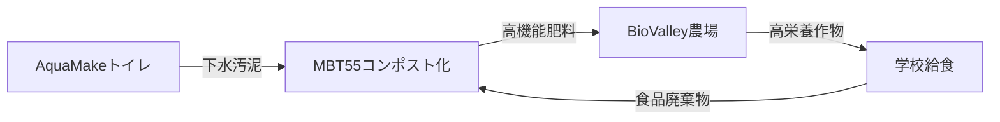

以下は、AGRIX ProjectとMBT Sustainable Cycleがもたらす食料システム変革の可能性について、ロックフェラー財団のフード・イニシアティブとの連携を視野にまとめた提言書です。

---

### **AGRIX Project: アフリカの食料システム変革への統合的アプローチ**
#### **～MBT Sustainable Cycle × BioValley × AquaMakeによる資源循環モデル～**

---

### **１. 現状の課題とAGRIXの核心的解決策**
- **アフリカ農業の危機的状況**  
  - 穀物収量: 2.8トン/ha（世界平均4.5トン）  
  - 土壌劣化: 10億ヘクタール（世界の劣化土壌の1/3）  
  - 栄養問題: 5歳未満児の3人に1人が栄養不良  
  ⇒ 従来の食料援助では持続可能な解決が不可能  

- **MBT Sustainable Cycleの革新性**  
  - **24時間コンポスト化**: 食品廃棄物・家畜糞尿を超高速分解（従来2～6ヶ月→24時間）  
  - **多面的効果**:  
    ▶ 収量増加（30～50％）  
    ▶ 農薬・抗生物質使用量70％削減  
    ▶ 土壌炭素貯留量60倍増（炭素クレジット創出）  
    ▶ 作物の栄養価向上（ビタミン・ミネラル1.5～2倍）  

---

### **２. ロックフェラー財団イニシアティブとの戦略的連携**
#### **(1) Food System Vision Prize への提言**
- **AGRIXビジョン「2050年アフリカ飢餓ゼロ」の核心要素**:  
  ```markdown
  | 目標期間 | 主要KPI                     | 革新技術               |
  |----------|-----------------------------|------------------------|
  | 3年      | 輸入肥料50%削減・農家所得2倍 | MBT55コンポスト拡散    |
  | 5年      | 劣化土壌100%回復・飢餓撲滅  | BioValleyネットワーク  |
  ```

#### **(2) 学校給食プログラム強化戦略**
- **AquaMakeの統合的導入**:  
  - 無水地域でも稼働する循環型トイレ（特許: ZL 01 8 000321）  
  - 処理下水汚泥をMBTで24時間コンポスト化→学校菜園の肥料に転換  
  - **実績**: 日本500拠点・中国舟山島（日処理50トン）で稼働実証済み  

#### **(3) Food Security Tracker 連携**
- **AGRIX Platformのデータ活用**:  
  - AgriWare®が収集する土壌・気候・作物成長データをAI分析  
  - ナイロビ事例: 廃棄物処理コスト削減＋医療費削減で**年9～22億ドル**の経済効果予測  

---

### **３. 技術統合による資源循環モデル**
#### **サニテーション→農業→栄養改善のクローズドループ**


#### **BioValleyが創出するグリーンマニュファクチャリング**
- **地域循環ハブとしての機能**:  
  - コンポスト/飼料製造  
  - 廃棄物収集ビジネス（鶏糞・魚介残渣など）  
  - 炭素クレジット取引  
- **経済効果**: 1拠点あたり**30～50%の農業コスト削減**＋新規雇用創出  

---

### **４. 投資フレームワークと社会インパクト**
#### **「環境保護と経済成長の両立」モデル**
- **三重のROI構造**:  
  1. 農業: 収量増＋輸入肥料依存脱却  
  2. 環境: 炭素貯留（JCMクレジット化）  
  3. 医療: 栄養改善による疾病予防コスト削減  

- **実証事例**:  
  - ナイジェリアでMBT55適用→作物収量**3～5倍増**（トウモロコシ）  
  - 高機能野菜例: 糖度17.5度の桃・硝酸塩20%低減レタス  

---

### **５. 行動提案**
1. **ロックフェラー財団との共同実証**  
   - ベナン・ガーナの学校で「AquaMake＋MBTコンポスト＋AGRIX監視システム」パイロット導入  
2. **炭素金融メカニズム構築**  
   - 土壌炭素貯留量をAgriChain®で可視化→グリーンボンド発行基盤に  
3. **アフリカ政府向け政策パッケージ**  
   - 廃棄物処理費の資源化事業転換インセンティブ制度設計  

> **“The essence of Africa's agricultural problems is the absence of a model to solve them.”**  
> AGRIXは援助ではなくビジネスで課題を解決する。MBT Sustainable Cycleが創出する資源循環は、アフリカの農業経済を「コストセンター」から「バリュー生成拠点」へ転換する基盤技術である。

---

**資料出典**:  
- AGRIX Project V4.4 (BioNexus Holdings)  
- AquaMake技術仕様書 (上海永環環境設備)  
- Rockefeller Foundation Food Initiative Report