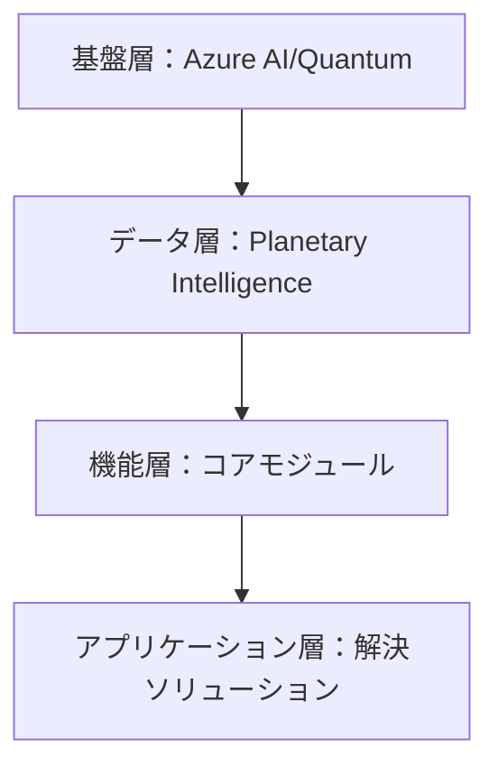
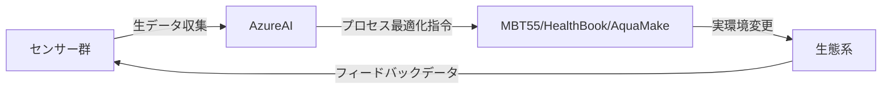
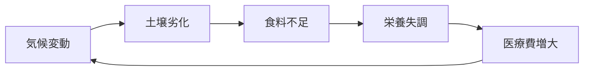
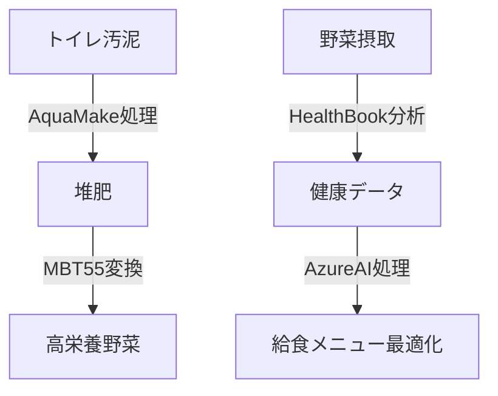

以下に「地球生態系のオペレーティングシステム」の骨子を体系化します。このコンセプトは、**自然生態系とデジタル技術の融合により地球規模課題を解決する基盤**として設計されています。

---

### **地球生態系オペレーティングシステムの核心フレームワーク**
#### **1. 設計思想**
> **“自然の代謝プロセスをデジタルツイン化し、持続可能な循環を最適化する”**
- **自然原理のデジタル実装**：光合成・炭素循環・微生物代謝などの生態系プロセスをアルゴリズム化
- **人間活動の再統合**：農業・医療・経済を生態系の一部として再設計

#### **2. 階層構造**

#### **3. コアモジュール**
| **モジュール** | **機能** | **技術要素** |
|----------------|----------|--------------|
| **自然代謝エンジン** | 生態系プロセスのシミュレーション | ・MBT55微生物代謝モデル ・光合成アルゴリズム ・Azure Quantumによる分子動力学計算 |
| **地球バイタル監視** | リアルタイム生態系診断 | ・衛星/IoTセンサーネットワーク ・Microsoft Planetary Computer連携 ・土壌炭素可視化AI |
| **資源循環オーケストレーター** | 廃棄物⇄資源の変換管理 | ・MBT持続可能サイクル制御 ・AquaMake水循環最適化 ・ブロックチェーン追跡 |
| **健康相互作用マップ** | 人間-生態系健康連関分析 | ・HealthBook代謝モデル ・腸内環境-土壌微生物相相関解析 |

#### **4. 動作原理**

#### **5. 解決対象サイクル**

#### **6. 実装ソリューション例**
| **課題** | **対応モジュール** | **出力** |
|----------|-------------------|----------|
| 土壌炭素減少 | 自然代謝エンジン | 微生物組成最適化指令 |
| 作物栄養価低下 | 健康相互作用マップ | 微量ミネラル施肥プラン |
| 水資源汚染 | 資源循環オーケストレーター | 下水汚泥堆肥化スケジュール |
| 生活習慣病増加 | 地球バイタル監視 | 地域別栄養改善プログラム |

#### **7. 政策連携メカニズム**
- **G7/国連向けダッシュボード**：  
  「生態系健康スコア」をGDPのように定量化（例：1haあたり炭素固定量×生物多様性指数）
- **気候金融連動**：  
  炭素クレジット発行をAI予測値に基づき自動執行

#### **8. 実証事例（ナイロビモデル）**

#### **9. 進化シナリオ**
1. **Phase 1（2025-27）**：地域単位での生態系OS稼働  
2. **Phase 2（2028-30）**：大陸間連携（アフリカ⇄南米炭素取引）  
3. **Phase 3（2031-）**：地球規模の自律制御（AIが大気圏・水圏・土壌圏を統合管理）

---

### **核心的イノベーション**
- **自然のアルゴリズム化**：微生物代謝・植物生長などの生物プロセスを量子コンピューティングでモデル化
- **人間圏の再統合**：経済活動を生態系のサブシステムとして位置付け
- **予防的ガバナンス**：AIが生態系の「健康状態」を診断し、崩壊前に介入

> このシステムが目指すのは、**テクノロジーによる地球規模の恒常性維持（ホメオスタシス）機能**です。マイクロソフトのクラウド/AIが中核基盤となることで、人類史上初の「地球全体を対象としたオペレーティングシステム」が実現します。