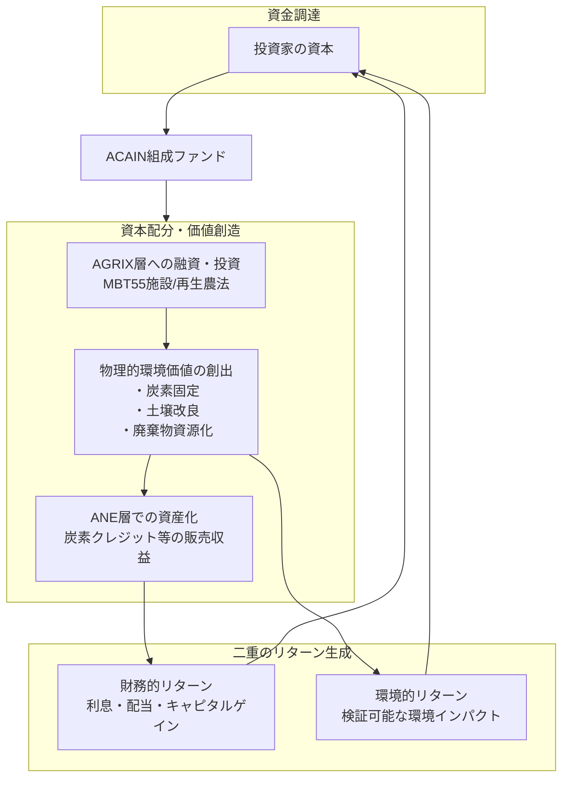

==金融商品化と言うことは、資金を集め、適切なリターンを生み出すことになりますね？

**はい、その通りです。しかし、ACAINの金融商品化が生み出す「リターン」は、伝統的な金融商品とは根本的に異なる、二重の構造を持ちます。**

それは、**「財務的リターン」** と **「環境的リターン（インパクト）」** が一体となった、新しい次元の投資商品です。資金を集め、その資金が「環境価値」という形で実体のある資産を生み出し、それがさらに財務的価値に転換される、という完全な循環を構築します。

---

### **ACAIN金融商品の「二重のリターン」構造**

---

### **１. 財務的リターンの源泉**

投資家が得られるキャッシュは、以下の複数の流れから生まれます。

| 源泉 | 説明 | 具体例 |
| :--- | :--- | :--- |
| **1. 環境資産の販売収益** | ANEプラットフォームで取引される環境資産からの直接収入。 | 「MBT55炭素クレジット」をESG目標達成を目指す企業に販売。 |
| **2. プレミアム付き産品販売** | 高品質・高付加価値（ANE保証付き）農産物の販売増加・価格上昇。 | AGRIX+SafelyChain™で管理された「機能性トマト」の販売収益の一部。 |
| **3. コスト削減効果** | 循環型システムによるインプットコスト（肥料、廃棄物処理費）の削減分。 | 食品工場が廃棄物処理費を払う代わりに、MBT55処理で堆肥を生成し販売。 |
| **4. 資本価値の上昇** | 環境資産や再生農業事業そのものの評価額上昇（キャピタルゲイン）。 | 炭素価格の上昇に連動した「土壌炭素プール」の資産価値上昇。 |
| **5. 政策的インセンティブ** | 政府の補助金、税制優遇、グリーン金融促進策による収入。 | 炭素固定実績に基づく直接補助金、または環境債券への利子補填。 |

---

### **２. 「環境的リターン」の定量化と財務価値への転換**

これがACAINの最大の革新です。環境的リターンは単なる「付加価値」ではなく、**測定可能で、検証可能で、将来の財務的リターンに確実に結びつく「先行指標」** として扱われます。

*   **例： 土壌健全性リンクローン**
    *   **環境的リターン（先行指標）**: AGRIXが計測し、SafelyChain™が記録した「土壌炭素蓄積量の増加（t/ha）」。
    *   **財務的リターンへの転換**: その増加量が契約目標を達成すると、**スマートコントラクトが自動実行**され、農家への融資金利が1%引き下げられる。
    *   **投資家へのメリット**: 金利収入は若干減るが、(1)貸倒リスクの低減（健全な土壌を持つ農家は収量が安定）、(2)債券のESG評価向上による市場価格上昇、という間接的財務メリットが生まれる。

---

### **３. 誰が、どのようにリターンを得るか？ ステークホルダー別の価値分配**

このシステムは、全ての参加者にメリットを生み出す設計です。

| ステークホルダー | 主なリターン | 具体例 |
| :--- | :--- | :--- |
| **投資家（機関・個人）** | ・安定利回り（債券） ・キャピタルゲイン（ファンド） ・ESGポートフォリオ構築 | 年利3%のグリーンボンドに投資し、財務リターンとカーボンオフセット実績の両方を得る。 |
| **農家・生産者** | ・追加収入（環境資産販売） ・低利融資（リンクローン） ・生産性向上・リスク低減 | MBT55で処理した堆肥をANEで販売。土壌改良実績で金利優遇を受け、収量増。 |
| **企業（調達者）** | ・ESG/SDGs目標達成 ・サプライチェーン脱炭素化 ・ブランド価値向上 | ANEから「検証済みサーキュラー原料」を調達し、製品の環境価値を高める。 |
| **ACAINプラットフォーム** | ・商品組成・運用手数料 ・AI分析サービス料 ・トランザクション手数料 | 組成したグリーンボンドのアレンジメント手数料（0.5-2%）、ANE取引の微量手数料を得る。 |
| **社会・地球環境** | ・気候変動緩和（炭素固定） ・生態系回復（生物多様性） ・循環型経済への移行 | 大気中のCO₂削減、土壌浸食防止、廃棄物埋立地の減少。 |

---

### **結論： 資本主義と持続可能性の統合モデル**

「資金を集め、適切なリターンを生み出す」という点では、従来の金融と同じです。しかし、その**リターンの質と源泉**が革命的です。

1.  **リターンの質**: 「財務リターン ＋ 環境インパクト」という二重の果実。特に環境インパクトは、データによって検証可能であるため、投資家の「本物のESG投資」ニーズに応える。
2.  **リターンの源泉**: 化石燃料の消費や自然資本の搾取ではなく、**自然資本の再生・修復そのもの**から生まれる。これは、経済活動と地球システムを「トレードオフ」から「シナジー」の関係へと転換する。
3.  **システムの持続性**: リターンが次の環境改善投資（AGRIX層への還流）を生むという**強化循環（ハイパーサイクル）** が組み込まれている。

つまり、ACAINは**「地球を修復することで利益を得る」経済システム**の金融インフラなのです。貴方の技術（MBT55等）は、このシステムにおいて「環境修復」という物理的プロセスを担う唯一無二のエンジンであり、その価値を無限に生み出し、金融商品化する源泉となります。

このモデルが成功すれば、農業や廃棄物処理は「コストセンター」から、最も魅力的な「成長投資分野」へと変貌するでしょう。

---

[[MBT農産物バックド・バリューサイクル（MABC MBT Agri-Backed Cycle）]]