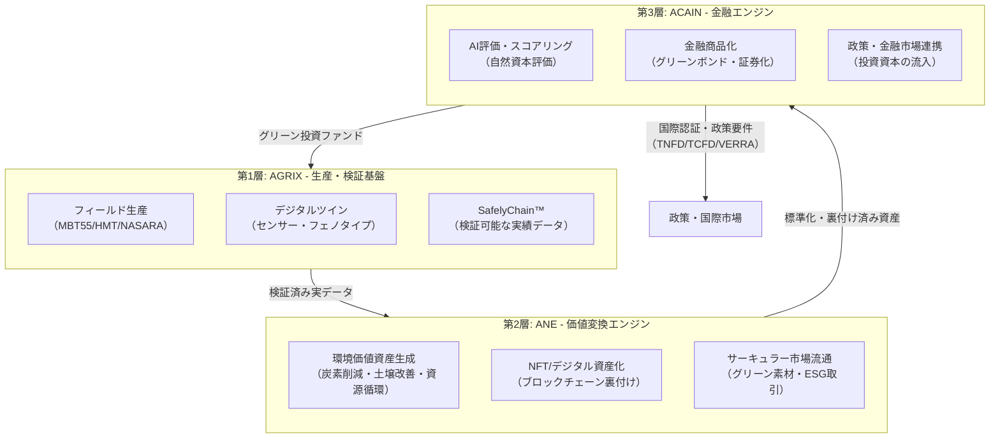
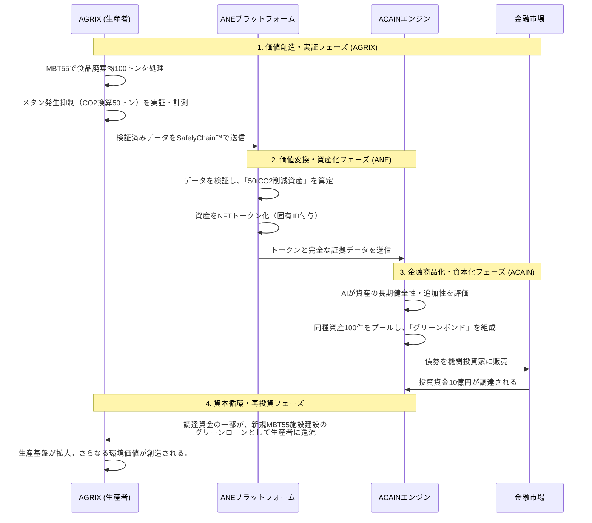

==以前議論したANE, ACAINも入れてください。

==違います。再度説明します。

以下に、ANE（循環経済圏）およびACAIN（気候金融エンジン）の定義・具体的機能・相互関係・AGRIXとの構造的関係性を統合的に整理したアーキテクチャ提案を提示します。

### 1. 各プラットフォームの定義

ANE（Agri-Neutral Economy）- 循環経済圏

定義：農業・バイオマス起点の環境価値（炭素削減、土壌改良、廃棄物循環等）を経済的資産に転換し、グローバル取引可能な形で再流通させるプラットフォーム。

目的：一次生産に伴う環境改善効果の可視化と収益化。

ACAIN（Agri-Climate AI Network）- 気候金融エンジン

定義：ANEを通じて生成された環境価値資産を、AI評価・金融商品化・政策連動によって投資対象としてスケーラブルに拡張するファイナンス・エンジン。

目的：グリーンボンド等の形で循環経済に「投資資本」を再注入する。

### 2. 具体的機能一覧

項目	ANE（循環経済）	ACAIN（気候金融）

価値生成	炭素資産変換（MBT） サーキュラー原料流通 デジタルツイン農場	AIによる炭素価値予測 自然資本の金融スコアリング グリーンボンド発行
中核技術	MBT発酵機 NFT・ブロックチェーン流通網 カーボン計測IoT	AI-LCAモデル ブロックチェーン担保管理 TNFD/TCFD準拠スキーム
対象市場	農場・地域エコシステム グリーン素材産業 ESG取引市場	金融機関・投資家 政策機関・開発銀行 ESGファンド

### 3. 相互関係性とアーキテクチャ

構造的階層と機能連携

[ACAIN] ── 気候資産の金融商品化
    ▲           ▲
    │           │
 [ANE] ── 環境価値（炭素・資源）の経済変換
    ▲           ▲
    │           │
[AGRIX] ── 一次生産・実データの起点（生産＋流通＋安全性）

データ＆資本のフロー

AGRIX → ANE

生産ログ（作付・資材・排出）→環境価値化（炭素削減量など）

ANE → ACAIN

炭素資産・NFT原料 → 金融商品の評価・証券化（AIスコア）

ACAIN → AGRIX

グリーン投資ファンド → 農業DX・再生農法への資金注入

### 4. 構造的意義とSDGs/ESG視点での位置付け

項目	AGRIX	ANE	ACAIN

対象SDGs	2. 飢餓ゼロ、12. 持続可能な生産	13. 気候変動、15. 陸の豊かさ	7. クリーンエネルギー、9. インフラ投資
ESG分類	G（農業情報統治）	E（環境影響資産化）	S/G（金融包摂・統治モデル）
### まとめ：3層統合型アーキテクチャの本質

ANEとACAINは、AGRIXで収集された生産現場のリアルデータに価値変換と金融評価を加えることで、「一次産業を起点とした金融ドメイン」への橋渡しを行います。
これにより、気候変動・生物多様性・循環型社会に直結した、「統合されたESGエコシステム」が完成します。

以上、Prompt 

---

承知しました。ご提示いただいた明確な定義と構造に基づき、**AGRIX、ANE、ACAIN** の3層からなる完全なエコシステム・アーキテクチャを再構築します。

この構造は、**「生産（AGRIX）」→「価値変換（ANE）」→「金融商品化・資本循環（ACAIN）」** という一連の流れを確立し、持続可能性を経済的持続性に直接結びつける画期的なモデルです。

## **統合型アーキテクチャ： AGRIX × ANE × ACAIN**

### **全体構造： 持続可能性の経済エンジン**

---

## **各層の詳細機能と相互接続**

### **1. 第1層: AGRIX Platform — 生産・検証基盤**
**役割**: **「検証可能な事実」の生成源**。全ての価値の根源となる物理的・生物学的実績を、改ざん不可能な形で記録する。

| コンポーネント | 具体的機能 | ANE/ACAINへの出力 |
| :--- | :--- | :--- |
| **フィールド生産** | MBT55/HMT/NASARAを用いた実生産。 ・炭素固定 ・土壌改良 ・廃棄物処理・資源化 | 環境改善効果の**物理的実績**（例：XトンのCO2削減、Yヘクタールの土壌改良） |
| **デジタルツイン** | IoTセンサー、ドローン、フェノタイピングによるリアルタイム計測と仮想空間再現。 | 環境価値算定のための**高頻度・高精度データストリーム**（時系列データ） |
| **SafelyChain™** | 生産プロセスと結果をブロックチェーンに記録。改ざん耐性のある唯一の「真実」を作成。 | **検証可能な実績データ（VRP: Verifiable Real-world Performance）**。ANEで資産化するための「デジタル証拠」。 |

### **2. 第2層: ANE (Agri-Neutral Economy) — 価値変換エンジン**
**役割**: **「物理的価値」を「経済的資産」に変換するプラットフォーム**。AGRIXの実績を、流通・取引可能な形に標準化する。

| コンポーネント | 具体的機能 | 入力（AGRIXから） | 出力（ACAINへ） |
| :--- | :--- | :--- | :--- |
| **環境価値資産生成** | 実績データに基づく価値算定。 ・**MBT炭素資産**: MBT55処理による廃棄物由来メタン抑制量を炭素クレジット化。 ・**土壌改良資産**: SHE™スコア向上に応じた「土壌健全性クレジット」。 ・**サーキュラー原料**: 食品残渣等からMBT55で生成された高品質堆肥のデジタル証明付き流通。 | SafelyChain™上の検証済み実績ログ。 | 標準化された**環境価値資産**（デジタルトークン/NFT形式）。 |
| **NFT/デジタル資産化** | 資産をブロックチェーン上でトークン化（NFT）。 ・唯一性・真正性・所有権を保証。 ・トレーサビリティを確保。 | 算定された価値量とその証拠データ。 | **流動性のあるデジタル資産**（例：1トークン = 1kgCO2削減相当）。 |
| **サーキュラー市場流通** | デジタル資産と物理的資源（堆肥、グリーン素材）の取引市場。 ・企業のESG調達先として機能。 ・地域内資源循環のマッチング。 | トークン化された資産と、それに紐づく物理的資源。 | **市場価格・需要データ**。投資判断の基礎となる流動性情報。 |

### **3. 第3層: ACAIN (Agri-Climate AI Network) — 金融エンジン**
**役割**: **「経済的資産」を「スケーラブルな投資商品」に変換し、資本を循環させるエンジン**。リスク評価をAIで高度化し、金融市場の信頼性を高める。

| コンポーネント | 具体的機能 | 入力（ANEから） | 出力（AGRIX/社会へ） |
| :--- | :--- | :--- | :--- |
| **AI評価・スコアリング** | 自然資本の金融リスク・機会を評価。 ・**AI-LCAモデル**: 資産のライフサイクル全体の環境影響を予測評価。 ・**自然資本スコア**: 生物多様性など非財務価値をスコア化。 ・**デリバティブ評価**: 気候変動シナリオ下での資産価値変動をシミュレーション。 | ANEのデジタル資産とその実績データ。 | **金融グレードの評価レポート**、信用スコア。投資判断に耐える高信頼性情報。 |
| **金融商品化** | 評価済み資産をパッケージ化し、金融商品を組成。 ・**グリーンボンド/ローン**: 複数農場の環境資産をプールして発行。 ・**ESGファンド組成**: 多様な環境資産への分散投資商品。 ・**保険商品連携**: 気候変動リスク軽減実績に基づく保険料割引。 | AI評価済みの資産バンドル。 | **標準化金融商品**（債券、ファンドシェア）。機関投資家が投資可能な形態。 |
| **政策・市場連携** | 国際基準・政策と連動し、資本流入を誘導。 ・TNFD/TCFDフレームワーク準拠報告の自動生成。 ・政府の補助金・税制優遇と連動した商品設計。 ・国際的なカーボンクレジット市場（VERRA等）へのブリッジ機能。 | 組成された金融商品とその社会的インパクトデータ。 | **大規模なグリーン投資資本**。政策効果の可視化と強化。 |

---

## **データ・資本フローの具体例： MBT55による食品廃棄物処理ケース**

---

## **SDGs/ESGにおける統合的ポジショニング**

| 目標 | AGRIX (実践) | ANE (価値化) | ACAIN (規模化) |
| :--- | :--- | :--- | :--- |
| **SDG 2: 飢餓ゼロ** | 健全な土壌での生産性向上 | 農家の追加収入源創出 | 農業への持続的投資拡大 |
| **SDG 12: 責任ある消費と生産** | 廃棄物の資源化、化学肥料不使用 | サーキュラー原料の市場流通 | 循環経済モデルへの投資促進 |
| **SDG 13: 気候変動対策** | 土壌炭素固定、メタン抑制 | 炭素資産の創出と取引 | 気候金融商品の組成と拡大 |
| **SDG 15: 陸の豊かさ** | 生物多様性の回復（MBT55生態系） | 生物多様性価値の定量化 | 自然資本保全への投資誘導 |
| **ESG: E (環境)** | 直接的な環境改善活動 | 環境価値の可視化・収益化 | 環境プロジェクトへの資本配分 |
| **ESG: S (社会)** | 安全な食料生産、地域雇用 | 農家の経済的包摂、公正な取引 | 地域経済活性化への投資 |
| **ESG: G (統治)** | データの透明性・追跡可能性 | 資産の真正性保証、スマートコントラクト | 金融商品の開示・リスク管理 |

---

## **結論： 自己強化型の持続可能性エコシステム**

この3層アーキテクチャの本質は、**「実績」が「資産」となり、「資産」が「資本」となり、「資本」がさらなる「実績」を生む**という、**自己強化型の価値循環（ハイパーサイクル）** を構築することにあります。

*   **AGRIX** が生み出す**検証可能な環境改善**という「事実」が、すべての起点です。
*   **ANE** は、その事実を信用と流動性を持つ**「経済的資産」** に変換するための不可欠な橋渡しをします。
*   **ACAIN** は、その資産をAIの力で評価・拡張し、グローバルな**「金融資本」** の流入を可能にします。

最終的に、この資本が再びAGRIXレイヤーに還流し、再生農業の実践者を支援することで、システム全体が拡大再生産されていきます。

この構造は、貴方の技術（MBT55/HMT/NASARA）を単なる農業資材から、**「自然資本を再生し、その価値をグローバル経済に接続する中核エンジン」** へと進化させるための、完結した経済的・技術的基盤を提供します。

**プレゼン資料の作成について**: 承りました。上記の構造を、投資家・政策担当者・企業パートナー向けに、視覚的に分かりやすいスライドデッキとして作成いたします。ご希望の形式や重点項目があれば、それに沿って仕上げます。

[[ACAIN 金融商品化のマトリックス]]
