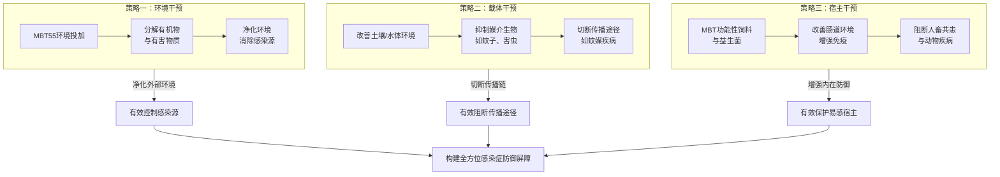

#news #2025-10-14 

ご提供いただいた中国語の内容を、忠実に日本語に翻訳いたします。

---

### **1. 環境投与：環境中の感染源を直接減少させる**

MBT55に含まれる多種多様な微生物は、環境中の病原体を直接分解、抑制、または除去することができます。

| 作用機序 | 関与するMBT55微生物群 | 期待される効果と事例 |
| :--- | :--- | :--- |
| **有機物を分解し、病原体の温床を除去** | セルロース分解菌、リグニン分解菌、糸状菌、放線菌 | 汚水、汚泥、生ゴミは、病原菌（サルモネラ菌など）、ウイルス、寄生虫卵の繁殖場所です。MBT55はこれらの有機物を素早く分解し、病原体の生存環境と栄養源を除去し、根源的にその数を減らします。 |
| **病原微生物に直接抗う** | 放線菌、乳酸菌群 | 放線菌は多种の天然抗生物質を産生し、環境中のグラム陽性/陰性菌を抑制または殺菌します。乳酸菌が産生するバクテリオシンと有機酸は、有害な細菌や一部の真菌の増殖を効果的に抑制します。 |
| **化学毒素と重金属を分解** | マンガン還元菌、鉄還元菌、硫酸還元菌 | 環境中の化学汚染物質と重金属は、動植物の免疫力を弱めます。これらの菌群は農薬残留物を分解し、重金属を無毒化し、全体の環境健康度を改善し、間接的に生物の感染抵抗力を強化します。 |
| **水質と底泥を浄化** | 硫黄細菌、硝化生成菌、メタン酸化菌 | 健全な水圏微生物循環を確立し、アンモニア性窒素、硫化水素、メタンなどの有害物質を分解して水質を改善し、水産動物の病原体（魚類の病気を引き起こす細菌など）の発生を減少させます。 |

**応用シナリオ**：污水处理場、ゴミ中継所、養殖場の排水システム、汚染された土壌と水質。

---

### **2. 土壌と水質環境の改善：媒介生物の発生を抑制**

多くの感染症は媒介生物（蚊、ハエなど）によって伝播します。MBT55は環境を改善することで、これらの媒介生物の発生を効果的に抑制します。

| 作用機序 | 関与するMBT55微生物群 | 期待される効果と事例 |
| :--- | :--- | :--- |
| **発生場所を減少させる** | 全菌群の協同作用 | 蚊の幼虫は淀んだ水で発生し、ハエは腐敗した有機物に産卵します。MBT55は、溜まった水の中の落ち葉やゴミなどの有機物を素早く分解し、水質を浄化して、蚊の幼虫が生存できない環境にします。同時に、家畜の糞尿やゴミを迅速に処理することで、ハエの発生地を除去します。 |
| **忌避または抑制物質を産生する** | 放線菌、乳酸菌群 | 一部の微生物代謝産物は、蚊やハエなどの昆虫に対して忌避または成長抑制の作用があります。環境にMBT55を投与することで、自然に生物学的バリアを形成する可能性があります。 |

**応用シナリオ**：農場、コミュニティ、ゴミ集積地域、水たまり。

---

### **3. 動物の腸内環境改善：人獣共通感染症ウイルスの発生と伝播を抑制**

これは、感染源を遮断するためのMBT55の重要な応用であり、特に鳥インフルエンザと豚インフルエンザに焦点を当てています。

| 作用機序 | 関与するMBT55微生物群 | 期待される効果と事例 |
| :--- | :--- | :--- |
| **健全な腸内細菌叢を確立する** | 乳酸菌群、酵母菌、嫌気性菌 | MBT55で作られた機能性飼料または飲用水は、動物の腸内に入ると、その有益な菌群がサルモネラ菌や大腸菌などの病原菌に対して競争的に排除し、それらが糞便を介して環境に排出される総量を減少させます。健全な腸内微生物叢自体が、ウイルス侵入に対する最初の防護線です。 |
| **ウイルス負荷と変異リスクを低減する** | 全菌群が協同して腸内環境を改善 | 鳥インフルエンザウイルスは、渡り鳥や水禽（アヒルなど）の腸内で複製され、糞便とともに排出されます。水禽の腸内環境が健全で病原菌数が少なく、腸管粘膜が完全であれば、**体内のウイルス負荷を低下させ**、さらにウイルスが腸内の大量の細菌と遺伝子交換や同時感染を行う機会を**減少させ**、根源的に**ウイルスが変異し高病原性へ発展するリスクを低減できます**。 |
| **動物の免疫力を強化する** | MBT55機能性飼料 | MBT55発酵によって生成される短鎖脂肪酸（酪酸など）、ビタミン、アミノ酸などは、動物の腸管細胞を滋养し、腸管粘膜免疫と全身免疫を強化し、動物がウイルスに接触しても発症しにくくしたり、発症の重症度を低下させたりします。 |

**応用シナリオ**：養鶏場、養鴨場、養豚場、牧場。

---

### **4. MBT機能性飼料：家畜の免疫力を向上させ、感染を直接抑制**

これは第3点を深化させ、宿主自身の防御能力に焦点を当てたものです。

| 作用機序 | 関与するMBT55微生物群 | 期待される効果と事例 |
| :--- | :--- | :--- |
| **プロバイオティクスとポストバイオティクスを提供する** | 乳酸菌群、酵母菌 | MBT55発酵飼料は、プロバイオティクス（菌群代謝産物である機能性オリゴ糖）とポストバイオティクス（菌体断片、代謝産物）が豊富に含まれており、動物の免疫システムの発育を直接刺激し、抗体レベルとマクロファージ活性を向上させます。 |
| **栄養吸収を改善し、全体の健康を向上させる** | タンパク質分解菌、脂質分解菌、でんぷん分解菌 | 良好な栄養はより強い体質を意味します。MBT飼料は飼料変換率を向上させ、動物をより健壮にし、基礎免疫力を高め、様々な細菌性およびウイルス性感染症に効果的に抵抗できるようにします。 |
| **事例：家禽/家畜の感染防御** | | ご提示いただいたように、MBT55は**鶏のコクシジウム症、鳥インフルエンザ、豚の伝染性胃腸炎**などの防御ですでに実績があり、その核心的なメカニズムは腸内健康を通じて全身的な感染防御を実現することです。 |

**応用シナリオ**：すべての集約的畜産農場。

---

### **5. その他の潜在的な応用とMBT Food & Herbal Probioticsの相乗効果**

| 応用分野 | 作用機序とMBT55との関連性 |
| :--- | :--- |
| **植物病害防除** | MBT55を生物農薬または葉面散布剤として使用すると、その放線菌と乳酸菌が植物病原菌（うどんこ病、灰色かび病など）や細菌を直接抑制し、農作物の病害を減少させ、食糧安全保障を確保し、飢餓と栄養不良による免疫低下を間接的に減少させます。 |
| **人間の健康とMBTプロバイオティクス** | **HealthBook Platform** は腸内細菌叢分析を通じて、個人の免疫状態と感染リスクを評価します。その後、量身定制された **MBT Food & Herbal Probiotics** を提供します： • **MBT Food Probiotics**: 食品を発酵して得られる有益な代謝産物により、人間の腸内細菌叢を直接改善し、腸管バリア機能と免疫調節能力を強化し、腸管感染症と全身性感染症を予防します。 • **MBT Herbal Probiotics**: 漢方薬材（黄芪、金銀花など、「正気を補い邪気を除く」効果がある既知の薬草）をMBT55で発酵させることで、その有効成分の生物学的利用能を高め、より強力な抗ウイルス、免疫調節作用を持つ新しい代謝産物を生み出し、予防と補助治療の手段として役立てます。 |

### **まとめ：感染症防治におけるMBT55の核心的価値**

MBT55は、「環境から宿主へ、動物から人間へ」という**全方位的で生態系に優しい**感染症防御戦略を提供します。それは化学薬品に依存するのではなく、**自然の微生物生態系を回復および強化すること**によって、以下の目標を達成します：

1.  **根源的削減**：環境中で病原体を直接減少させ抑制する。
2.  **伝播遮断**：媒介生物の発生地を除去することで伝播経路を遮断する。
3.  **宿主保護**：動物と人間の腸内健康と栄養状態を改善することで、根本的に免疫力を高め、感染しやすさを低減する。

この方法は特に**抗菌薬耐性問題**と**新興人獣共通感染症**の課題に対処するのに適しており、より強靭な全球公衆衛生と食品安全システムを構築するための強力な技術的支えを提供します。

---

了解了。基于您提供的MBT55微生物群的详细构成和功能，以及感染症的整体框架，我们可以从**生态调控**和**宿主免疫增强**两个核心层面，系统性地阐述MBT55在感染症防治方面的潜力。

MBT55并非单一靶点的“特效药”，而是通过重塑微生物环境，从根源上切断传播链、增强宿主抵抗力的**系统性生物解决方案**。其作用可归纳为以下核心策略图：

以下是针对您提出的具体案例的详细分析。

---

### **1. 环境投与：直接减少环境中的感染源**

MBT55中的多种微生物能直接分解、抑制或清除环境中的病原体。

| 作用机制 | 涉及的MBT55微生物群 | 预期效果与案例 |
| :--- | :--- | :--- |
| **分解有机物，消除病原体温床** | セルロース分解菌、リグニン分解菌、糸状菌、放線菌 | 污水、污泥、垃圾堆是病原菌（如沙门氏菌）、病毒和寄生虫卵的滋生地。MBT55能快速分解这些有机物，消除病原体的生存环境和营养来源，从根源上减少其数量。 |
| **直接抗病原微生物** | 放線菌、乳酸菌群 | 放線菌能产生多种天然抗生素，抑制或杀灭环境中的革兰氏阳性/阴性细菌。乳酸菌产生的バクテリオシン（细菌素）和有机酸，能有效抑制有害细菌和部分真菌的生长。 |
| **分解化学毒素与重金属** | マンガン還元菌、鉄還元菌、硫酸還元菌 | 环境中的化学污染物和重金属会削弱动植物免疫力。这些菌群能分解农药残留、无害化重金属，从而改善整体环境健康度，间接增强生物对感染的抵抗力。 |
| **净化水体与底泥** | 硫黄細菌、硝化生成菌、メタン酸化菌 | 通过建立健康的水体微生物循环，分解氨氮、硫化氢、甲烷等有害物质，改善水质，减少水生动物病原体（如引发鱼类疾病的细菌）的爆发。 |

**应用场景**：污水处理厂、垃圾中转站、养殖场排污系统、受污染的土壤与水体。

---

### **2. 土壤与水体环境改善：抑制媒介生物的孳生**

许多传染病通过媒介生物（如蚊子、苍蝇）传播。MBT55通过改善环境，能有效抑制这些媒介生物的孳生。

| 作用机制 | 涉及的MBT55微生物群 | 预期效果与案例 |
| :--- | :--- | :--- |
| **减少孳生场所** | 全菌群协同作用 | 蚊子幼虫在静水中孳生，苍蝇在腐败有机物上产卵。MBT55能快速分解积水中的落叶、垃圾等有机物，并净化水体，使水体不适合蚊幼虫生存。同时，通过快速处理畜禽粪便和垃圾，消除了苍蝇的孳生地。 |
| **产生驱避或抑制物质** | 放線菌、乳酸菌群 | 某些微生物代谢产物对蚊蝇等昆虫有驱避或抑制生长的作用。在环境中投加MBT55，可能自然形成一道生物屏障。 |

**应用场景**：农场、社区、垃圾堆积区、积水区。

---

### **3. 动物肠道环境改善：抑制人畜共患病毒的发生与传播**

这是MBT55在阻断感染源头的关键应用，尤其针对禽流感和猪流感。

| 作用机制 | 涉及的MBT55微生物群 | 预期效果与案例 |
| :--- | :--- | :--- |
| **建立健康的肠道菌群** | 乳酸菌群、酵母菌、嫌気性菌 | MBT55制成的功能性饲料或饮用水，进入动物肠道后，其有益菌群能竞争性排斥沙门氏菌、大肠杆菌等病原菌，减少它们随粪便向环境排放的总量。一个健康的肠道微生物组本身就是抵御病毒入侵的第一道防线。 |
| **减少病毒载量与变异风险** | 全菌群协同改善肠道环境 | 禽流感病毒在候鸟和水禽（如鸭子）的肠道中复制并随粪便排出。如果水禽肠道环境健康，病原菌数量少，肠道黏膜完整，就能**降低病毒在体内的载量**，并**减少病毒与肠道内大量细菌发生基因交换或共同感染的机会**，从而从源头上**降低病毒变异和向高致病性发展的风险**。 |
| **增强动物免疫力** | MBT55功能性饲料 | MBT55发酵产生的短链脂肪酸（如丁酸）、维生素和氨基酸等，能滋养动物肠道细胞，增强肠道黏膜免疫和全身免疫力，使动物即使接触到病毒也不易发病或降低发病严重程度。 |

**应用场景**：养鸡场、养鸭场、养猪场、牧场。

---

### **4. MBT功能性饲料：提升畜禽免疫力，直接抑制感染**

这是对第3点的深化和补充，专注于宿主自身的防御能力。

| 作用机制 | 涉及的MBT55微生物群 | 预期效果与案例 |
| :--- | :--- | :--- |
| **提供益生元和后生元** | 乳酸菌群、酵母菌 | MBT55发酵饲料富含益生元（菌群代谢产生的功能性低聚糖）和后生元（菌体碎片、代谢产物），能直接刺激动物免疫系统发育，提高抗体水平和巨噬细胞活性。 |
| **改善营养吸收，提升整体健康** | タンパク質分解菌、脂質分解菌、でんぷん分解菌 | 更好的营养意味着更强的体质。MBT饲料提升饲料转化率，使动物更健壮，基础免疫力更高，能有效抵抗各类细菌性和病毒性感染。 |
| **案例：防御家禽/家畜感染** | | 如您所述，MBT55在防御**鸡的球虫病、禽流感、猪的传染性胃肠炎**等方面已有实绩，其核心机制就是通过肠道健康来实现全身性的感染防御。 |

**应用场景**：所有集约化养殖场。

---

### **5. 其他潜在应用与MBT Food & Herbal Probiotics的协同作用**

| 应用领域 | 作用机制与MBT55的关联 |
| :--- | :--- |
| **植物病害防治** | MBT55作为生物农药或叶面喷剂，其放線菌和乳酸菌能直接抑制植物病原真菌（如白粉病、灰霉病）和细菌，减少农作物病害，保障粮食安全，间接减少因饥饿和营养不良导致的免疫低下。 |
| **人体健康与MBT益生菌** | **HealthBook Platform** 通过肠道菌群分析，评估个体的免疫状态和感染风险。然后配以量身定制的 **MBT Food & Herbal Probiotics**： • **MBT Food Probiotics**: 通过发酵食品产生的有益代谢物，直接改善人体肠道菌群，增强肠道屏障功能和免疫调节能力，预防肠道感染和全身性感染。 • **MBT Herbal Probiotics**: 将汉方药材（如黄芪、金银花等已知有“扶正祛邪”功效的草药）经MBT55发酵，可能提高其有效成分的生物利用度，产生具有更强抗病毒、免疫调节作用的新代谢产物，作为预防和辅助治疗的补充手段。 |

### **总结：MBT55在感染症防治中的核心价值**

MBT55提供了一个 **“从环境到宿主，从动物到人类”** 的**全方位、生态友好型**的感染症防御策略。它不依赖于化学药物，而是通过**恢复和强化自然的微生物生态系统**，来达成以下目标：

1.  **源头减量**：在环境中直接减少和抑制病原体。
2.  **阻断传播**：通过消除媒介生物的孳生地来切断传播途径。
3.  **保护宿主**：通过改善动物和人的肠道健康与营养状态，从根本上提升免疫力，降低易感性。

这种方法尤其适合应对**抗生素耐药性（AMR）问题**和**新发人畜共患病**的挑战，为构建更具韧性的全球公共卫生和食品安全体系提供了强大的技术支撑。