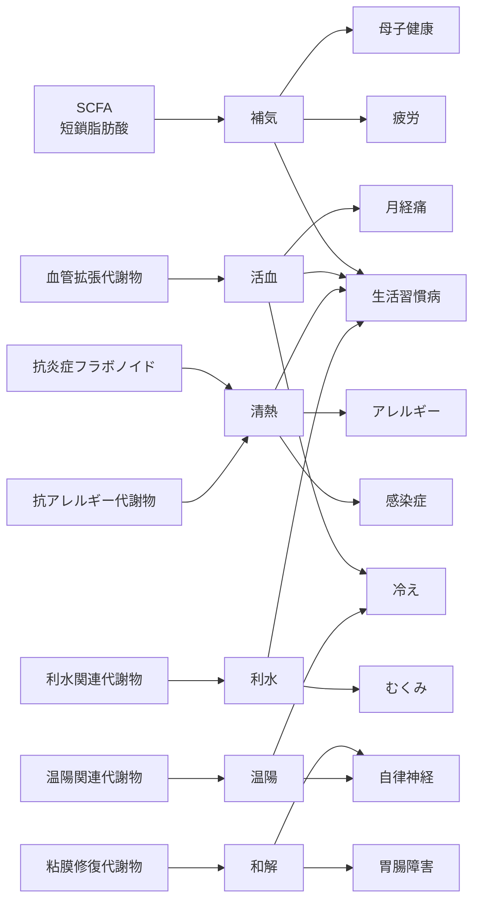

# MBT漢方体系図（Master Map）

---

## 1. 全体構造（6層モデル）

[Layer 1] 生薬（38）
      ↓
[Layer 2] MBT55代謝経路（7）
      ↓
[Layer 3] 生成代謝物クラスター（14）
      ↓
[Layer 4] 薬理作用（代謝物ベース）
      ↓
[Layer 5] 証（補気・活血・清熱・利水・補血・温陽）
      ↓
[Layer 6] 症状・社会的適応（12）

---

## 2. 代謝物 × 証 × 症状（Mermaid）

