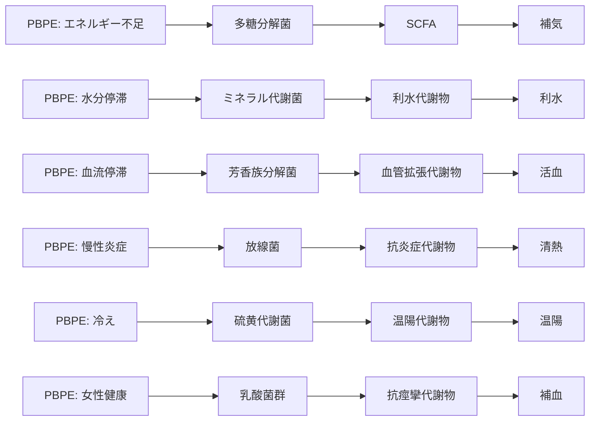

# PBPE統合（Version 1.0）
MBT55 × 漢方 × PBPE（Phenotype-Based Planetary Ecology）  
生態系フェノタイプを「証」として再定義する統合モデル

---

# 1. PBPEとは何か（要点）
PBPEは、生態系・農業・気候・健康を  
「フェノタイプ（表現型）」で統合するフレームワーク。

- 土壌のフェノタイプ  
- 植物のフェノタイプ  
- 微生物のフェノタイプ  
- 人体のフェノタイプ（証）  
- 社会的フェノタイプ（症状・行動）  

これらを **同じ構造で扱える** のが最大の強み。

---

# 2. PBPEと漢方の構造対応

| PBPEフェノタイプ | 漢方の証 | 代謝物クラスター | MBT55経路 |
|------------------|----------|-------------------|------------|
| エネルギー不足 | 補気 | SCFA | 多糖分解菌 |
| 水分停滞 | 利水 | 利水代謝物 | ミネラル代謝菌 |
| 血流停滞 | 活血 | 血管拡張代謝物 | 芳香族分解菌 |
| 慢性炎症 | 清熱 | 抗炎症フラボノイド | 放線菌 |
| 冷え・低代謝 | 温陽 | 温陽代謝物 | 硫黄代謝菌 |
| 女性健康・血液量 | 補血 | 抗痙攣代謝物 | 乳酸菌群 |

→ **PBPEフェノタイプ = 証（漢方）**  
→ **証 = 代謝物クラスターの組み合わせ**  
→ **代謝物 = MBT55のアウトプット**

---

# 3. PBPE → MBT55 → 漢方の流れ（Master Flow）

例：  
「冷え・低代謝（PBPE）」  
→ 硫黄代謝菌の低下  
→ 温陽代謝物不足  
→ 温陽証  
→ 冷え・自律神経不安定  
→ 人参湯・小建中湯

---

# 4. PBPE × 漢方 × MBT55の統合マップ（Mermaid）

