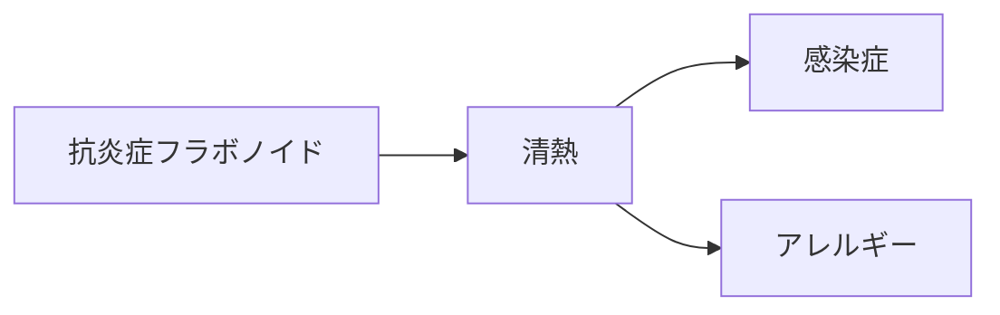

# 代謝物クラスター：抗炎症フラボノイド

## 概要
フラボノイド類が腸内微生物により変換され、強力な抗炎症作用を示す代謝物群。
清熱（炎症鎮静）の中心。

## MBT55代謝経路
- 芳香族分解菌
- 放線菌

## 生成源となる生薬
- [[麻黄]]
- [[黄芩]]
- [[黄連]]
- [[連翹]]
- [[牡丹皮]]
- [[柴胡]]

## 薬理作用
- 抗炎症
- 抗ウイルス
- 抗アレルギー
- 発熱抑制

## 対応する証
- [[清熱]]

## 関連症状
- [[感染症]]
- [[アレルギー]]
- [[生活習慣病]]
- [[咽頭痛]]

## 関連方剤
- [[麻黄湯]]
- [[小柴胡湯]]
- [[半夏瀉心湯]]
- [[白虎湯]]

## Mermaid（ミニマップ）

