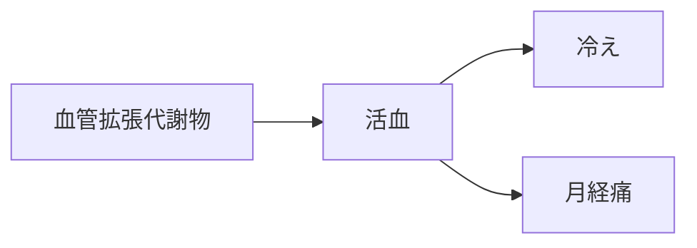

# 代謝物クラスター：血管拡張代謝物

## 概要
血管平滑筋を弛緩させ、末梢循環を改善する代謝物群。
活血（血流改善）の中心。

## MBT55代謝経路
- 芳香族分解菌
- 糸状菌

## 生成源となる生薬
- [[桂枝]]
- [[桂皮]]
- [[川芎]]
- [[桃仁]]
- [[紅花]]
- [[当帰]]

## 薬理作用
- 血流改善
- 血栓予防
- 末梢循環改善
- 冷え改善

## 対応する証
- [[活血]]

## 関連症状
- [[冷え]]
- [[月経痛]]
- [[頭痛]]
- [[生活習慣病]]

## 関連方剤
- [[桂枝茯苓丸]]
- [[当帰芍薬散]]
- [[桃核承気湯]]

## Mermaid（ミニマップ）

