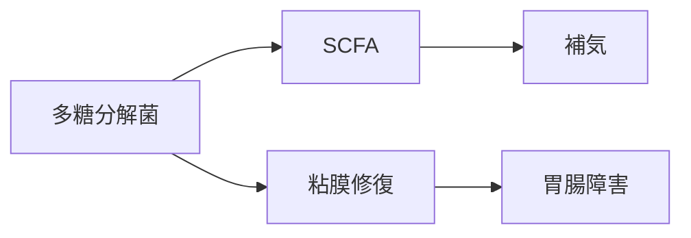

# MBT55代謝経路：多糖分解菌（Polysaccharide Degraders）

## 概要
多糖類（デンプン・粘液質・多糖成分）を分解し、SCFA を中心とした
エネルギー代謝物を生成する菌群。

## 主な生成代謝物
- [[SCFA]]
- [[粘膜修復代謝物]]
- [[利水関連代謝物]]

## 関連する生薬
- [[人参]]
- [[白朮]]
- [[茯苓]]
- [[大棗]]
- [[麦門冬]]
- [[半夏]]
- [[沢瀉]]
- [[猪苓]]

## 対応する証
- [[補気]]
- [[利水]]
- [[和解]]

## 関連症状
- [[疲労]]
- [[胃腸障害]]
- [[むくみ]]

## 関連方剤
- [[四君子湯]]
- [[六君子湯]]
- [[補中益気湯]]
- [[麦門冬湯]]

## Mermaid
