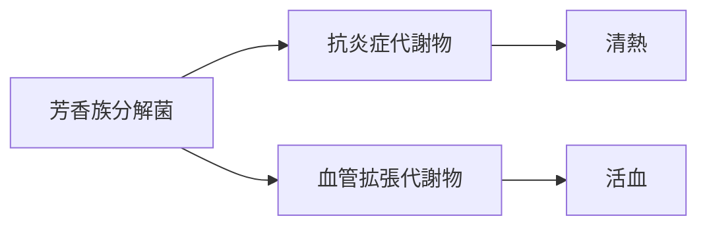

# MBT55代謝経路：芳香族分解菌（Aromatic Degraders）

## 概要
芳香族化合物（フラボノイド・精油・リグナンなど）を分解し、
抗炎症・血流改善・抗アレルギーなどの代謝物を生成する中心的な菌群。

## 主な生成代謝物
- [[抗炎症フラボノイド]]
- [[血管拡張代謝物]]
- [[抗アレルギー代謝物]]
- [[抗ウイルス代謝物]]

## 関連する生薬
- [[麻黄]]
- [[桂枝]]
- [[桂皮]]
- [[柴胡]]
- [[黄芩]]
- [[黄連]]
- [[連翹]]
- [[牡丹皮]]
- [[川芎]]
- [[桃仁]]
- [[紅花]]

## 対応する証
- [[清熱]]
- [[活血]]

## 関連症状
- [[感染症]]
- [[アレルギー]]
- [[冷え]]
- [[月経痛]]

## 関連方剤
- [[麻黄湯]]
- [[葛根湯]]
- [[小柴胡湯]]
- [[桂枝茯苓丸]]
- [[桃核承気湯]]

## Mermaid（ミニマップ）
