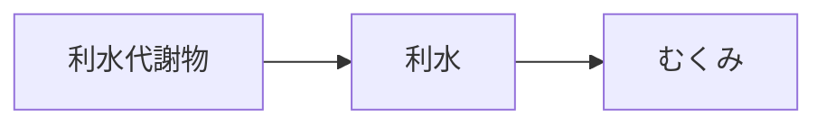

# 証：利水（りすい）

## 概要
水分代謝の停滞、むくみ、腎・泌尿器の不調に関わる証。
MBT55では「多糖分解菌・ミネラル代謝菌 → 利水代謝物」が中心。

---

## 主な代謝物クラスター
- [[利水関連代謝物]]
- [[ミネラル調整代謝物]]

---

## 関連するMBT55経路
- [[多糖分解菌]]
- [[ミネラル代謝菌]]

---

## 主な症状
- [[むくみ]]
- [[腎・泌尿器]]
- [[生活習慣病]]

---

## 関連する生薬
- [[沢瀉]]
- [[猪苓]]
- [[茯苓]]

---

## 関連方剤
- [[当帰芍薬散]]
- （補助）[[桂枝茯苓丸]]

---

## Mermaid（利水ミニマップ）
