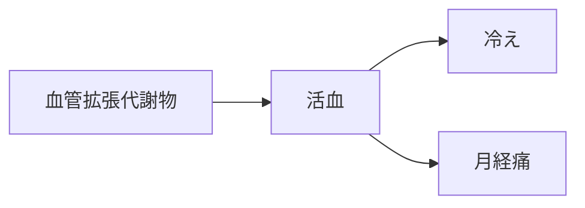

# 証：活血（かっけつ）

## 概要
血流停滞・瘀血・冷え・女性健康の問題に関わる証。
MBT55では「芳香族分解菌・糸状菌 → 血管拡張代謝物」が中心。

---

## 主な代謝物クラスター
- [[血管拡張代謝物]]
- [[抗血栓代謝物]]
- [[抗痙攣代謝物]]

---

## 関連するMBT55経路
- [[芳香族分解菌]]
- [[糸状菌]]

---

## 主な症状
- [[冷え]]
- [[月経痛]]
- [[頭痛]]
- [[生活習慣病]]

---

## 関連する生薬
- [[桂枝]]
- [[桂皮]]
- [[川芎]]
- [[桃仁]]
- [[紅花]]
- [[当帰]]

---

## 関連方剤
- [[桂枝茯苓丸]]
- [[当帰芍薬散]]
- [[桃核承気湯]]

---

## Mermaid（活血ミニマップ）
