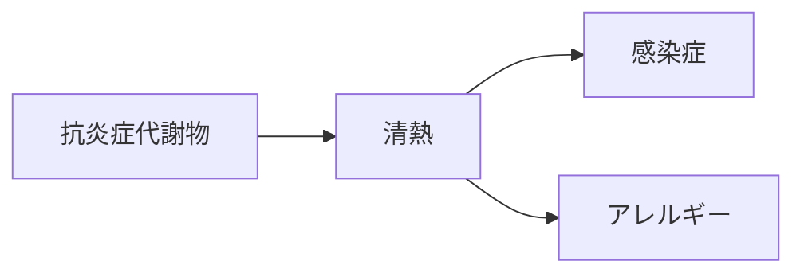

# 証：清熱（せいねつ）

## 概要
炎症・発熱・感染症・アレルギーなど「熱（炎症）」を鎮める証。
MBT55では「芳香族分解菌・放線菌 → 抗炎症フラボノイド」が中心。

---

## 主な代謝物クラスター
- [[抗炎症フラボノイド]]
- [[抗ウイルス代謝物]]
- [[抗アレルギー代謝物]]

---

## 関連するMBT55経路
- [[芳香族分解菌]]
- [[放線菌]]

---

## 主な症状
- [[感染症]]
- [[アレルギー]]
- [[咽頭痛]]
- [[生活習慣病]]

---

## 関連する生薬
- [[麻黄]]
- [[黄芩]]
- [[黄連]]
- [[連翹]]
- [[牡丹皮]]

---

## 関連方剤
- [[麻黄湯]]
- [[小柴胡湯]]
- [[半夏瀉心湯]]
- [[白虎湯]]

---

## Mermaid（清熱ミニマップ）
