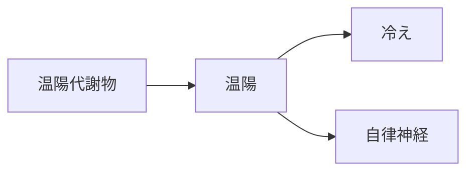

# 証：温陽（おんよう）

## 概要
冷え、低代謝、末梢循環不良、自律神経の不安定さに関わる証。
MBT55では「芳香族分解菌・硫黄代謝菌 → 温陽代謝物」が中心。

---

## 主な代謝物クラスター
- [[温陽関連代謝物]]
- [[血管拡張代謝物]]

---

## 関連するMBT55経路
- [[芳香族分解菌]]
- [[硫黄代謝菌]]

---

## 主な症状
- [[冷え]]
- [[自律神経不安定]]
- [[疲労]]

---

## 関連する生薬
- [[乾姜]]
- [[桂皮]]
- [[麻黄]]

---

## 関連方剤
- [[人参湯]]
- [[小建中湯]]
- [[桂枝湯]]

---

## Mermaid（温陽ミニマップ）
