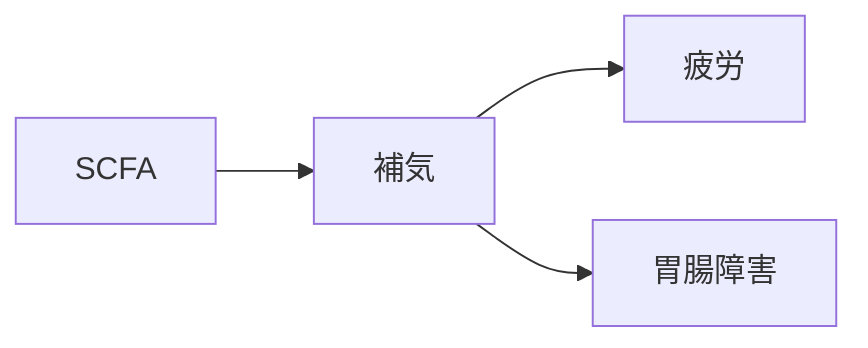

# 証：補気（ほき）

## 概要
エネルギー代謝の低下、消化吸収の弱さ、免疫力の低下などを示す証。
MBT55では「多糖分解菌・乳酸菌群 → SCFA」が中心。

---

## 主な代謝物クラスター
- [[SCFA]]
- [[代謝促進代謝物]]

---

## 関連するMBT55経路
- [[多糖分解菌]]
- [[乳酸菌群]]

---

## 主な症状・社会的適応
- [[疲労]]
- [[胃腸障害]]
- [[母子健康]]
- [[生活習慣病]]

---

## 関連する生薬
- [[人参]]
- [[白朮]]
- [[茯苓]]
- [[大棗]]
- [[甘草]]

---

## 関連方剤
- [[四君子湯]]
- [[六君子湯]]
- [[補中益気湯]]
- [[人参湯]]

---

## Mermaid（補気ミニマップ）
