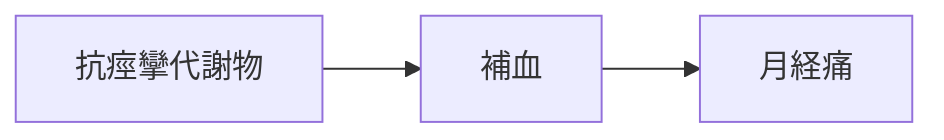

# 証：補血（ほけつ）

## 概要
血液量の不足、女性健康、月経不順、貧血傾向に関わる証。
代謝物としては「抗痙攣代謝物」「血管拡張代謝物」が関与。

---

## 主な代謝物クラスター
- [[抗痙攣代謝物]]
- [[血管拡張代謝物]]

---

## 関連するMBT55経路
- [[芳香族分解菌]]
- [[乳酸菌群]]

---

## 主な症状
- [[月経痛]]
- [[貧血]]
- [[冷え]]

---

## 関連する生薬
- [[当帰]]
- [[芍薬]]
- [[白芍]]
- [[川芎]]

---

## 関連方剤
- [[当帰芍薬散]]
- [[桂枝茯苓丸]]

---

## Mermaid（補血ミニマップ）
