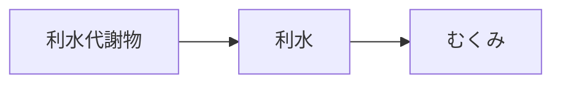

# 症状：むくみ

## 概要
水分代謝の停滞、腎・泌尿器の機能低下。

## 関連する証
- [[利水]]

## 関連する代謝物クラスター
- [[利水関連代謝物]]
- [[ミネラル調整代謝物]]

## 関連するMBT55経路
- [[多糖分解菌]]
- [[ミネラル代謝菌]]

## 関連する生薬
- [[沢瀉]]
- [[猪苓]]
- [[茯苓]]

## 関連する方剤
- [[当帰芍薬散]]

## Mermaid
