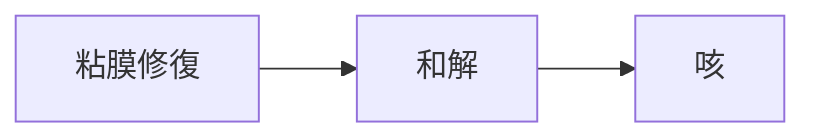

# 症状：咳（乾性・湿性）

## 概要
気道炎症、粘膜障害、痰の停滞。

## 関連する証
- [[清熱]]
- [[和解]]

## 関連する代謝物クラスター
- [[粘膜修復代謝物]]
- [[抗炎症フラボノイド]]

## 関連するMBT55経路
- [[乳酸菌群]]
- [[芳香族分解菌]]

## 関連する生薬
- [[麻黄]]
- [[杏仁]]
- [[麦門冬]]
- [[半夏]]

## 関連する方剤
- [[麻黄湯]]
- [[小青竜湯]]
- [[麦門冬湯]]

## Mermaid
