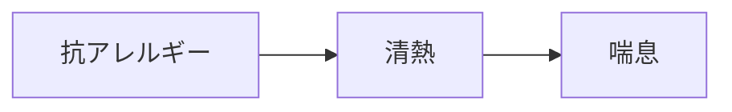

# 症状：喘息（気道過敏）

## 概要
気道炎症、アレルギー、気管支収縮。

## 関連する証
- [[清熱]]

## 関連する代謝物クラスター
- [[抗アレルギー代謝物]]
- [[抗炎症フラボノイド]]

## 関連するMBT55経路
- [[芳香族分解菌]]
- [[乳酸菌群]]

## 関連する生薬
- [[麻黄]]
- [[杏仁]]
- [[五味子]]

## 関連する方剤
- [[麻黄湯]]
- [[小青竜湯]]

## Mermaid
