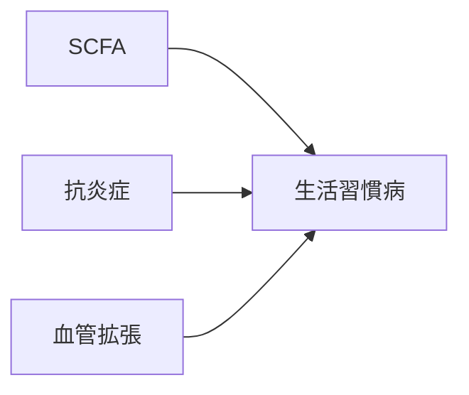

# 症状：生活習慣病（慢性炎症・代謝異常）

## 概要
慢性炎症、血流停滞、代謝低下が複合した状態。

## 関連する証
- [[補気]]
- [[活血]]
- [[清熱]]
- [[利水]]

## 関連する代謝物クラスター
- [[SCFA]]
- [[抗炎症フラボノイド]]
- [[血管拡張代謝物]]
- [[利水関連代謝物]]

## 関連するMBT55経路
- [[多糖分解菌]]
- [[芳香族分解菌]]
- [[放線菌]]

## 関連する生薬
- [[人参]]
- [[桂皮]]
- [[黄芩]]
- [[沢瀉]]

## 関連する方剤
- [[補中益気湯]]
- [[桂枝茯苓丸]]
- [[小柴胡湯]]

## Mermaid
