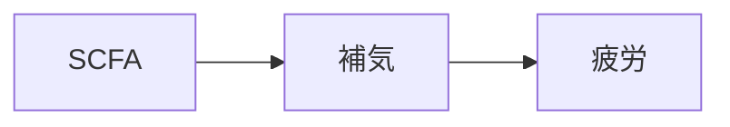

# 症状：疲労

## 概要
エネルギー代謝の低下、消化吸収の弱さ、免疫低下などにより生じる。

## 関連する証
- [[補気]]
- （補助）[[⑥温陽]]

## 関連する代謝物クラスター
- [[SCFA]]
- [[代謝促進代謝物]]

## 関連するMBT55経路
- [[多糖分解菌]]
- [[乳酸菌群]]

## 関連する生薬
- [[人参]]
- [[白朮]]
- [[茯苓]]
- [[大棗]]
- [[甘草]]

## 関連する方剤
- [[四君子湯]]
- [[六君子湯]]
- [[補中益気湯]]
- [[人参湯]]

## Mermaid
