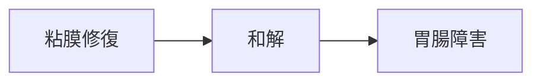

# 症状：胃腸障害（胃炎・消化不良）

## 概要
粘膜障害、消化吸収低下、ストレス性胃腸障害。

## 関連する証
- [[和解]]
- [[補気]]

## 関連する代謝物クラスター
- [[粘膜修復代謝物]]
- [[SCFA]]

## 関連するMBT55経路
- [[多糖分解菌]]
- [[乳酸菌群]]

## 関連する生薬
- [[半夏]]
- [[甘草]]
- [[麦門冬]]
- [[人参]]

## 関連する方剤
- [[六君子湯]]
- [[半夏瀉心湯]]
- [[麦門冬湯]]

## Mermaid
