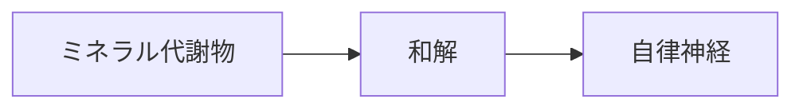

# 症状：自律神経不安定

## 概要
ストレス、冷え、ミネラル代謝異常による神経調整の乱れ。

## 関連する証
- [[⑥温陽]]
- [[和解]]

## 関連する代謝物クラスター
- [[温陽関連代謝物]]
- [[ミネラル調整代謝物]]

## 関連するMBT55経路
- [[硫黄代謝菌]]
- [[ミネラル代謝菌]]

## 関連する生薬
- [[竜骨]]
- [[牡蛎]]
- [[乾姜]]

## 関連する方剤
- [[桂枝加竜骨牡蛎湯]]
- [[小建中湯]]

## Mermaid
