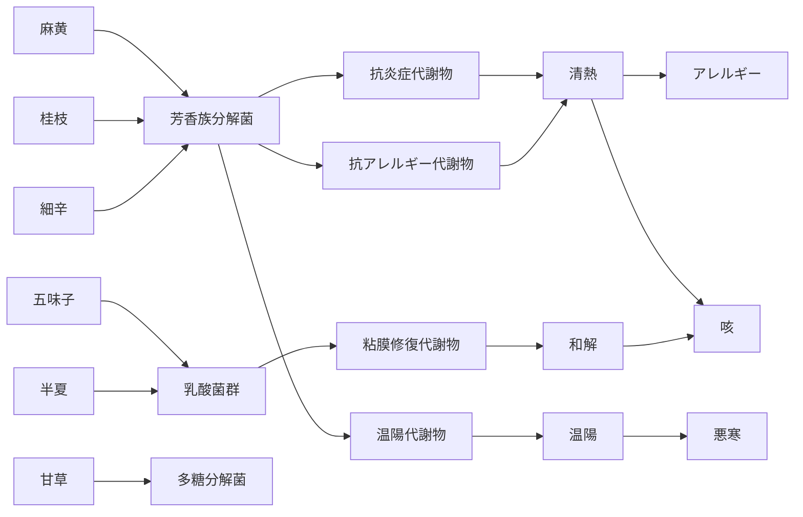

# 小青竜湯（Shoseiryuto）ネットワーク図

```mermaid
graph LR
    %% 生薬
    Maou[麻黄]
    Keishi[桂枝]
    Goshitsu[五味子]
    Saishin[細辛]
    Hange[半夏]
    Kanzo[甘草]

    %% MBT55
    Aro[芳香族分解菌]
    Lacto[乳酸菌群]
    Poly[多糖分解菌]

    %% 代謝物
    AntiInf[抗炎症代謝物]
    AntiAllergy[抗アレルギー代謝物]
    Mucosa[粘膜修復代謝物]
    WarmM[温陽代謝物]

    %% 証
    Seinetu[清熱]
    Onyo[温陽]
    Wakai[和解]

    %% 症状
    Cough[咳]
    AllergyS[アレルギー]
    Chill[悪寒]

    %% 生薬→MBT55
    Maou --> Aro
    Keishi --> Aro
    Goshitsu --> Lacto
    Saishin --> Aro
    Hange --> Lacto
    Kanzo --> Poly

    %% MBT55→代謝物
    Aro --> AntiInf
    Aro --> AntiAllergy
    Lacto --> Mucosa
    Aro --> WarmM

    %% 代謝物→証
    AntiInf --> Seinetu
    AntiAllergy --> Seinetu
    Mucosa --> Wakai
    WarmM --> Onyo

    %% 証→症状
    Seinetu --> AllergyS
    Seinetu --> Cough
    Wakai --> Cough
    Onyo --> Chill
```