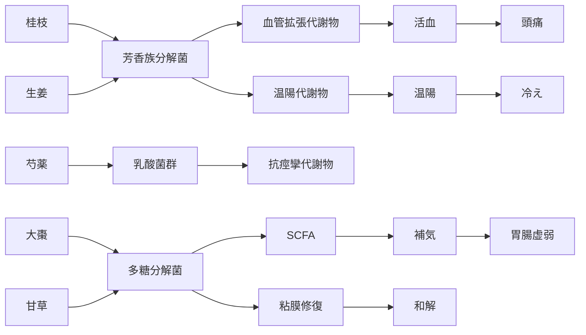

# 桂枝湯（Keishito）ネットワーク図

```mermaid
graph LR
    Keishi[桂枝]
    Shakuyaku[芍薬]
    Shoukyou[生姜]
    Taiso[大棗]
    Kanzo[甘草]

    Aro[芳香族分解菌]
    Lacto[乳酸菌群]
    Poly[多糖分解菌]

    Vaso[血管拡張代謝物]
    AntiSpasm[抗痙攣代謝物]
    WarmM[温陽代謝物]
    SCFA[SCFA]
    Mucosa[粘膜修復]

    Kakketsu[活血]
    Onyo[温陽]
    HoKi[補気]
    Wakai[和解]

    Cold[冷え]
    Headache[頭痛]
    GI[胃腸虚弱]

    Keishi --> Aro
    Shakuyaku --> Lacto
    Shoukyou --> Aro
    Taiso --> Poly
    Kanzo --> Poly

    Aro --> Vaso
    Aro --> WarmM
    Lacto --> AntiSpasm
    Poly --> SCFA
    Poly --> Mucosa

    Vaso --> Kakketsu
    WarmM --> Onyo
    SCFA --> HoKi
    Mucosa --> Wakai

    Kakketsu --> Headache
    Onyo --> Cold
    HoKi --> GI
```