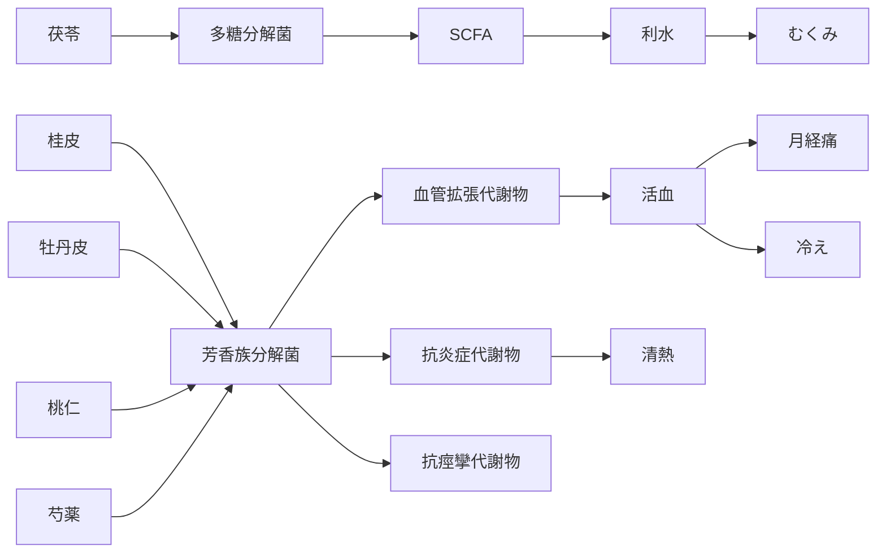

# 桂枝茯苓丸（Keishibukuryogan）ネットワーク図

```mermaid
graph LR
    Keihi[桂皮]
    Bukuryo[茯苓]
    Botanpi[牡丹皮]
    Toujin[桃仁]
    Shakuyaku[芍薬]

    Aro[芳香族分解菌]
    Poly[多糖分解菌]

    Vaso[血管拡張代謝物]
    AntiInf[抗炎症代謝物]
    AntiSpasm[抗痙攣代謝物]
    SCFA[SCFA]

    Kakketsu[活血]
    Risui[利水]
    Seinetu[清熱]

    Cold[冷え]
    Dysmen[月経痛]
    Edema[むくみ]

    Keihi --> Aro
    Botanpi --> Aro
    Toujin --> Aro
    Shakuyaku --> Aro
    Bukuryo --> Poly

    Aro --> Vaso
    Aro --> AntiInf
    Aro --> AntiSpasm
    Poly --> SCFA

    Vaso --> Kakketsu
    AntiInf --> Seinetu
    SCFA --> Risui

    Kakketsu --> Dysmen
    Risui --> Edema
    Kakketsu --> Cold
```