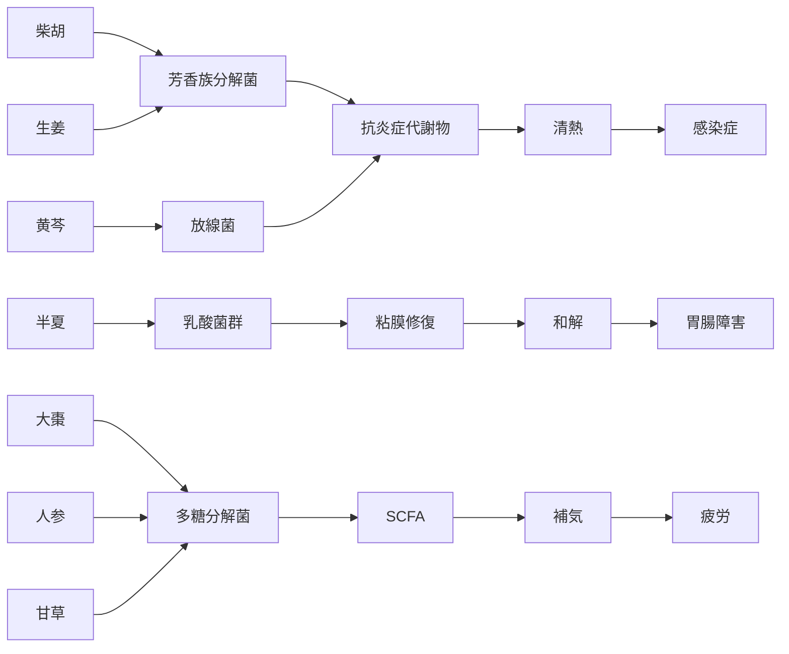

# 小柴胡湯（Shosaikoto）ネットワーク図

```mermaid
graph LR
    Saiko[柴胡]
    Ougon[黄芩]
    Hange[半夏]
    Shoukyou[生姜]
    Taiso[大棗]
    Ninjin[人参]
    Kanzo[甘草]

    Aro[芳香族分解菌]
    Poly[多糖分解菌]
    Lacto[乳酸菌群]
    Actino[放線菌]

    AntiInf[抗炎症代謝物]
    Mucosa[粘膜修復]
    SCFA[SCFA]

    Seinetu[清熱]
    Wakai[和解]
    HoKi[補気]

    Infection[感染症]
    GI[胃腸障害]
    Fatigue[疲労]

    Saiko --> Aro
    Ougon --> Actino
    Hange --> Lacto
    Shoukyou --> Aro
    Taiso --> Poly
    Ninjin --> Poly
    Kanzo --> Poly

    Aro --> AntiInf
    Actino --> AntiInf
    Lacto --> Mucosa
    Poly --> SCFA

    AntiInf --> Seinetu
    Mucosa --> Wakai
    SCFA --> HoKi

    Seinetu --> Infection
    Wakai --> GI
    HoKi --> Fatigue
```