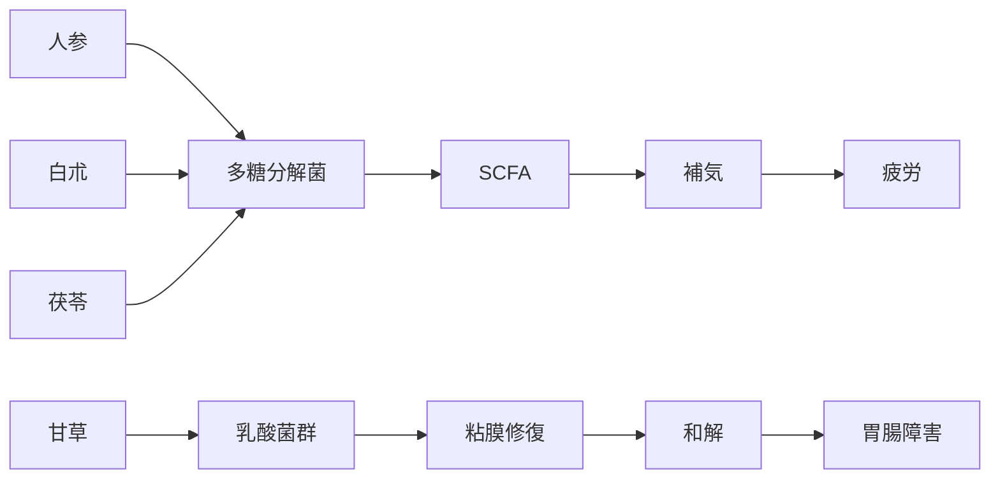

# 四君子湯（Shikunshito）ネットワーク図

```mermaid
graph LR
    Ninjin[人参]
    Byakujutsu[白朮]
    Bukuryo[茯苓]
    Kanzo[甘草]

    Poly[多糖分解菌]
    Lacto[乳酸菌群]

    SCFA[SCFA]
    Mucosa[粘膜修復]

    HoKi[補気]
    Wakai[和解]

    Fatigue[疲労]
    GI[胃腸障害]

    Ninjin --> Poly
    Byakujutsu --> Poly
    Bukuryo --> Poly
    Kanzo --> Lacto

    Poly --> SCFA
    Lacto --> Mucosa

    SCFA --> HoKi
    Mucosa --> Wakai

    HoKi --> Fatigue
    Wakai --> GI
```