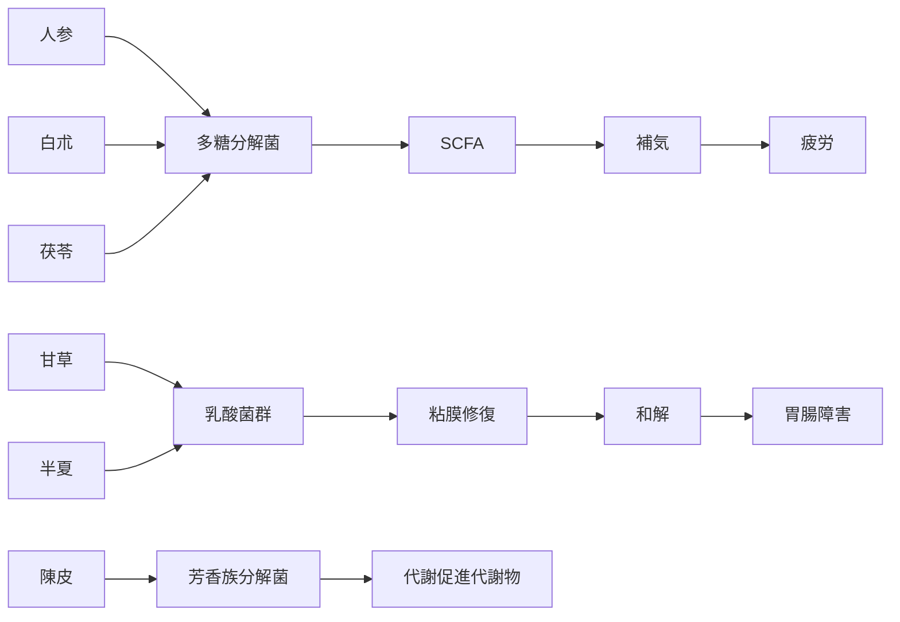

# 六君子湯（Rikkunshito）ネットワーク図

```mermaid
graph LR
    %% 四君子湯 + 半夏 + 陳皮
    Ninjin[人参]
    Byakujutsu[白朮]
    Bukuryo[茯苓]
    Kanzo[甘草]
    Hange[半夏]
    Chinpi[陳皮]

    Poly[多糖分解菌]
    Lacto[乳酸菌群]
    Aro[芳香族分解菌]

    SCFA[SCFA]
    Mucosa[粘膜修復]
    Metabo[代謝促進代謝物]

    HoKi[補気]
    Wakai[和解]

    GI[胃腸障害]
    Fatigue[疲労]

    Ninjin --> Poly
    Byakujutsu --> Poly
    Bukuryo --> Poly
    Kanzo --> Lacto
    Hange --> Lacto
    Chinpi --> Aro

    Poly --> SCFA
    Lacto --> Mucosa
    Aro --> Metabo

    SCFA --> HoKi
    Mucosa --> Wakai

    HoKi --> Fatigue
    Wakai --> GI
```