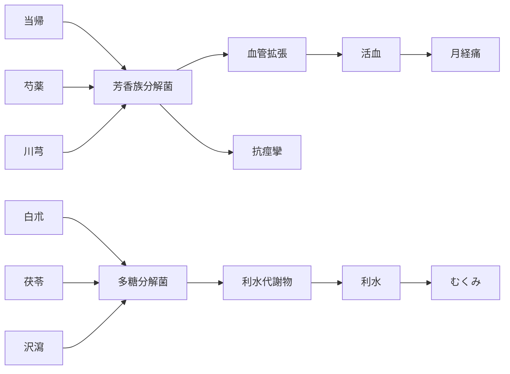

# 当帰芍薬散（Tokishakuyakusan）ネットワーク図

```mermaid
graph LR
    Touki[当帰]
    Shakuyaku[芍薬]
    Senkyu[川芎]
    Byakujutsu[白朮]
    Bukuryo[茯苓]
    Takusha[沢瀉]

    Aro[芳香族分解菌]
    Poly[多糖分解菌]

    Vaso[血管拡張]
    AntiSpasm[抗痙攣]
    Diuretic[利水代謝物]

    Kakketsu[活血]
    Risui[利水]

    Dysmen[月経痛]
    Edema[むくみ]

    Touki --> Aro
    Shakuyaku --> Aro
    Senkyu --> Aro
    Byakujutsu --> Poly
    Bukuryo --> Poly
    Takusha --> Poly

    Aro --> Vaso
    Aro --> AntiSpasm
    Poly --> Diuretic

    Vaso --> Kakketsu
    Diuretic --> Risui

    Kakketsu --> Dysmen
    Risui --> Edema
```