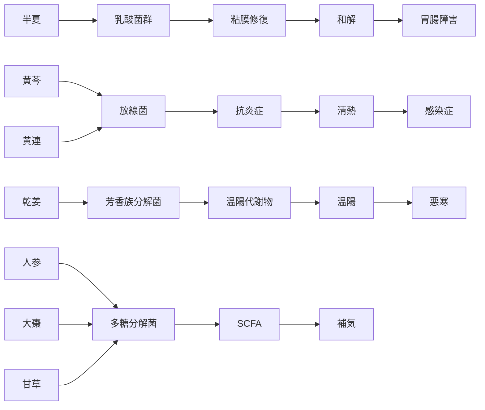

# 半夏瀉心湯（Hangeshashinto）ネットワーク図

```mermaid
graph LR
    Hange[半夏]
    Ougon[黄芩]
    Oren[黄連]
    Kankyo[乾姜]
    Ninjin[人参]
    Taiso[大棗]
    Kanzo[甘草]

    Poly[多糖分解菌]
    Lacto[乳酸菌群]
    Aro[芳香族分解菌]
    Actino[放線菌]

    Mucosa[粘膜修復]
    AntiInf[抗炎症]
    WarmM[温陽代謝物]
    SCFA[SCFA]

    Wakai[和解]
    Seinetu[清熱]
    Onyo[温陽]
    HoKi[補気]

    GI[胃腸障害]
    Infection[感染症]
    Chill[悪寒]

    Hange --> Lacto
    Ougon --> Actino
    Oren --> Actino
    Kankyo --> Aro
    Ninjin --> Poly
    Taiso --> Poly
    Kanzo --> Poly

    Lacto --> Mucosa
    Actino --> AntiInf
    Aro --> WarmM
    Poly --> SCFA

    Mucosa --> Wakai
    AntiInf --> Seinetu
    WarmM --> Onyo
    SCFA --> HoKi

    Wakai --> GI
    Seinetu --> Infection
    Onyo --> Chill
```